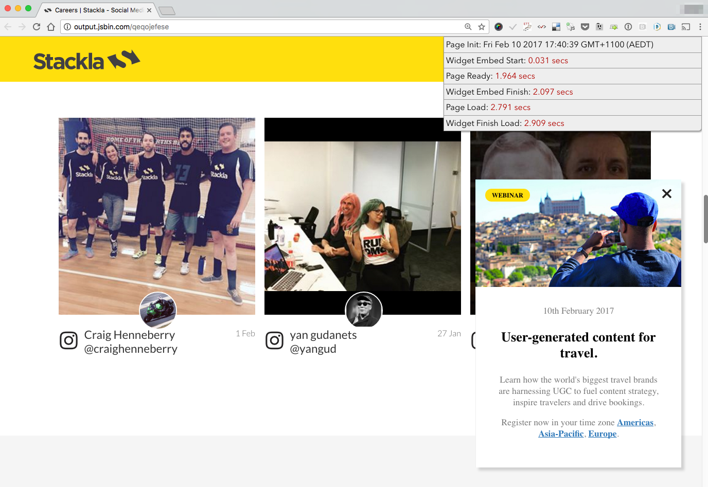

# Profiling Widget Performance

* [Overview](profiling-widget-performance.md#overview)
* [Facts](profiling-widget-performance.md#facts)
* [Benefits](profiling-widget-performance.md#benefits)
* [Steps](profiling-widget-performance.md#steps)
* [Recommendation](profiling-widget-performance.md#recommendation)


You are reading the **Classic Widget Documentation**

Classic widgets are a previous widget version for onsite widgets created before September 23rd.

From September 23rd 2025, all new widgets created will be NextGen.

Please check your widget version on the **Widget List page** to see if it is **Classic** or **NextGen** widget.

You can read the [Nextgen widget documentation here](../widgets-nextgen/).

**Note: This feature is unique to Classic widgets**


## Overview

After you embed the Nosto's UGC widget into your web page, you may want to evaluate the widget load time. The article provides a step-by-step tutorial to help you to write a profiler.



## Facts

* The Nosto's UGC Widget loads asynchronously. Unlike the default behavior of `<script src="..."></script>`, it doesn't block your page from loading.
* Widget loading is heavily affected by other page assets which load before the embed code (`fluid-embed.js`). When you find that the Nosto's UGC widget loads slowly, check if there are slow assets which are requested before the embed code on your page. This could be any slow images, CSS, or JavaScript files before the embed code.

## Benefits

If you are able to report these profiling results back to us when logging a support ticket on performance issues, it will make it easier for us to investigate and assist you with this issue.

## Steps

### 1. Paste the following code before the tag

We have to get the initial time from the page and compare it with the different benchmarks coming from multiple events.

```
(function () {
    window.Stackla = window.Stackla || {};

    // All the benchmarks
    Stackla.profilerRecords = [];

    // Method for adding a benchmark
    Stackla.addProfilerItem = function (label, finish, start) {
        var duration;
        if (start) {
            duration = (finish - start) / 1000 + ' secs';
            Stackla.profilerRecords.push([
                '<span class="title">' + label + '</span>',
                '<span class="content">' + duration + '</span>'
            ].join(''));
        } else {
            Stackla.profilerRecords.push(label);
        }
    };

    // Page Init At
    Stackla.pageInit = new Date();
    Stackla.addProfilerItem('Page Init: ' + Stackla.pageInit);

    // Page Load
    window.addEventListener('load', function () {
        Stackla.pageLoad = new Date();
        Stackla.addProfilerItem('Page Load: ', Stackla.pageLoad, Stackla.pageInit);
    });

    // DOMReady
    document.addEventListener('DOMContentLoaded', function () {
        Stackla.pageReady = new Date();
        Stackla.addProfilerItem('Page Ready: ', Stackla.pageReady, Stackla.pageInit);
    });

    // Widget Finish Load
    window.addEventListener('message', function (e) {
        var data = JSON.parse(e.data),
            listEl = document.createElement('ul');

        if (data.action !== 'initComplete') {
            return;
        }

        Stackla.widgetLoad = new Date();
        Stackla.addProfilerItem('Widget Finish Load: ', Stackla.widgetLoad, Stackla.pageInit);

        Stackla.profilerRecords.forEach(function (record, i) {
            var itemEl = document.createElement('li');
            itemEl.innerHTML = record;
            listEl.appendChild(itemEl);
        });

        listEl.setAttribute('id', 'stackla-widget-profiler');

        // Output the Profiler
        document.body.appendChild(listEl);
    });
}());
```

### 2. Update your Embed Code

The following is the general embed code with additional 6 lines. Please follow the comments.

```html
<div class="stackla-widget" data-id="XXXX" data-hash="XXXX" data-ct=""
     data-alias="XXXX.stackla.com" data-ttl="30" style="width: 100%; overflow: hidden;"></div>
<script type='text/javascript'>
(function (d, id) {
     var t, el = d.scripts[d.scripts.length - 1].previousElementSibling;
    el.dataset.initTimestamp = (new Date()).getTime();
    if (d.getElementById(id)) return;

     // ADD THE FOLLOWING 2 LINES HERE
    Stackla.widgetBeforeLoad = new Date();
    Stackla.addProfilerItem('Widget Embed Start: ', Stackla.widgetBeforeLoad, Stackla.pageInit);

    t = d.createElement('script');
    t.src = '//assetscdn.stackla.com/media/js/widget/fluid-embed.js';
    t.id = id;

    // ADD THE FOLLOWING 4 LINES HERE
    t.addEventListener('load', function () {
        Stackla.widgetLoad = new Date();
        Stackla.addProfilerItem('Widget Embed Finish: ', Stackla.widgetLoad, Stackla.widgetBeforeLoad);
    });

    (d.getElementsByTagName('head')[0] || d.getElementsByTagName('body')[0]).appendChild(t);
}(document, 'stackla-widget-js'));
</script>
```

### Step 3 - Add the style sheet

Let's make the profiler more readable by adding some rules to your CSS stylesheet.

```
/* #stackla-widget-profiler (start) */
#stackla-widget-profiler {
    right: 0;
    font-family: 'Avenir Next', 'Open Sans', 'PT Sans', 'DejaVu Sans', 'Bitstream Vera Sans', Verdana, sans-serif;
    text-shadow: 0 1px 0 rgba(255, 255, 255, 0.5);
    position: fixed;
    top: 0;
    width: 400px;
    box-shadow: 1px 1px 4px rgba(0, 0, 0, 0.5);
    z-index: 2;
    background: #eee;
    border: solid 1px #999;
    font-size: 13px;
    font-family; 'OpenSans'
    -moz-border-radius-bottomright: 5px;
    -webkit-border-bottom-right-radius: 5px;
    border-bottom-right-radius: 5px;
    text-align: left;
}
#stackla-widget-profiler {
    margin: 0;
    padding: 0;
}
#stackla-widget-profiler li {
    border-bottom: solid 1px #999;
    padding: 3px;
    margin: 0;
    list-style-type: none;
}
#stackla-widget-profiler li:last-child {
    border-bottom: none;
}
#stackla-widget-profiler li .content {
    color: #a00;
    text-align: right;
}
/* #stackla-widget-profiler (end) */
```

## Useful trick - Make use of JSBin

Ideally your profiling page would sit on your own web server. However, you can choose to use an online JavaScript prototyping tool, such as JSBin to assist you if this is not possible. By copy-pasting all the server-generated HTML source code with the following line after the tag, you can get a similar test page.

```
<base href="YOUR-BASE-URL-FOR-ALL-ASSETS"/>
```

The examples of the following section are using JSBin.

## Recommendation

We recommend you make profilers for the following scenarios.

* A blank page which only has the Nosto's UGC Widget ([Example](http://jsbin.com/zivuzosuva/1/edit?html,css,output)).
* Your current page without the Nosto's UGC Widget ([Example](http://jsbin.com/nolosegiqa/edit?html,css,output)).
* Your current page with the Nosto's UGC Widget ([Example](http://jsbin.com/qeqojefese/edit?html,css,output)).

This way you can get several different benchmarks to identify the problem.
