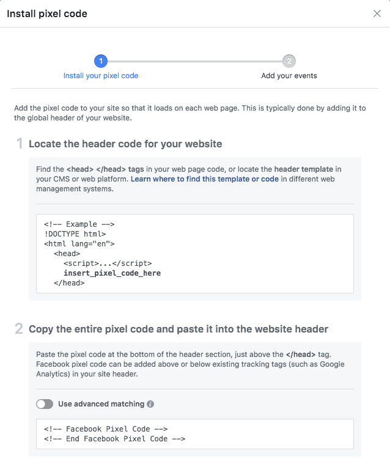
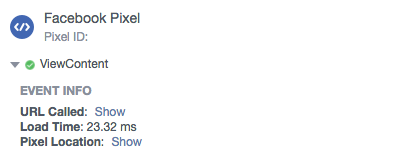
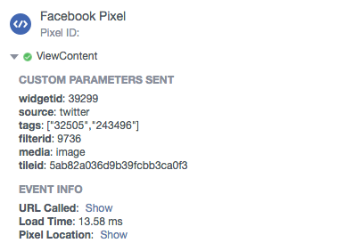
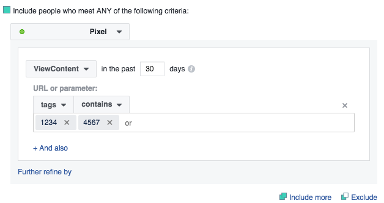

# Re-targeting with Widgets and Facebook Pixel

* [Overview](re-targeting-widgets-facebook-pixel.md#overview)
* [Generate your Pixel](re-targeting-widgets-facebook-pixel.md#generate-pixel)
* [Decide what to send to Facebook](re-targeting-widgets-facebook-pixel.md#decide-what-to-send)
* [Track a View Content Event](re-targeting-widgets-facebook-pixel.md#viewcontent)
* [Track a Custom Event](re-targeting-widgets-facebook-pixel.md#customevent)
* [Conclusion](re-targeting-widgets-facebook-pixel.md#conclusion)


You are reading the Classic Widget Documentation

NextGen widgets are a new and improved way to display UGC content.&#x20;

On Oct 1st, all widgets created will be NextGen.

Please check your widget version on the Widget List page to see if it is **Classic** or **NextGen** widget.

You can read the [Nextgen widget documentation here](../widgets-nextgen/).


## Overview

Behaviour Re-Targeting (also known as behavioural re-marketing, or simply, retargeting) is an important and regularly use component of most brand's online advertising strategy. Through Behaviour Re-Targeting, brands will target specific advertising to users based upon their previous Internet actions, such as going to a particular page, clicking on a certain link or engaging with a Nosto's UGC Widget.

In this guide, we will look at how you can use Nosto's UGC Widgets as part of your Facebook Pixel re-targeting strategy, and the types of data points you can leverage to deliver more relevant and engaging ads back on either Facebook, Facebook Messenger or Instagram.

[Back to Top](re-targeting-widgets-facebook-pixel.md#top)

## Generate your Facebook Pixel

The first step in this process is to ensure that you have a Facebook Pixel setup. If you have not yet setup a Facebook Pixel, you will need to go into Facebook Adverts and select Pixels.

From here, Facebook will ask you to name your Pixel and then provide you with the relevant embed code for your page. Please ensure this code is included on the same page(s) you have your Nosto's UGC Widget(s) on.



[Back to Top](re-targeting-widgets-facebook-pixel.md#top)

## Decide what to send to Facebook

Facebook Pixel offers 9x standard _Event Types_ which a Customer can register an event against, plus offer the ability for a customer to create their own Custom Event type. The standard Event Types are:

* `ViewContent` - Register an Event when a Key page has been viewed by the End User
* `Search` - Register an Event based upon the End User using a Search prompt on a page
* `AddToCart` - Register an Event based upon the End User adding a Product to their cart
* `AddToWishList` - Register an Event based upon the End User adding a Product to their Wish List
* `InitateCheckout` - Register an Event when an End User enters the checkout flow in the purchase process
* `AddPaymentInfo` - Register an Event when an End User gets to the Payment Page in the purchase process
* `Purchase` - Register an Event when the purchase process has been completed
* `Lead` - Register an Event when a user completes a 'Sign Up' process
* `CompleteRegistration` - Register an Event when a user completes a Registration form

Now naturally some of these Event Types are better used later on in a user's journey on a website, so for the purpose of this guide, we are going to use `ViewContent`, sending information across whenever a user Expands a Tile on a Widget.

We are also going to create a Custom Event to track whenever clicks on a Product Link on our Expanded Tile.

## Track a View Content Event

Now to send information to Facebook from the Nosto's UGC Widget, we are going to leverage the [Global Widgets API](../../api-docs/javascript/widgets/reference.md#parent-page) to instigate the Facebook Event.

To start, we will use the Global Widget API Event Type, `TileExpand`. This event type fires whenever someone clicks on an Inline Tile and thus opens the Expanded Tile. To do this, we will need to add the following code to our Nosto's UGC Widget, using the Custom Javascript section on the Expanded Tile.

```
Stackla.WidgetManager.on('tileExpand', function (e, data) {
    fbq('track', 'ViewContent');
});
```

Now this will send the below information to Facebook. Useful if you only want to track and re-target based upon a User interacting with your Widget, but also quite light on in terms of the relevant data you are sending back.



As such, we are going to expand the code to now include other attributes such as Widget ID (`data.widgetId`), Filter ID (`data.filterId`), Tile ID (`data.tileData._id.$id`), Tile Media Type (`data.tileData.media`), Tile Source Network (`data.tileData.source`) and the Tags associated with the Tiles (`data.tileData.tags`). To do this we would update the code to the below:

```
Stackla.WidgetManager.on('tileExpand', function (e, data) {
    fbq('track', 'ViewContent', {widgetid: data.widgetId, filterid: data.filterId, tileid: data.tileData._id.$id, media: data.tileData.media, source: data.tileData.source, tags: data.tileData.tags});
});
```

This would then send the following to Facebook:



This additional information we can then look to leverage if we want to go into the world of Custom Audience targeting.

[Back to Top](re-targeting-widgets-facebook-pixel.md#top)

## Track a Custom Event

So we now know how to send information to Facebook when it correlates to one of their standard events, but what if we want to track something that doesn't fit the mould? This is where Facebook's Custom Event function becomes useful.

Now for this use-case we want to track whenever a user clicks on a Product listing on our Widget, and send across the relevant External Product ID (`data.productTag.ext_product_id`) to Facebook Pixel. To do this, we would simply add this code to the Custom Javascript section on the Expanded Tile within the Custom Code editor on our Widget.

```
Stackla.WidgetManager.on('productActionClick', function (e, data) {
    fbq('trackCustom', 'ShopEvent', {sku: data.productTag.ext_product_id });
});
```

If we wanted to extend this and include other data, such as Widget ID (`data.widgetId`), Filter ID (`data.filterId`), Tile ID (`data.tileData._id.$id`) and Tile Media Type (`data.tileData.media`), we could do this as well by adjusting the code as follows:

```
Stackla.WidgetManager.on('productActionClick', function (e, data) {
    fbq('trackCustom', 'ShopEvent', {widgetid: data.widgetId, filterid: data.filterId, tileid: data.tileData._id.$id, media: data.tileData.media, sku: data.productTag.ext_product_id });
});
```

[Back to Top](re-targeting-widgets-facebook-pixel.md#top)

## Custom Audiences

Now that we are sending custom data to our Pixel, and have validated that everything is working as expected, we can now jump into the process of building our Custom Audiences using the Nosto's UGC data we have defined in our events.

To start, all we need to do is go to Facebook Adverts > Pixel > Settings and pick 'Build Custom Audience'.

From here we can set as many or as few conditions as we want and build as many different audiences as we want, similar to the example below where we are using Tag IDs.



From there, once all setup, we can start building new, more relevant and engaging ads for both Facebook and Instagram and target away.

[Back to Top](re-targeting-widgets-facebook-pixel.md#top)

## Conclusion

The above guide focuses on just a few possible use-cases, however some other options you can consider include tracking events when users Search on a Widget (Event: `SearchCompleteRegistration` or `Lead`) or of course tracking interactions such as Votes, Shopspot clicks or so on.

[Back to Top](re-targeting-widgets-facebook-pixel.md#top)
