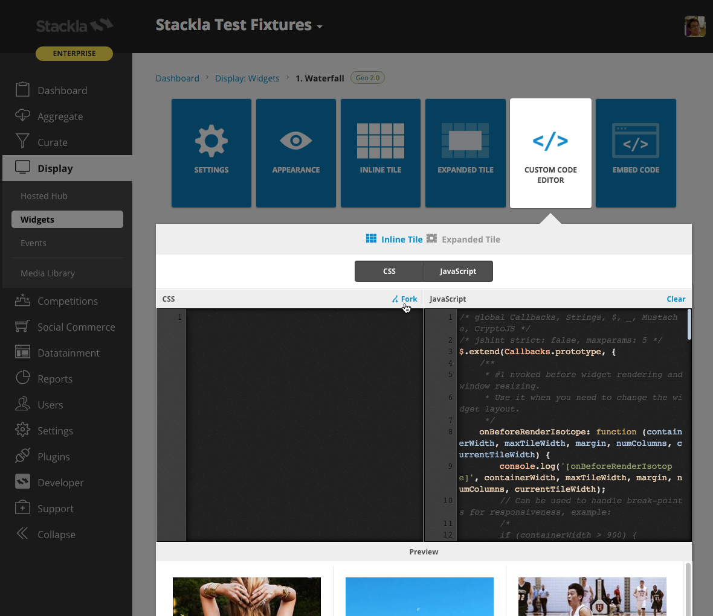
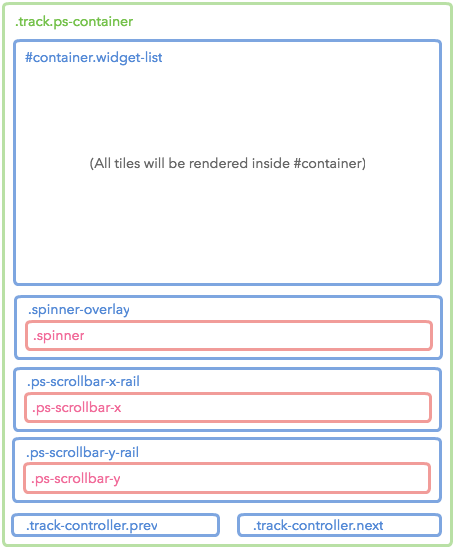
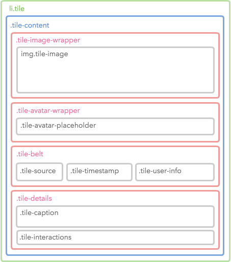
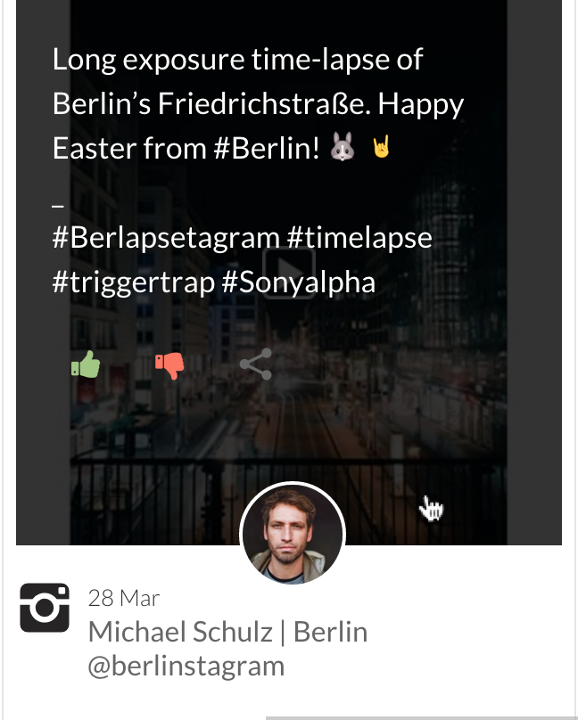

# Styling Carousel Widget


You are reading the Classic Widget Documentation

NextGen widgets are a new and improved way to display UGC content.&#x20;

On Oct 1st, all widgets created will be NextGen.

Please check your widget version on the Widget List page to see if it is **Classic** or **NextGen** widget.

You can read the [Nextgen widget documentation here](../widgets-nextgen/).


* [Overview](styling-carousel-widget.md#overview)
* [Use the Code Editor](styling-carousel-widget.md#use-the-code-editor)
* [Layout Structure](styling-carousel-widget.md#layout-structure)
* [Tile Structure](styling-carousel-widget.md#tile-structure)
* [Sample](styling-carousel-widget.md#sample)

## Overview

This article will instruct you on how to custom style a Carousel Widget using Custom CSS. If you're looking to customise a widget using our Javascript API - you can find the documentation [here](../../api-docs/rest/reference/widgets.md).

## Use the Code Editor

You can use the Code Editor to modify both your Custom CSS and JavaScript. The CSS editor supports [LESS CSS pre-processor](http://lesscss.org). That means you can use both traditional CSS syntax or the better LESS syntax.

### Fork from Nosto's UGC

You can now also click the **fork** link at the top-right corner of each editor pane. This brings the boilerplate code from the Nosto's UGC codebase so that you don't need to write from scratch or copy & paste from our Developer Portal.



## Layout Structure

The below Layout demonstrates the wrappers of our Widget tiles.

|

#### Diagram



|

#### Code

```
<!DOCTYPE html>
<html class="js no-touch small-screen-width">
<head>...</head>
<body class="cf-latest">
<div class="track ps-container">
<ul class="widget-list" id="container">
<!-- All tiles will be appeneded to here -->
</ul>
<div class="spinner-overlay">
<div class="spinner"></div>
</div>
<div class="ps-scrollbar-x-rail">
<div class="ps-scrollbar-x"></div>
</div>
<div class="ps-scrollbar-y-rail">
<div class="ps-scrollbar-y"></div>
</div>
<div class="track-controller prev">
<i class="fs fs-arrow-left2"></i>
</div>
<div class="track-controller next">
<i class="fs fs-arrow-right2"></i>
</div>
</div>
</body>
</html>
```

\| | ------------------------------------------------------------------------------ | -------------------------------------------------------------------------------------------------------------------------------------------------------------------------------------------------------------------------------------------------------------------------------------------------------------------------------------------------------------------------------------------------------------------------------------------------------------------------------------------------------------------------------------------------------------------------------------------------------------------------------------------------------------------------------------------------------------------------------------------------------------------------------------------------------------------------------------------------------------------------------------------------------------------------------------------------------------------------------------------------------------------------------------------------------------------------------------------------------------------------------- |

### Possible Scenarios

* Changing the background style by setting `body` selector.
* Changing the tile container style by setting `#container` selector.
* Changing the **AJAX indicator** style by setting `.spinner-overlay` and `.spinner` selectors.
* Changing the **Scroll bars** style by setting `.ps-scrollbar*` selectors.
* Changing the **Prev/Next Nav Arrow** style by setting `.track-controller` selectors.

## Tile Structure

The Carousel widget is mostly composed by tiles - as such it is much easier to customize the Carousel widget when you are familiar with it's structure.

| <p><strong>Diagram</strong></p><p></p> | <p><strong>Snapshot</strong></p><p></p> |
| ------------------------------------------------------------------------------------------------------------------------------- | ------------------------------------------------------------------------------------------------------------------------------ |

### Code

The diagram above only shows until the 4th level. Check the complete Tile structure by referencing the following code.

```
<li class="tile">
    <div class="tile-content">
        <div class="tile-image-wrapper">
            
            <div class="tile-media-loading"/>
        </div>
        <div class="tile-avatar-wrapper">
            <div class="tile-avatar-placeholder">
                
            </div>
            <a class="tile-avatar-link">
                
            </a>
        </div>
        <div class="tile-belt">
            <div class="tile-source"></div>
            <div class="tile-timestamp">...</div>
            <div class="tile-user-info">
                <div class="tile-user">
                    <a class="tile-user-top">
                        <div class="tile-source social-source"></div>
                        <span class="tile-user-name">...</span>
                    </a>
                    <a class="tile-user-bottom">
                        <span class="tile-user-handle">...</span>
                    </a>
                </div>
            </div>
        </div>
        <div class="tile-details">
            <div class="tile-caption">
                <div>
                    <p>...</p>
                </div>
            </div>
            <div class="tile-interactions">
                <span class="tile-interaction-like">
                    <a class="tile-interaction-link"></a>
                </span>
                <span class="tile-interaction-dislike">
                    <a class="tile-interaction-link"></a>
                </span>
                <span class="tile-interaction-share">
                    <a class="tile-interaction-link"></a>
                </span>
                <ul class="tile-sharing-expanded">
                    <li>
                        <a class="tile-share-button facebook"></a>
                        <div class="fs fs-facebook"></div>
                    </li>
                    <li>
                        <a class="tile-share-button twitter"></a>
                        <div class="fs fs-twitter"></div>
                    </li>
                    <li>
                        <a class="tile-share-button pinterest"></a>
                        <div class="fs fs-pinterest"></div>
                    </li>
                    <li>
                        <a class="tile-share-button gplus"></a>
                        <div class="fs fs-googleplus"></div>
                    </li>
                    <li>
                        <a class="tile-share-button linkedin"></a>
                        <div class="fs fs-linkedin"></div>
                    </li>
                    <li>
                        <a class="tile-share-button email"></a>
                        <div class="fs fs-envelope"></div>
                    </li>
                    <li>
                        <a class="tile-share-close"></a>
                    </li>
                </ul>
            </div>
        </div>
    </div>
</li>
```

## Sample

The following is an example of a customized widget.

```html
<script type="text/javascript">(function (d, id) { if (d.getElementById(id)) return; var t = d.createElement('script'); t.type = 'text/javascript'; t.src = '//assetscdn.stackla.com/media/js/widget/fluid-embed.js'; t.id = id; (document.getElementsByTagName('head')[0] || document.getElementsByTagName('body')[0]).appendChild(t); }(document, 'stackla-widget-js'));</script>
```

You can use the following CSS/LESS code as your Custom CSS boilerplate.

```less
@import url(https://fonts.googleapis.com/css?family=Lato);

html, body {
    background: #000;
}

body {
    padding: 0;
    margin: 5px 0;
}

.tile {
    border: none;
    border-radius: 4px;
    margin-left: 5px;
    margin-bottom: 10px;
    padding-left: 0;
    padding-right: 0;
    &-image {
        border-radius: 4px 4px 0 0;
    }
    &-avatar-wrapper {
        top: 6px;
        position: relative;
    }
    &-belt {
        background-color: #eee;
        border-radius: 0 0 4px 4px;
        margin-top: -20px;
        padding: 25px 15px;
        text-shadow: 0 1px 0 rgba(255, 255, 255, 1);
    }
    &-caption {
        border-radius: 0 0 4px 4px;
        font-family: 'Raleway', sans-serif;
        font-size: 18px !important;
        line-height: 1.5;
        padding: 0 15px;
    }
    &-details {
        .image &,
        .video & {
            height: 0;
            overflow: hidden;
            padding: 0;
            top: auto;
            bottom: 111px;
            transition: height .3s ease-in,
                        padding .4s linear,
                        opacity .6s linear;
        }
        .image:hover &,
        .video:hover & {
            padding: 20px;
            height: 306px;
        }
    }
}

.track-controller{
    color: #ffffff;
    background-color: #000000;
    border-radius: 0;
    opacity: 0.5;
    transition: opacity .3s ease;
    &:hover{
        opacity: 1;
    }
    &.prev{
        left: 0;
    }
    &.next{
        right: 0;
    }
}
```
