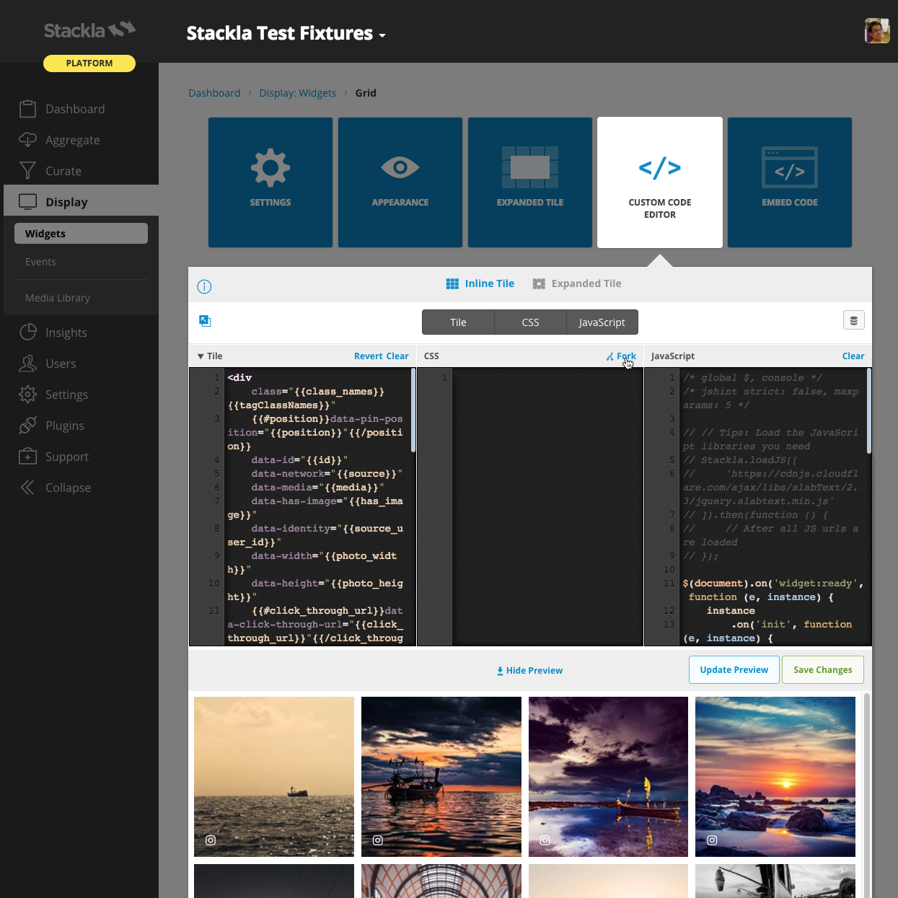

# Styling Grid Widget

* [Overview](styling-grid-widget.md#overview)
* [Use the Code Editor](styling-grid-widget.md#use-the-code-editor)
* [Layout Structure](styling-grid-widget.md#layout-structure)
* [Tile Structure](styling-grid-widget.md#tile-structure)
* [Sample](styling-grid-widget.md#sample)


You are reading the Classic Widget Documentation

NextGen widgets are a new and improved way to display UGC content.&#x20;

On Oct 1st, all widgets created will be NextGen.

Please check your widget version on the Widget List page to see if it is **Classic** or **NextGen** widget.

You can read the [Nextgen widget documentation here](../widgets-nextgen/).


## Overview

This article will instruct you on how to custom style a Grid Widget using Custom CSS. If you're looking to customise a widget using our Javascript API - you can find the documentation [here](../../api-docs/rest/reference/widgets.md).

## Use the Code Editor

You can use the Code Editor to modify both your Custom Tile, Custom CSS and JavaScript. The CSS editor supports [LESS CSS pre-processor](http://lesscss.org). That means you can use both traditional CSS syntax or the better LESS syntax.

### Fork from Nosto's UGC

You can now also click the **fork** link at the top-right corner of each editor pane. This brings the boilerplate code from the Nosto's UGC codebase so that you don't need to write from scratch or copy & paste from our Developer Portal.

### Custom Tile

Currently the Custom Tile editor is only available in the Grid, Masonry and the Blank Canvas widgets. Unlike other widgets, you are free to change the tile HTML structure according to your need. However, you will need to learn the template syntax [Mustache.js](https://mustache.github.io). You can check which [tile properties](../../api-docs/javascript/widgets/blank-canvas.md#helper-methods-tile-properties) are available.



## Layout Structure

The below Layout demonstrates the wrappers of our Widget tiles.

|

#### Diagram

.png>)

|

#### Code

```
<!DOCTYPE html>
<html>
<head>...</head>
<body class="cf-latest">
<div class="track">
<div class="container">
<!-- All tiles will be appeneded to here -->
</div>
</div>
</body>
</html>
```

\| | --------------------------------------------------------------------- | ------------------------------------------------------------------------------------------------------------------------------------------------------------------------------------------------------------------------------------------------------------------------------------------------------------------------------------------------------------- |

### Possible Scenarios

* Changing the background style by setting `body` selector.
* Changing the widget margin style by setting `.track` selector.
* Changing the tile container style by setting `.container` selector.

## Tile Structure

The Grid Widget is mostly composed of tiles - as such it is much easier to customize the Grid Widget when you are familiar with it's structure.

Below demostrates the default structure. You can change the tile structure using the custom code editor.

|

#### Code

```
<div class="tile">
<div class="tile-detail">
<div class="tile-caption">...</div>
<div class="tile-user">
<i class="tile-user-source fs fs-instagram"></i>
<a class="tile-user-link">
<span class="tile-user-handle">...</span>
</a>
</div>
</div>
<div class="tile-image"></div>
<div class="tile-source tile-source-instagram">
<i class="fs fs-instagram"></i>
</div>
</div>


Sample
The following is an example of a customized widget.
<script type="text/javascript">(function (d, id) { var t, el = d.scripts[d.scripts.length - 1].previousElementSibling; if (d.getElementById(id)) return; t = d.createElement('script'); t.src = '//assetscdn.stackla.com/media/js/widget/fluid-embed.js'; t.id = id; (d.getElementsByTagName('head')[0] || d.getElementsByTagName('body')[0]).appendChild(t); }(document, 'stackla-widget-js'));</script>
You can use the following CSS/LESS code as your Custom CSS boilerplate.
@import url('https://fonts.googleapis.com/css?family=Lobster|Raleway:200,400');.tile {    border-radius: 8px;    -webkit-filter: grayscale(100%);    &:hover {        opacity: 1;        -webkit-filter: none;        .tile-caption {            opacity: 1;        }        .tile-detail {            background-color: rgba(0, 0, 0, 0.2);        }    }    // Overlay    &-detail {        border-radius: 8px;        background-color: transparent;        font-weight: bold;        opacity: 1;        text-shadow: 1px 0 1px rgba(0, 0, 0, 0.7);    }    // Caption    &-caption {        opacity: 0;        font-family: Raleway;        font-weight: bold;        transition: opacity 1s;    }    // User    &-user {        text-shadow: 1px 0 1px rgba(0, 0, 0, 0.7);    }    &-user-handle {        font-size: 20px;        font-family: Lobster;    }    // Source    &-user,    &-source {        font-size: 24px;    }}
```
