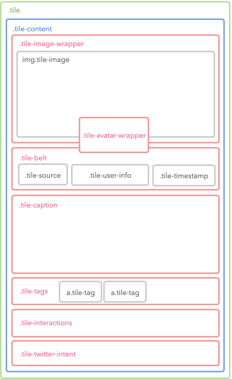
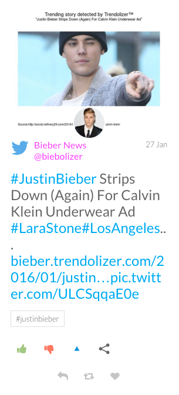

# Styling Waterfall Widget

* [Overview](styling-waterfall-widget.md#overview)
* [Use the CSS Code Editor](styling-waterfall-widget.md#use-the-code-editor)
* [Layout Structure](styling-waterfall-widget.md#layout-structure)
* [Tile Structure](styling-waterfall-widget.md#tile-structure)
* [Sample](styling-waterfall-widget.md#sample)
* [Helpful Resource](styling-waterfall-widget.md#helpful-resource)


You are reading the Classic Widget Documentation

NextGen widgets are a new and improved way to display UGC content.&#x20;

On Oct 1st, all widgets created will be NextGen.

Please check your widget version on the Widget List page to see if it is **Classic** or **NextGen** widget.

You can read the [Nextgen widget documentation here](../widgets-nextgen/styling-guides/).


## Overview

This article will instruct you on how to custom style a Waterfall Widget using Custom CSS. If you're looking to customise a widget using our Javascript API - you can find the documentation [here](../../api-docs/rest/reference/widgets.md).

## Use the Code Editor

You can use the Code Editor to modify both your Custom CSS and JavaScript. The CSS editor supports [LESS CSS pre-processor](http://lesscss.org). That means you can use both traditional CSS syntax or the better LESS syntax.

### Fork from Nosto's UGC

You can now also click the **fork** link at the top-right corner of each editor pane. This brings the boilerplate code from the Nosto's UGC codebase so that you don't need to write from scratch or copy & paste from our Developer Portal.

.png>)

## Layout Structure

The below Layout demonstrates the wrappers of our Widget tiles.

|

#### Diagram

.png>)

|

#### Code

```
<!DOCTYPE html>
<html class="csstransforms csstransforms3d csstransitions js no-touch">
<head>...</head>
<body>
<div class="track">
<div id="container" class="container isotope">
<!-- All tiles will be appeneded to here -->
</div>
<a class="button js-load-more">Load more content</a>
<div class="spinner-overlay">
<div class="spinner"></div>
</div>
</div>
</body>
</html>
```

\| | ------------------------------------------------------------------------------- | ------------------------------------------------------------------------------------------------------------------------------------------------------------------------------------------------------------------------------------------------------------------------------------------------------------------------------------------------------------------------------------------------------------------------------------------------------------------------------------------------------------------------------------------------------------------------------------------------------------------------------------------- |

### Possible Scenarios

* Changing the background style by setting `body` selector.
* Changing the tile container style by setting `#container` selector.
* Changing the **Load More Data** style by setting `.js-load-more` selector.
* Changing the **AJAX indicator** style by setting `.spinner-overlay` and `.spinner` selectors.

## Tile Structure

The Waterfall widget is mostly composed by tiles - as such it is much easier to customise the Waterfall widget when you are familiar with it's structure.

| <p><strong>Diagram</strong></p><p></p> | <p><strong>Snapshot</strong></p><p></p> |
| -------------------------------------------------------------------------------------------------------------------------------- | ------------------------------------------------------------------------------------------------------------------------------- |

### Code

The diagram above only shows until the 4th level. Check the complete Tile structure by referencing the following code.

```
<div class="tile ">
    <div class="tile-content">
        <div class="tile-image-wrapper">
            
            <div class="tile-media-loading">
                <span class="tile-media-loading-icon"></span>
            </div>
        </div>
        <div class="tile-avatar-wrapper">
            <div class="tile-avatar-placeholder">
                
            </div>
            <a class="tile-avatar-link">
                
            </a>
        </div>
        <div class="tile-belt">
            <div class="tile-source tile-source-twitter">
                <i class="fs fs-twitter"></i>
            </div>
            <div class="tile-timestamp"></div>
            <div class="tile-user-info">
                <div class="tile-user">
                    <a class="tile-user-top">
                        <span class="tile-user-name"></span>
                    </a>
                    <a class="tile-user-bottom">
                        <span class="tile-user-handle"></span>
                    </a>
                </div>
            </div>
        </div>
        <div class="tile-caption"></div>
        <div class="tile-tags">
            <a class="tile-tag"></a>
        </div>
        <div class="tile-interactions">
            <span class="tile-interaction-like">
                <a class="tile-interaction-link">
                    <i class="fs fs-thumbs-up"></i>
                </a>
                <span class="tile-interaction-count"></span>
            </span>
            <span class="tile-interaction-dislike">
                <a class="tile-interaction-link">
                    <i class="fs fs-thumbs-down"></i>
                </a>
                <span class="tile-interaction-count"></span>
            </span>
            <span class="tile-interaction-vote">
                <a class="tile-interaction-link">
                    <i class="fs fs-triangle-up"></i>
                </a>
                <span class="tile-interaction-count"></span>
            </span>
            <span class="tile-interaction-share">
                <a class="tile-interaction-link">
                    <i class="fs fs-share"></i>
                </a>
                <ul class="tile-sharing-expanded">
                    <li>
                        <a class="tile-share-button">
                            <div class="fs fs-facebook"></div>
                        </a>
                    </li>
                    <li>
                        <a class="tile-share-button twitter">
                            <div class="fs fs-twitter"></div>
                        </a>
                    </li>
                    <li>
                        <a class="tile-share-button pinterest">
                            <div class="fs fs-pinterest"></div>
                        </a>
                    </li>
                    <li>
                        <a class="tile-share-button gplus">
                            <div class="fs fs-googleplus"></div>
                        </a>
                    </li>
                    <li>
                        <a class="tile-share-button linkedin">
                            <div class="fs fs-linkedin"></div>
                        </a>
                    </li>
                    <li>
                        <a class="tile-share-button email">
                            <div class="fs fs-envelope"></div>
                        </a>
                    </li>
                    <li>
                        <a class="tile-share-close">
                            <i class="fs fs-close"></i>
                        </a>
                    </li>
                </ul>
            </span>
        </div>
        <div class="tile-twitter-intent">
            <a class="tile-twitter-reply">
                <i class="fs fs-reply"></i>
            </a>
            <a class="tile-twitter-retweet">
                <i class="fs fs-retweet"></i>
            </a>
            <a class="tile-twitter-favorite">
                <i class="fs fs-heart"></i>
            </a>
        </div>
    </div>
</div>
```

## Sample

The following is an example of a customized widget.

```html
<script type="text/javascript">(function (d, id) { if (d.getElementById(id)) return; var t = d.createElement('script'); t.type = 'text/javascript'; t.src = '//assetscdn.stackla.com/media/js/widget/fluid-embed.js'; t.id = id; (document.getElementsByTagName('head')[0] || document.getElementsByTagName('body')[0]).appendChild(t); }(document, 'stackla-widget-js'));</script>
```

You can use the following CSS/LESS code as your Custom CSS boilerplate.

```
@import url(https://fonts.googleapis.com/css?family=Lato);

html, body {
    background: #000;
}

.js-load-more {
    background: rgba(51, 102, 153, 0.8);
    border-radius: 4px 4px 0 0;
    bottom: 0;
    display: inline-block;
    font-size: 12px;
    font-weight: bold;
    left: ~"calc(50% - 68px)";
    position: absolute;
    text-transform: uppercase;
    transition: background 1s linear;
    &:hover {
        background: #0198cf;
    }
}

.tile {
    border: none;
    border-radius: 4px;
    &-content {
        margin: 0;
    }
    &-image-wrapper {
        margin-bottom: -60px;
        &:after {
            background: rgba(255, 255, 255, 0.2);
            bottom: 0;
            content: '';
            left: 0;
            position: absolute;
            right: 0;
            top: 0;
            transition: background 0.3s linear;
        }
        &:hover {
            &:after {
                background: rgba(255, 255, 255, 0);
            }
        }
    }
    &-image {
        border-radius: 4px 4px 0 0;
    }
    &-avatar-wrapper {
        top: 14px;
        position: relative;
    }
    &-belt {
        background-color: #eee;
        padding: 15px;
        text-shadow: 0 1px 0 rgba(255, 255, 255, 1);
    }
    &-tags {
        padding: 0 15px;
    }
    &-caption {
        font-family: 'Raleway', sans-serif;
        font-size: 18px !important;
        line-height: 1.5;
        padding: 0 15px;
    }
    &-twitter-intent {
        padding-bottom: 15px;
    }
}
```

## Helpful Resource

You can download a layered PSD to demonstrate our widget [here](https://github.com/Stackla/docs/blob/master/docs/media/guides/assets/20/stackla-waterfall-wireframe-2016.psd.zip).
