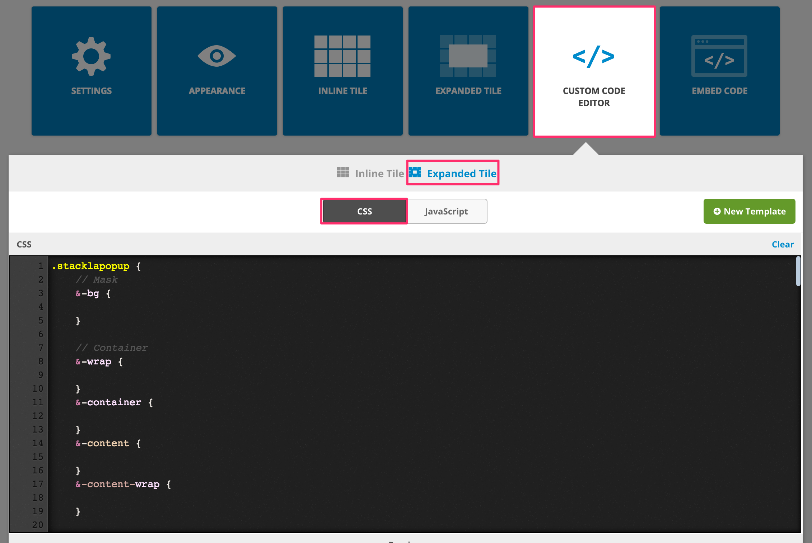
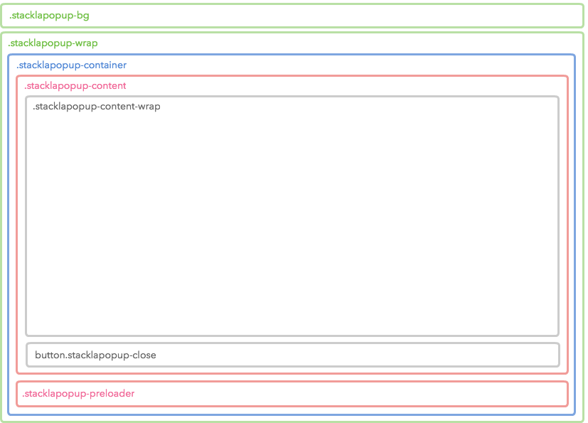
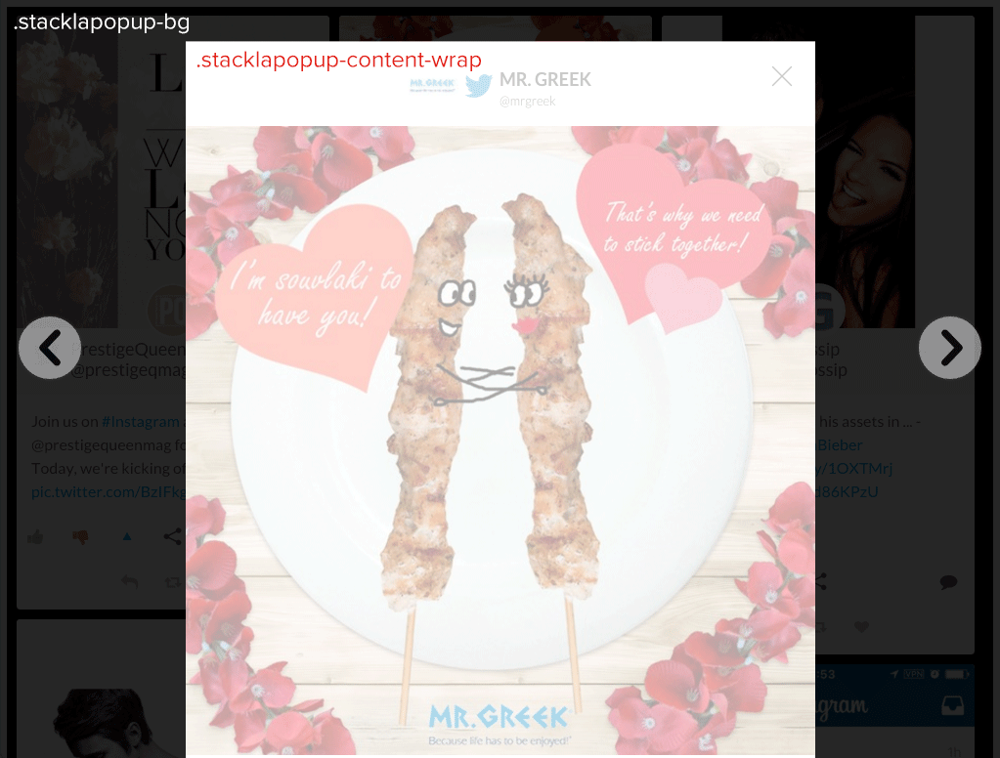
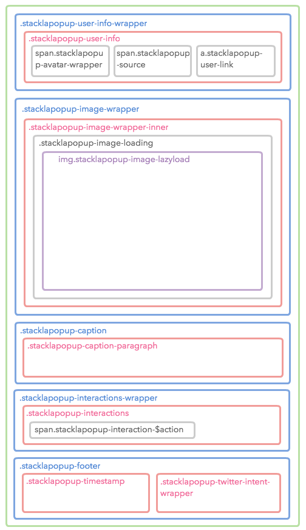
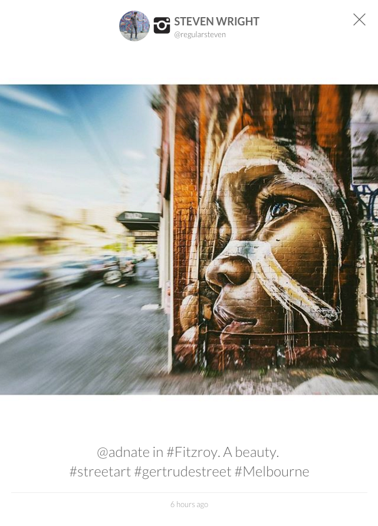
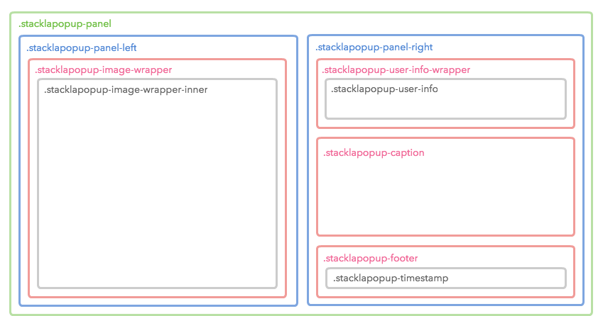
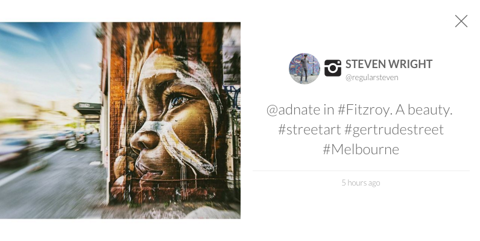

# Styling Widget Expanded Tile

* [Overview](styling-widget-expanded-tile.md#overview)
* [Use the CSS Code Editor](styling-widget-expanded-tile.md#use-the-css-code-editor)
* [Layout Structure](styling-widget-expanded-tile.md#layout-structure)
* [Tile Structure](styling-widget-expanded-tile.md#tile-structure)
* [Sample](styling-widget-expanded-tile.md#sample)
* [Helpful Resource](styling-widget-expanded-tile.md#helpful-resource)


You are reading the Classic Widget Documentation

NextGen widgets are a new and improved way to display UGC content.&#x20;

On Oct 1st, all widgets created will be NextGen.

Please check your widget version on the Widget List page to see if it is **Classic** or **NextGen** widget.

You can read the [Nextgen widget documentation here](../widgets-nextgen/styling-guides/how-to-make-expanded-tiles-vertical.md).


## Overview

This article will instruct you on how to custom style the Expanded Tile for our Widgets using Custom CSS. If you're looking to customise a widget using our Javascript API - you can find the documentation [here](../../api-docs/rest/reference/widgets.md).

## Use the CSS Code Editor

You can use the CSS Code Editor to modify your Widget Expanded Tile CSS. It supports [LESS CSS pre-processor](http://lesscss.org). That means you can use both traditional CSS syntax or the better LESS syntax.



### Tips

The Expanded Tile actually exists in the parent page instead of Visual UGC's iframe. That means you can write custom CSS in your own page rather than in our Code Editor. However, we recommend that you use our editor for ease of management.

## Container Structure

The below diagram demonstrates the container of our Widget Expanded Tile. It contains the required HTML elements for the background mask and tile centerizing.

| <p><strong>Diagram</strong></p><p></p> |
| -------------------------------------------------------------------------------------------------------------------------------------- |
| <p><strong>Snapshot</strong></p><p></p>   |

### Possible Scenarios

* Changing the mask style by setting `.stacklapopup-bg` selector.
* Changing the maximum width of Expanded Tile by setting `.stacklapopup-content-wrap` selector.
* Changing the close button style by setting `.stacklapopup-close` selector.

### Tips

#### Reset

You can break the Expanded Tile styling when you set rules for common tags such as `div` or `span`. To avoid this, you can manually apply the following CSS rules:

```
.stacklapopup-wrap * {
    margin: 0;
    padding: 0;
}
```

#### z-index

You may have some overlays with z-index values in your page. To display these correctly you may need to overwrite the default z-index values.

```
.stacklapopup-bg {
    z-index: 1042; /* Default value */
}
.stacklapopup-wrap {
    z-index: 1043; /* Default value */
}
```

## Tile Structure

The Expanded Tile has two different layouts which are **Portrait** and **Landscape**.

### Portrait

| <p><strong>Diagram</strong></p><p></p> | <p><strong>Snapshot</strong></p><p></p> |
| ---------------------------------------------------------------------------------------------------------------------------------------- | -------------------------------------------------------------------------------------------------------------------------------------- |

### Landscape

Landscape has more HTML elements than Portrait for layout purpose. They are `.stacklapopup-panel`, `.stacklapopup-panel-left` and `.stacklapopup-panel-right`. All the inner blocks share the same structure as the Portrait layout.

| <p><strong>Diagram</strong></p><p></p> |
| ----------------------------------------------------------------------------------------------------------------------------------------- |
| <p><strong>Snapshot</strong></p><p></p>   |

### Code

The diagrams above only show up to the 4th level. Check the complete Expanded Tile structure by referencing the following code.

```
<div class="stacklapopup-wrap stacklapopup-close-btn-in stacklapopup-auto-cursor stacklapopup-ready">
    <div class="stacklapopup-container stacklapopup-s-ready stacklapopup-inline-holder">
        <div class="stacklapopup-content">
            <div class="stacklapopup-content-wrap instagram image stacklapopup-horizontal stacklapopup-landscape stacklapopup-has-author stacklapopup-has-timestamp stacklapopup-has-caption stacklapopup-has-interactions">
                <div class="stacklapopup-panel">
                    <div class="stacklapopup-panel-left">
                        <div class="stacklapopup-image-wrapper stacklapopup-js-zoom">
                            <div class="stacklapopup-image-wrapper-inner">
                                <div class="stacklapopup-image-loading">
                                   
                                </div>
                            </div>
                        </div>
                    </div><!-- .stacklapopup-panel-left (end) -->
                    <div class="stacklapopup-panel-right">
                        <div class="stacklapopup-user-info-wrapper">
                            <div class="stacklapopup-user-info">
                                <span class="stacklapopup-avatar-wrapper">
                                    <a class="stacklapopup-avatar-link">
                                       
                                    </a>
                                </span>
                                <span class="stacklapopup-source stacklapopup-source-instagram">
                                    <i class="fs fs-instagram"></i>
                                </span>
                                <a class="stacklapopup-user-link">
                                    <div class="stacklapopup-user-top">
                                        <span class="stacklapopup-user-name"></span>
                                    </div>
                                    <div class="stacklapopup-user-bottom">
                                        <span class="stacklapopup-user-handle"></span>
                                    </div>
                                </a>
                            </div>
                        </div>
                        <div class="stacklapopup-caption">
                            <p class="stacklapopup-caption-paragraph"></p>
                        </div>
                        <div class="stacklapopup-interactions-wrapper">
                            <div class="stacklapopup-interactions">
                                <span class="stacklapopup-interaction-like">
                                    <a class="stacklapopup-interaction-link on">
                                        <i class="fs fs-thumbs-up"></i>
                                    </a>
                                    <span class="stacklapopup-interaction-count"></span>
                                </span>
                                <span class="stacklapopup-interaction-dislike">
                                    <a class="stacklapopup-interaction-link">
                                        <i class="fs fs-thumbs-down"></i>
                                    </a>
                                    <span class="stacklapopup-interaction-count"></span>
                                </span>
                                <span class="stacklapopup-interaction-vote">
                                    <a class="stacklapopup-interaction-link">
                                        <i class="fs fs-triangle-up"></i>
                                    </a>
                                    <span class="stacklapopup-interaction-count"></span>
                                </span>
                                <span class="stacklapopup-interaction-comment ">
                                    <a class="stacklapopup-interaction-link js-stacklapopup-comment-button">
                                        <i class="fs fs-comment"></i>
                                    </a>
                                </span>
                            </div>
                        </div>
                        <div class="stacklapopup-footer">
                            <div class="stacklapopup-timestamp"></div>
                        </div>
                    </div><!-- .stacklapopup-panel-right (end) -->
                </div><!-- .stacklapopup-panel (end) -->
                <div class="stacklapopup-comments-wrap">
                    <div class="stacklapopup-comments-user clearfix">
                        <ul class="stacklapopup-comments-list"></ul>
                        <form>
                            <textarea class="stacklapopup-comments-user-textarea"></textarea>
                            <input class="stacklapopup-comments-user-input">
                            <button type="button" class="stacklapopup-comments-user-button">
                                <i class="fs fs-arrow-right6"></i>
                            </button>
                            <div class="stacklapopup-comments-user-message">
                                <i class="stacklapopup-comments-user-message-icon fs fs-success"></i>
                            </div>
                        </form>
                    </div><!-- .stacklapopup-comments-wrap (end) -->
                </div>
                <button class="stacklapopup-arrow stacklapopup-arrow-left">
                    <i class="stacklapopup-arrow-icon fs fs-arrow-left2"></i>
                </button>
                <button  class="stacklapopup-arrow stacklapopup-arrow-right">
                    <i class="stacklapopup-arrow-icon fs fs-arrow-right2"></i>
                </button>
                <button class="stacklapopup-close"></button>
            </div><!-- .stacklapopup-content-wrap (end) -->
        </div><!-- .stacklapopup-content (end) -->
        <div class="stacklapopup-preloader"></div>
    </div><!-- .stacklapopup-container (end) -->
</div><!-- .stacklapopup-wrap (end) -->
```

## Sample

The following is an example of a customized Expanded Tile.

\<br/>\<p> You can use the following CSS/LESS code as your Custom CSS boilerplate

```
@import url(https://fonts.googleapis.com/css?family=Satisfy);

.stacklapopup {
    /* Mask */
    &-bg {
        background: #fff;
        opacity: 0.5;
    }
    &-content-wrap {
        border-radius: 10px;
        border: solid 1px #ccc;
        box-shadow: 0 0 10px rgba(0, 0, 0, 0.3);
    }
    &-user-info-wrapper {
        background: #eee;
        border-radius: 10px 10px 0 0;
        color: #333;
        display: block;
        margin-bottom: 0;
        padding: 10px;
        text-shadow: 1px 1px 0 rgba(255, 255, 255, 0.7);
    }
    &-caption {
        font-family: 'Satisfy', cursive;
        font-size: 36px;
    }
    &-tags {
        font-size: 14px;
        font-weight: bold;
    }
    &-interactions {
        margin: 0 10px;
    }
    &-footer {
        background: #eee;
        border-radius: 0 0 10px 10px;
        color: #333;
        padding: 10px;
        text-shadow: 1px 1px 0 rgba(255, 255, 255, 0.7);
    }
    &-timestamp {
        font-weight: bold;
    }
    &-preloader {
        display: none;
    }
}

/* Overwrite some special rules from Portrait layout */
.stacklapopup-portrait {
    &.stacklapopup-content-wrap {
        padding: 0;
    }
    .stacklapopup-image-wrapper,
    .stacklapopup-video-wrapper {
        margin: 0;
    }
}
```

## Helpful Resource

You can download a layered PSD to demonstrate our Expanded Tile layout [here](https://github.com/Stackla/docs/blob/master/wp-content/uploads/2017/12/stackla-lightbox-wireframe-2016.psd.zip).
