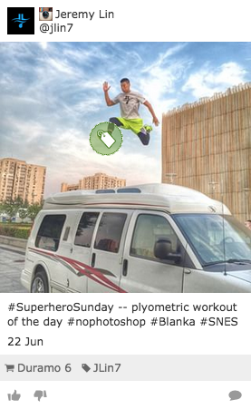
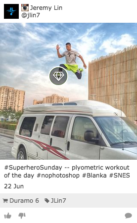
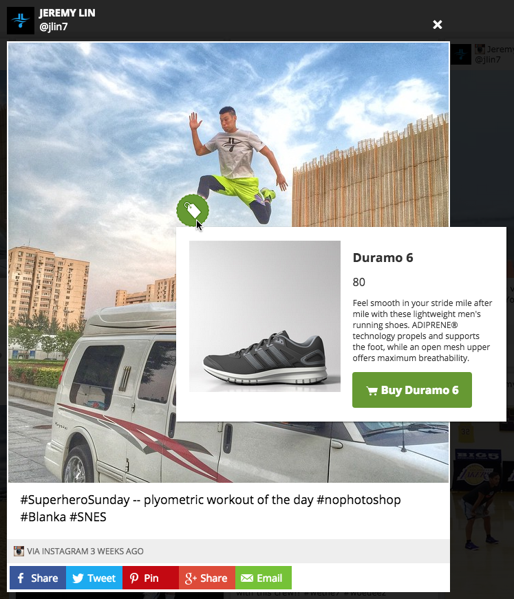
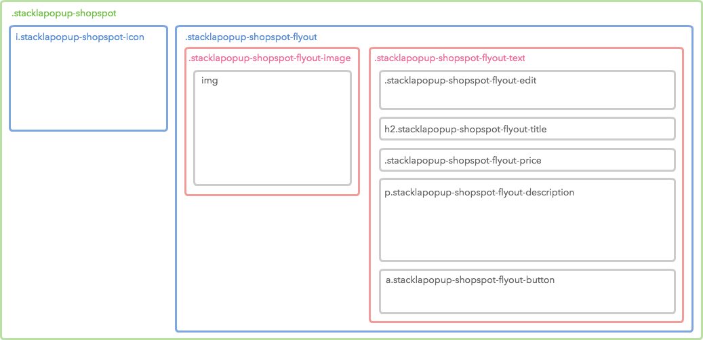
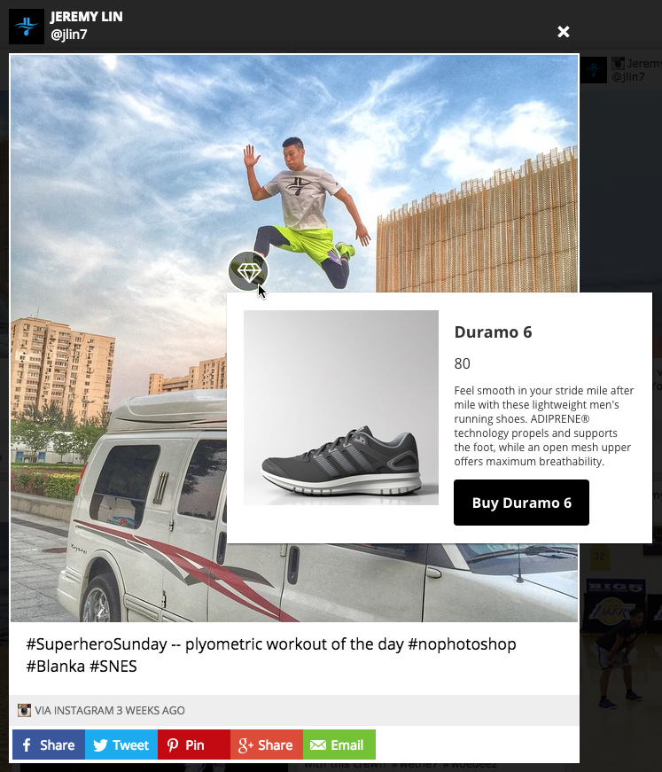

# Styling Widget Shopspots


You are reading the Classic Widget Documentation

Nextgen widgets are a new and improved way to display UGC content.&#x20;

Read the [Nextgen widget documentation here](../widgets-nextgen/).


## Overview

This article will instruct you on customizing Shopspot style in both Tiles and Expanded Tiles (a.k.a Lightbox).

## Shopspots in Tiles

You can style Shopspots in tiles via the Custom CSS tab in Nosto Admin Portal.



### HTML Structure

The structure is pretty simple. It uses `.tile-shopspot` as namespace.

```
<span class="tile-shopspot">
  :before
  <i class="tile-shopspot-icon"></i>
</span>
```

Be aware that our default style also makes use of the `:before` pseudo class for inner border. Remember to reset it if you don't need it.

### Sample CSS



By pasting the following code into your **Custom CSS** in Nosto'sNosto's UGC Widget setting, you can change the default style of Tile Shopspot.

```
@import 'https://maxcdn.bootstrapcdn.com/font-awesome/4.3.0/css/font-awesome.min.css';

.tile-shopspot {
    background-color: rgba(0, 0, 0, 0.5);
    border: solid 2px #fff;
}
.tile-shopspot-icon {
    content: 'f219' !important;
    background: none;
    font-family: FontAwesome;
    font-size: 20px;
    line-height: 36px;
}
```

## Shopspots in Expanded Tile (a.k.a Lightbox)

Since Expanded Tile resides in your page instead of Nosto's UGC Widget iframe, you will need to put your customized stylesheet **in your own page**, not via the Nosto Admin Portal.

The following snapshot illustrates the style of default Expanded Tile.



### HTML Structure

A Shopspot element (`.stacklapopup-shopspot`) wraps both **icon** (`.stacklapopup-shopspot-icon`) and **flyout** (`.stacklapopup-shopspot-flyout`). The following diagram shows detailed HTML structure with CSS class names.



The following is the sample HTML source code, which has the same architecture with the above diagram.

```
<div class="stacklapopup-shopspot">
    <i class="stacklapopup-shopspot-icon"></i>
    <div class="stacklapopup-shopspot-flyout">
        <div class="stacklapopup-shopspot-flyout-image">
            
        </div>
        <div class="stacklapopup-shopspot-flyout-text">
            <h2 class="stacklapopup-shopspot-flyout-title">...</h2>
            <div class="stacklapopup-shopspot-flyout-price">...</div>
            <p class="stacklapopup-shopspot-flyout-description">...</p>
            <a class="stacklapopup-shopspot-flyout-button" href="..." target="_blank">
                <i class="stacklapopup-shopspot-flyout-button-icon"></i>
                <span class="stacklapopup-shopspot-flyout-button-text">...</span>
            </a>
        </div>
    </div>
</div>
```

### How Does Flyout Work?

Our default style restricts the dimension to `46x46` and sets `overflow:hidden` style so the user can't see the flyout by default. When the user hovers to an icon, the hover class (`.stacklapopup-shopspot-hover`) will be attached which sets `overflow: visible` and displays the flyout.

### Sample CSS



By pasting the following code into one of stylesheets of your website, you can get the above customized style.

```
@import 'https://maxcdn.bootstrapcdn.com/font-awesome/4.3.0/css/font-awesome.min.css';

.stacklapopup-shopspot-wrapper .stacklapopup-shopspot {
    background-color: rgba(0, 0, 0, 0.5);
    border: solid 2px #fff;
    -webkit-font-smoothing: antialiased;
}
.stacklapopup-shopspot-wrapper .stacklapopup-shopspot-hover {
    box-shadow: none;
}
.stacklapopup-shopspot-wrapper .stacklapopup-shopspot-icon:before {
    background: none;
    content: 'f219' !important;
    font-family: FontAwesome;
    font-size: 24px;
    font-style: normal;
    line-height: 46px;
}
.stacklapopup-shopspot-wrapper .stacklapopup-shopspot-flyout-button,
.stacklapopup-shopspot-wrapper .stacklapopup-shopspot-flyout-button:link,
.stacklapopup-shopspot-wrapper .stacklapopup-shopspot-flyout-button:hover {
    background-color: #000;
}
.stacklapopup-shopspot-wrapper .stacklapopup-shopspot-flyout-button-icon {
    display: none;
}
```

### Shopspot Animation

The default style sets `top: -24px;` and `left: calc(100% -24px);` so that Shopspot flies from top-right corner. The default Shopspot dimension is 24px \* 24px.

#### Flying from Left-Top Corner

You can simply change the `top` and `left` properties to `-24px` to make it flying from top-left corner.

```
.stacklapopup-shopspot {
    top: -24px;
    left: -24px;
}
```

#### Removing Animation

You can remove the animation by using the following CSS code.

```
.stacklapopup-shopspot {
    top: auto;
    left: auto;
    transition: none;
}
```

#### Replacing with Fade-in

You can use CSS3 Animation to achieve many effects. The following fade-in effect is just an example.

```
@-webkit-keyframes fade-in {
    0% {opacity: 0;}
    100% {opacity: 1;}

}
@keyframes fade-in {
    0% {opacity: 0;}
    100% {opacity: 1;}
}
.stacklapopup-shopspot {
    top: auto;
    left: auto;
    transition: none;
    -webkit-animation: fade-in 0.5s;
    animation: fade-in 0.5s;
}
```
