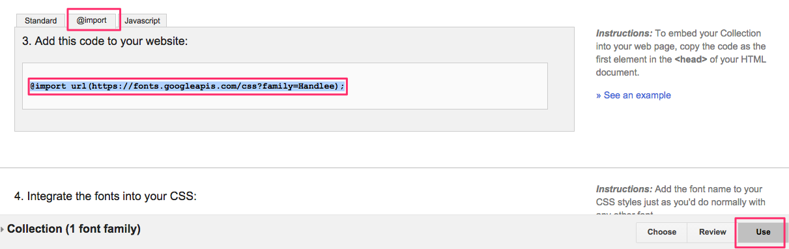
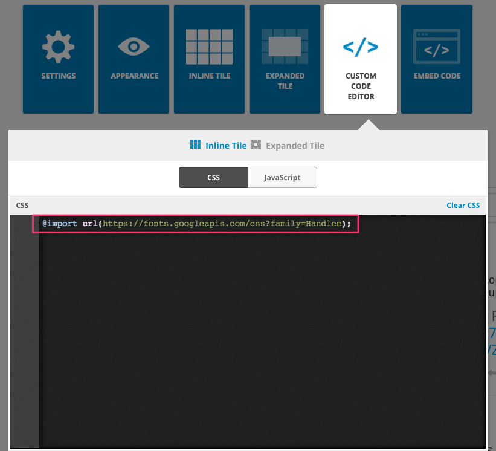
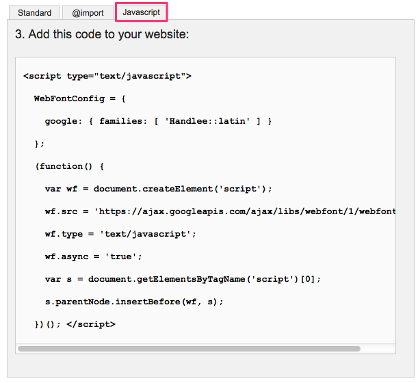
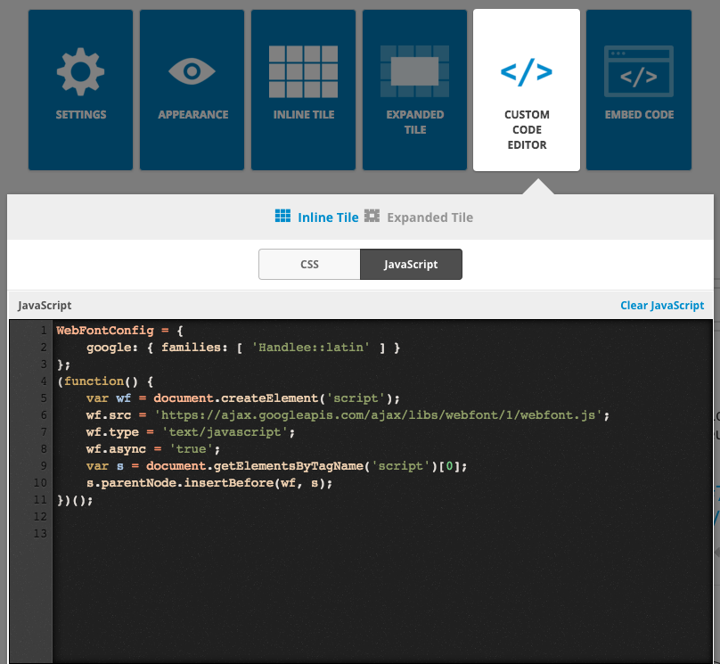
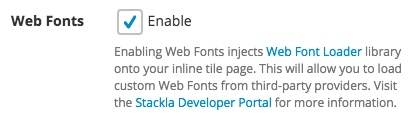
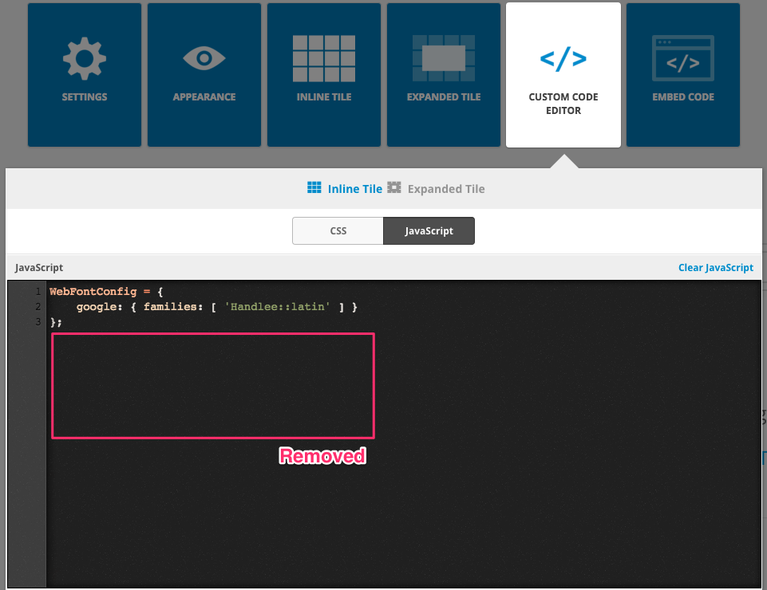
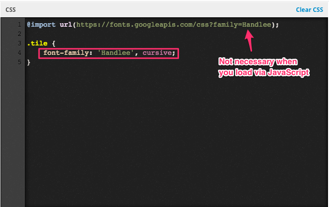

# Using Web Fonts in Widgets


You are reading the Classic Widget Documentation

NextGen widgets are a new and improved way to display UGC content.&#x20;

On Oct 1st, all widgets created will be NextGen.

Please check your widget version on the Widget List page to see if it is **Classic** or **NextGen** widget.

You can read the [Nextgen widget documentation here](../widgets-nextgen/styling-guides/using-webfonts-in-widgets.md).


* [Overview](using-webfonts-in-widgets.md#overview)
* [Step 1 - Load Fonts](using-webfonts-in-widgets.md#step1)
  * [Via the Custom CSS](using-webfonts-in-widgets.md#via-css)
  * [Via the Custom JavaScript](using-webfonts-in-widgets.md#via-js)
    * [Tips - Enabling Web Fonts](using-webfonts-in-widgets.md#webfonts)
    * [What's the differences](using-webfonts-in-widgets.md#differences)
* [Step 2 - Use Fonts](using-webfonts-in-widgets.md#step2)
* [Sample](using-webfonts-in-widgets.md#sample)

## Overview

This article will instruct you on how to use web fonts from different providers such as [Google](https://www.google.com/fonts), [Typekit](https://typekit.com), [Fonts.com](http://www.fonts.com) or [Fontdeck](http://fontdeck.com).

## Step 1 - Load Fonts

You will need to download the font files before using them. Let's take a look at some different approaches to load fonts onto our web page.

### Via the Custom CSS

The easiest way to use Web Fonts is via the CSS @import statement. You can get the required CSS code from the mentioned providers and paste it into Nosto's UGC Custom CSS Code Editor.

Let's take a look at Google Fonts as an example. After you select the fonts you need, you can go to the **Use** page and get the required code from the @import tab.



Paste the code into the Nosto's UGC Custom CSS Editor.



### Via the Custom JavaScript

An alternative way to load font files is via Javascript. Let's take a look at Google Fonts as an example again.



Paste the code into the Nosto's UGC Custom JavaScript Editor. Please note the `<script/>` tags must be removed.



#### Tips - Enabling Web Fonts

By enabling the **Web Fonts** option in Appearance tab, you just need to configure the `WebFontConfig` global variable without loading the Web Font Loader library manually.

|  |  |
| ------------------------------------------------------------------------ | ----------------------------------------------------------------------- |

Note the **Web Fonts** config option currently is only available in Waterfall, Carousel, and Vertical Fluid widgets. And it only affects the inline tiles, not the expanded tile.

#### What's the Differences?

You may wonder why we need the more complicated JavaScript method. This is because the Web Font Loader gives us additional control. The following code snippet illustrates minimizing the flash of styled text by setting `sessionStorage`.

```
WebFontConfig = {
    // other options and settings...
    active: function() {
        sessionStorage.font = true;
    }
}
```

For more information, check the official [Web Font Loader](https://github.com/typekit/webfontloader) repository. We also recommend you to read the [Loading Web Fonts with the Web Font Loader](https://css-tricks.com/loading-web-fonts-with-the-web-font-loader) article on the [CSS-Tricks](https://css-tricks.com) website.

## Step 2 - Use Fonts

After loading fonts properly, all you need to do is add the font name to your CSS styles. For example:



## Sample

In the following example, we are going to use the Custom Javascript editor to load multiple web fonts from different font providers. Note that we have enabled the Web Fonts option in the Appearance tab. We have also enabled sessionStorage to avoid the flash issue.


### Inline Tile Custom JavaScript

Here we specify how to use the "Open Sans Condensed" font from Google and a TypeKit kit containing the "Industry" font.

```
WebFontConfig = {
    google: {
        families: [
            'Open+Sans+Condensed:300:latin'
        ]
    },
    typekit: {
        id: 'YOUR KIT ID'
    },
    active: function() {
        sessionStorage.font = true;
    }
};
```

Note that TypeKit is a paid service, you need to register by yourself and use it on Nosto's UGC widgets.

### Inline Tile Custom CSS

```
.tile-user {
    font-family: 'Open Sans Condensed', sans-serif;
}
.tile-caption {
    font-family: 'industry', sans-serif;
}
```

### Expanded Tile Custom CSS

To demonstrate the Expanded Tile Custom CSS we've used the CSS @import method to load the "Open Sans Condensed" and "Rajdhani" fonts from Google Fonts.

```
@import url(https://fonts.googleapis.com/css?family=Open+Sans+Condensed:300|Rajdhani);

.stacklapopup-user-info {
    font-family: 'Open Sans Condensed', sans-serif;
}
.stacklapopup-caption {
    font-family: 'Rajdhani', sans-serif;
}
```

Currenly we don't provide the Web Font Loader in the Expanded Tile. You can only load the Web Fonts from CSS @import.

### Widget with Customised Web Fonts

```html
<script type="text/javascript">(function (d, id) { if (d.getElementById(id)) return; var t = d.createElement('script'); t.type = 'text/javascript'; t.src = '//assetscdn.stackla.com/media/js/widget/fluid-embed.js'; t.id = id; (document.getElementsByTagName('head')[0] || document.getElementsByTagName('body')[0]).appendChild(t); }(document, 'stackla-widget-js'));</script>
```
