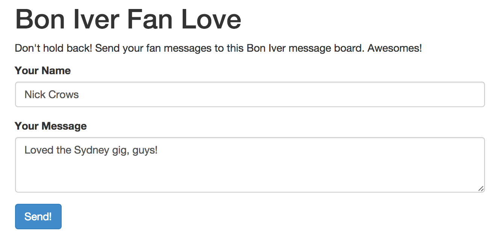

# Posting content into Nosto via Tile API

## Overview

Aside from aggregating from social networks, one thing not to be overlooked is Nosto's UGC ability to collect crowdsourced content that is not off social media. In this guide, we explore how to programmatically push content to Nosto's UGC via a UGC Post Feed Term.

We will create a simple one page microsite which will feature a HTML form to POST data to a backend processor, which will in turn push the data to Nosto's UGC via Tile API.

## Key concepts

### Tile

In your Stack, the name Tile is given to a piece of content that has been saved and made available for moderation. In this case it will be the resulting data posted to your Stack.

### Nosto's UGC Post Feed Term

This is a special type of Term (not to be confused with the Nosto's UGC Post Term) that you can use to draw content submitted via Tile API through. This allows you or your Stack admin to configure automatic moderation for the content, as well as other rules on how to treat the content. In the majority of cases, the API client performs most of the moderation and programmatic categorising of content, but some of these specific pieces can be controlled by an admin so that a code change is not needed.

### Example Application

When running a campaign that collects user-generated content (UGC), it's often useful to offer a form for users to post content directly, as well as accept content via Social Media. In this example, we will create a small PHP application that will serve as a View showing the microsite application, and contain a form that will accept a message of fan-love towards [Bon Iver](http://boniver.org), your favorite band.

## The Fun Part

### Getting Started

In this example we will need to do the following:

1. Create the Term
2. Create the microsite View
3. Create the backend app
4. Moderate the posted content

### Create the Term

Creating a new Nosto's UGC **Post Feed term** is done in the same manner as creating any other term. Go to **Discovery > Terms** and click **Create Term**.

In the New Term screen, select the pink **Nosto icon** as the Term Network

<figure><figcaption></figcaption></figure>

On the **Term type will be** select "**Post**" as the Type

<figure><figcaption></figcaption></figure>

You can name the term anything you like; however entering something familiar to the purpose will help you find it later in the list.

The "Display Name" field will show up in the case that the name parameter is not provided in the POST (this was not a mandatory field in the past, but it is now).

<figure><figcaption></figcaption></figure>

In the moderation settings for the term you can choose whether or not you want to auto-Publish the content, or if you would like to Queue it for later curation.

### Create the microsite View

Creating the View is super easy. All we need to do is create a page with a form to collect the user's Name and Message. That form will be posted to the backend via AJAX (helped along by jQuery) to the controller we will build in the backend.

### Create the backend app

The backend app is really simple. We take the POSTed data and pass it to the API via cURL. That's all we need to do!

### Moderate the posted content

Load up the page that holds the View and you should see a form like below.

After hitting "Send!", the message will be pushed to Nosto's UGC and available in your moderation queue.

<figure><figcaption></figcaption></figure>

Note about automatic moderation of posts

When content is submitted to Nosto's UGC, you can select what the default action with the post is upon ingestion, even by the type of post it is (i.e. Text-only, Image, Video). This means that you can choose to queue user-generated content for moderation by a human being, or if you're brave allow the content to be directly posted to the Stack.

This can be set on the Term's Moderation settings.

<figure><figcaption></figcaption></figure>

## Summary and Next Steps

This example can be further expanded with the following activities:

* Using Nosto's UGC Webhooks to trigger events when content is posted
* Displaying posted content in a Widget for voting
* Posting media such as images or videos instead of just text type (see [this guide](posting-images-into-stackla-via-tile-api.md) for an example)
