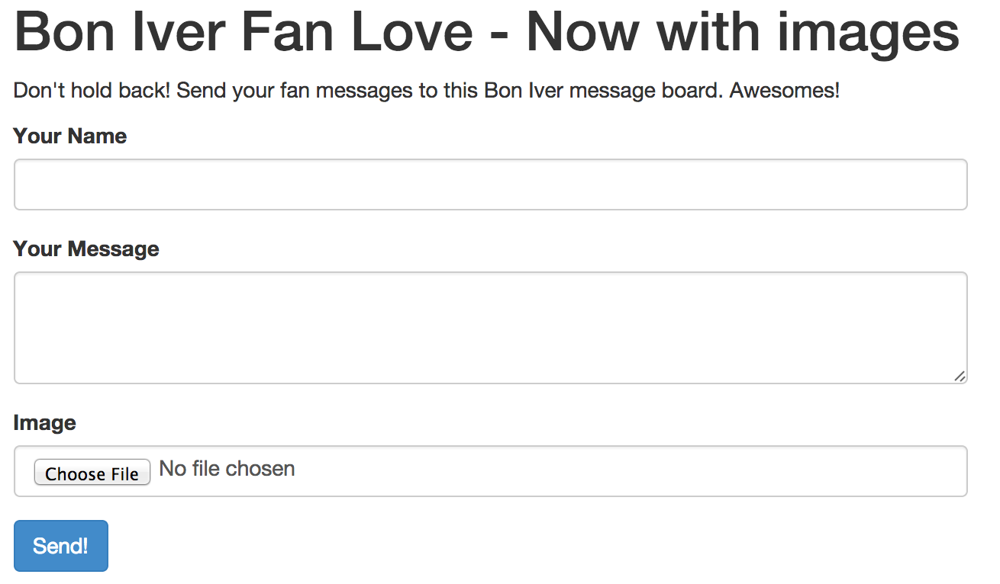

# Posting images into Nosto via Tile API

## Overview

In [a previous guide](posting-content-into-stackla-via-tile-api.md), we addressed how to post content directly into Nosto's UGC via API. In this guide, we will expand on that guide and ingest image content into the same Stack.

If you have not already, please consult the [Posting content into Nosto via Tile API](posting-content-into-stackla-via-tile-api.md) guide.

## Key concepts

### Text, Image, Video and HTML Tiles

Nosto's UGC Tiles can come in many shapes and sizes: text-only, image with message, video with a title and message or a HTML tile for rich text and imagery. There are also future types reserved for expansion.

### Example Application

The [previous example](posting-content-into-stackla-via-tile-api.md) built an application that had a Term configured, and a small app that sent messages of fan-love to a faux Bon Iver fan page. We will simply extend on that applicaiton, so there are no changes needed to the Term or the Stack itself. If you have not already, please consult the [Posting content into Nosto via Tile API](posting-content-into-stackla-via-tile-api.md) guide for more detailes on how to build these.

**Note about pre-requisites**

This example uses the [PHP GD library](http://php.net/manual/en/book.image.php), however the code is easily adaptable to a different library if needed, or can be removed if GD is not available.

## The Fun Part

### Getting Started

In this example we will need to do the following:

1. Modify the microsite View
2. Modify the backend app
3. Moderate the posted content

### Modify the microsite View

The old view sent data back to the [backend](posting-images-into-stackla-via-tile-api.md#app-backend) via AJAX. Since we need to send a file this time, we will use a simple form POST instead, to keep things simple.

The output will resemble something like the following.



#### [index.html](https://github.com/Stackla/docs/blob/master/docs/media/guides/assets/05/index.html)

````

### Create the backend app

The backend is very similar to what was used in the previous guide, except we are also accepting plugins and performing resizing (via the [ResizeImage class](#resizeimage-class), adapted from [here](http://www.paulund.co.uk/resize-image-class-php)).

#### Note on upload permissions

The uploaded file will be processed and saved into the path specified by the `$uploadsDir` variable, in the following code set to `./uploads` path. The permissions of this path needs to be set correctly to allow the application to save the processed file (i.e. for the user that the PHP script is executing as) in the path. For Apache, this user (and group) will often be `www-data`, so giving read, write and execute permissions to that user and group (i.e. `www-data:www-data`) will often suffice. Your mileage will vary, depending on your server settings (you can find some more information [here](http://serverfault.com/questions/357108/what-permissions-should-my-website-files-folders-have-on-a-linux-webserver)). The following commands should help for your development environment.

```
# From your application path
sudo chown www-data:www-data ./uploads
sudo chmod 755 ./uploads
```

#### [process.php](/docs/media/guides/assets/05/process.php)

``

#### [ResizeImage.class.php](/docs/media/guides/assets/05/ResizeImage.class.php)

`

### Moderate the posted content

Load up the page that holds the View and you should see a form like below.


After hitting "Send!", the message will be pushed to Nosto's UGC and available in your moderation queue.


#### Note about automatic moderation of posts

When content is submitted to Nosto's UGC, you can select what the default action with the post is upon ingestion, even by the type of post it is (i.e. Text-only, Image, Video). This means that you can choose to queue user-generated content for moderation by a human being, or if you're brave allow the content to be directly posted to the Stack.

This can be set on the Term's Moderation settings.


## Summary and Next Steps

This example can be further expanded with the following activities:

- Using Nosto's UGC Webhooks to trigger events when content is posted
- Displaying posted content in a Widget for voting
- Posting videos or HTML posts
````
