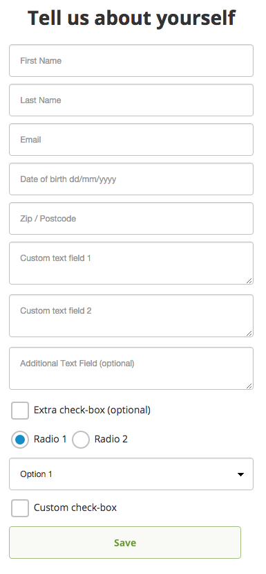
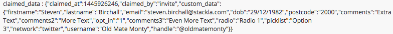

# Capture Custom Data on Rights by Registration Form

## Overview

In this guide we explore the general concept of adding custom data collection fields to the Rights by Registration form.

This guide focuses on the simplest and effective way of addings these fields and how to access this data within your Stack.

## Adding the Custom Fields

Go to **UGC Settings > Rights via Registration** and follow the steps to link your account with your relevant X and/or Instagram accounts and specify your Rights by Registration message.

Once complete, you should now have access to see the ‘Customer Facing Pages’ section of the Rights by Registration configuration page.

Scroll down to the second page (User Information Snippet) and click on the Edit button to access the mustache code. Here you can start adding your custom fields.

Rights by Registration accepts any field names that are prefixed with "custom-data-" and followed by a keyword, Note: The keyword must only contain alphanumeric or underscore characters. e.g custom-data-gender

For the purpose of this example, we have added an additional text field, a checkbox, radio button and a pick list to the existing fields.

The code we have used to add these additional fields is displayed below:

```
<div class="st-form-group">
<text{{!}}area name="custom-data-comments3" class="st-form-control" data-smartlabel="true"
data-input-name="Additional Text Field"
placeholder="Additional Text Field (optional) "></text{{!}}area>
</div>
		
<div class="st-form-group">
<input type="checkbox" name="custom-data-extra-checkbox" value="1" class="st-form-control"
data-input-name="Extra check-box"
placeholder="Extra check-box (optional)" />
Extra check-box (optional)
</div>
		
<div class="st-form-group">
<input type="radio" name="custom-data-radio" class="st-form-control"
data-input-name="Radio 1" value="Radio 1" checked />
Radio 1
<input type="radio" name="custom-data-radio" class="st-form-control"
data-input-name="Radio 2" value="Radio 2" />
Radio 2
</div>
		
<div class="st-form-group">
<select name="custom-data-picklist" class="st-form-control" >
<option value="Option 1">Option 1</option>
<option value="Option 2">Option 2</option>
<option value="Option 3">Option 3</option>
<option value="Option 4">Option 4</option>
</select>
</div>
```

Save your settings and you should be able to see the additional fields in your Rights via Registration form.



When your audiences submit this content, it will be available under the claimed\_data column on the data table.



The data will also be available through the CSV download for your Rights via Registration instance.
