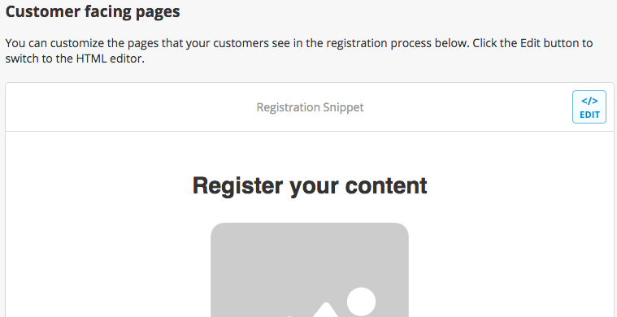
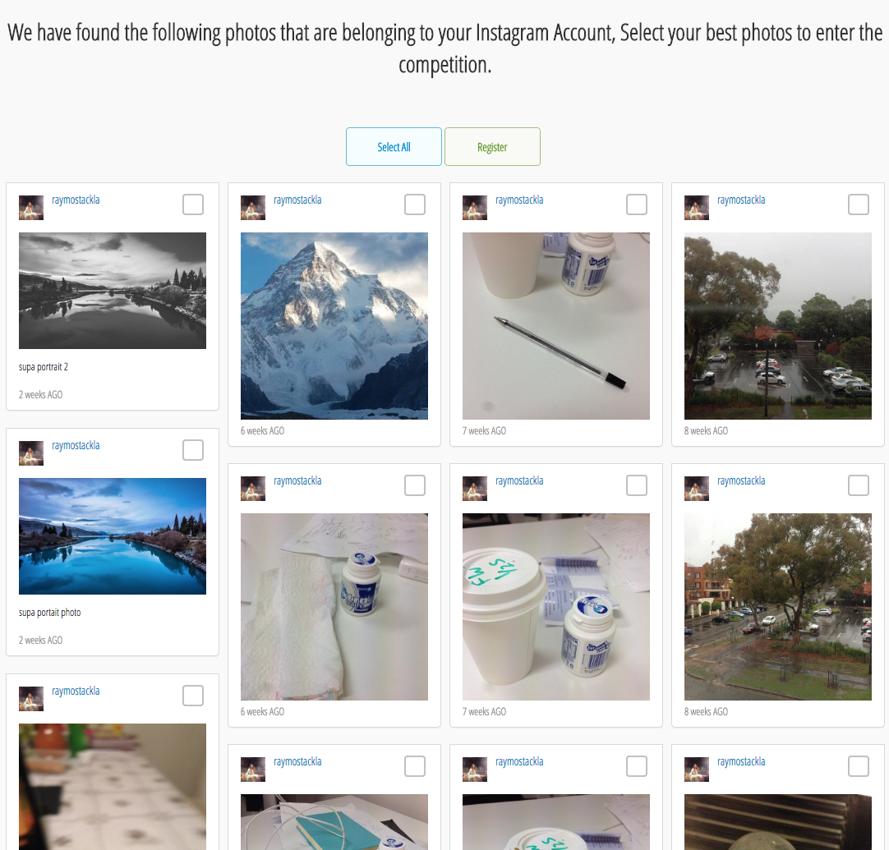

# Styling Rights via Registration Form

* [Using the Template Editor](styling-rights-by-registration-form.md#using-the-editor)
* [HTML Structures](styling-rights-by-registration-form.md#html-structure)
* [Sample Style](styling-rights-by-registration-form.md#sample-style)
* [Template Engine](styling-rights-by-registration-form.md#template-methods)

### Using the Template Editor

You can use the Template Editor to change any CSS styling or HTML semantics for the Registration Form, The button on the top right allows switching between the Edit mode and the Preview Mode. After editing the CSS or the HTML semantics on the Edit mode, You can switch back to the Preview mode to preview your custom changes.

You can upload your image assets to stackla through the Custom Assets button, Once your image has been uploaded, copy the image url and embed it to your registration form



If you want to revert back to the original setting, you can click the Revert Draft button. please be aware this will overwrite all your changes.

### HTML Structures

Below outlines the HTML Structure used in the Registration Form

````html
<!-- Mustache Template -->
<script type="text/html" class="claim-template">
    <div>
        <h1>Registration Form Title</h1>
        <form>
            <!-- Tiles container -->
            <div class="tiles">
                <!-- One Tile -->
                <div class="tile">
                    <!-- The Tile Network -->
                    <div class="">
                        <!-- image -->
                        
                        <!-- Body -->
                        <div class="tile-body">
                            <!-- User -->
                            <div class="tile-user-info">
                                <a class="tile-avatar"></a>
                                <div class="tile-user"></div>
                            </div>
                            <!-- Message -->
                            <div class="tile-caption"></div>
                            <!-- Date Time -->
                            <div class="tile-source-timestamp"></div>
                        </div>
                    </div>
                </div>
            </div>
        </form>
    </div>
</script>


### Masonry Style

Below sample code shows a Registration Form in Masonry Style. We have added Custom CSS on top of the template, and changed the HTML structure of the Tile to display User profile first.

```html
<script type="text/html" class="claim-template">
    <link href='https://fonts.googleapis.com/css?family=Open+Sans+Condensed:300' rel='stylesheet' type='text/css'>
    <style>
        body{
            font-family: 'Open Sans Condensed', sans-serif;
            font-weight:normal;
            font-style:normal
        }
        .claim-wrapper {
            width: 100%!important;
            padding: 0px!important;
        }
        .tile-list {
            column-gap: 10px;
            column-count: 4;
        }
        .tile {
            display: inline-block;
            width: 100%;
        }
        .select-checkbox {
            position: absolute!important;
            top: 0px;
            right: 0px;
        }
    </style>
    <div data-bind="visible: success() === -1">
        <h1 class="text-center">We have found the following photos that are belonging to your Instagram Account, Select your best photos to enter the competition.</h1>

        <form>
            <span class="error-message" data-bind="text: errorMessage()"></span>
            <div class="text-center" style="padding: 20px">
                <a class="st-btn st-btn-primary" data-bind="click: function() {selectToggle(); return true;}">Select All</a>
                <a data-bind="attr:{'class':getButtonClasses()}, click: function(d,e) { initClaimTiles() }" data-button-submit="register">
                    <span>Register</span>
                </a>
            </div>

            <div data-bind="foreach: tiles, attr:{'class':getListClasses()}">
                <!-- Tile -->
                <div data-bind="attr:{'class':getTileClasses()}">
                    <div class="tile-body">
                        <!-- User Profile -->
                        <div class="tile-user-info clearfix">
                            <a class="tile-avatar" data-bind="attr:{'href':getAvatarUrl()}">
                                
                            </a>
                            <div class="tile-user">
                                <a class="tile-user-top" data-bind="attr:{'href':getAvatarUrl()}">
                                    <span data-bind="text:name()"></span>
                                </a>
                                <a class="tile-user-bottom" data-bind="attr:{'href':getAvatarUrl()}">
                                    <span data-bind="text:user()"></span>
                                </a>
                            </div>

                            <!-- Select Checkbox -->
                            <input type="checkbox" class="st-form-control select-checkbox" data-bind="checked: selected, click: function() {$parent.updateSelection(); return true;}" />
                        </div>

                        

                        <!-- Image -->
                        <div class="tile-caption" data-bind="visible: message()">
                            <p data-bind="text:message()"></p>
                        </div>

                        <!-- Time -->
                        <div class="tile-source-timestamp" data-bind="visible: source\_created\_at()">
                            <span data-bind="text:getTimeAgoPhrase()"></span>
                        </div>
                    </div>
                </div>
            </div>

            <div class="st-form-group">
                {{#claimData.tcurl}}
                <label class="terms-and-conditions">
                    <input type="checkbox" class="st-form-control" data-bind="checked: termAndConditions, click: function() {updateSelection(); return true;}" />
                    I agree to the
                    <a href="{{claimData.tcurl}}" target="\_blank">Terms and Conditions</a>.
                </label>
                {{/claimData.tcurl}}
            </div>

        </form>
    </div>
    <scr{{i}}ipt>
    window.Stackla = window.Stackla || {};
    window.Stackla.tileListData = {{{json}}};
    </scr{{i}}ipt>
</script>
````



### Template Methods

Rights by Registration uses Mustache as the Rendering Template Engine, and Knockout JS as the View Model Logic. Below outlines the Knockout method calls and properties in the Mustache templates.

| Knockout JS View Model Methods | Description                                            |
| ------------------------------ | ------------------------------------------------------ |
| success()                      | Check if we should render the registration form        |
| multiple()                     | Check if multiple tiles available for registration     |
| selectToggleVisible()          | is toggle button visible                               |
| foreach: tiles                 | Iterate through each tiles                             |
| getListClasses()               | get css classes for the tiles container                |
| showTile()                     | showing current tile                                   |
| showSelected()                 | Show checkbox for current tile                         |
| $parent.updateSelection        | Select Current Tile (used in the tile block)           |
| getTileClasses()               | Get CSS classes for Tile                               |
| image()                        | Referring to the image field in the Tile               |
| getAvatarUrl()                 | Get Avatar URL                                         |
| avatar()                       | Referring to the avatar field in the Tile              |
| name()                         | Referring to the Name field in the Tile                |
| user()                         | Referring to the User field in the Tile                |
| message()                      | Referring to the message field in the Tile             |
| source\_created\_at()          | Referring to the source\_created\_at field in the Tile |
| getTimeAgoPhrase()             | Get Human readable Time                                |
| termAndConditions()            | Is term and conditions configured                      |
| getButtonClasses()             | get CSS classes for the Submission Button              |
| initClaimTiles()               | Submit the Form to Nosto's UGC                         |
| collectData()                  | Submit Additional Data to Nosto's UGC                  |
| dataCollectionError()          | Get error message for Submitting Additional Data       |
| errorMessage()                 | Get Error Messages                                     |

| Mustache Template Properties  | Description                                                                 |
| ----------------------------- | --------------------------------------------------------------------------- |
| claimData.tcurl               | the configured terms and condition url                                      |
| claimData.brand\_url\_success | the configured value for successful page                                    |
| claimData.brand\_url\_failure | the configured value for successful page                                    |
| claimData.source\_username    | the configured value for successful page                                    |
| claimData.source\_username    | the configured value for successful page                                    |
| dataToCollect.firstname       | the configrations for the first name field (_enabled, mandatory, optional_) |
| dataToCollect.lastname        | the configrations for the last name field                                   |
| dataToCollect.email           | the configrations for the email field                                       |
| dataToCollect.postcode        | the configrations for the post code field                                   |
| dataToCollect.comments        | the configrations for the comments field                                    |
| dataToCollect.comments2       | the configrations for the comments2 field                                   |
| dataToCollect.opt\_in         | the configrations for the opt\_in field                                     |
