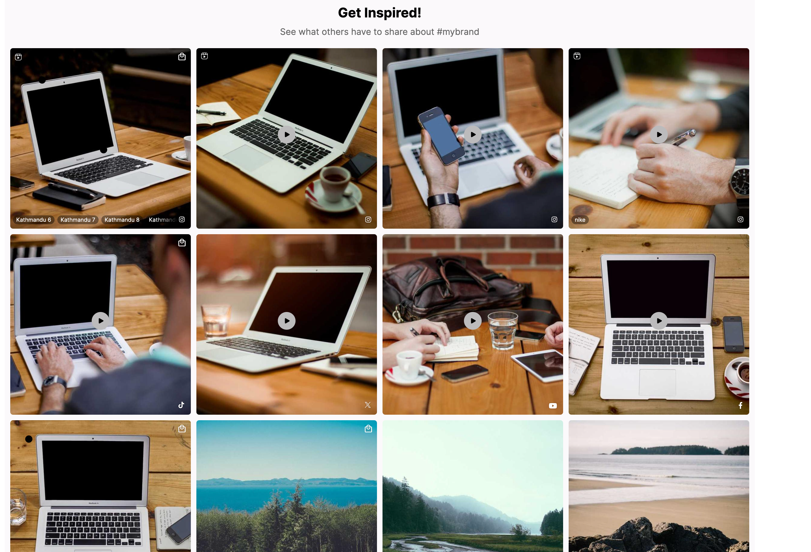

# How to add a title / subtitle to a widget

## Overview

Nosto's UGC offers the ability to create advanced customizations to your widgets to match your brand needs.

In this guide, we are going explain how you can add a Title & Sub-Title directly to your widgets to ensure if a widget hides in your website because it doesn't have enough content to be displayed the entire header hides with it.

Please note that this customization is currently not supported for Story widgets.

## Getting Started

Both IDE and Custom Code Editor require one simple change to add a Title & Sub-Title to your widgets.

1. Go to your layout.hbs file (or Widget Layout in the Custom Code Editor) and add the following code to the top of your file:

```hbs
<div class="ugc-headline">
  <span class="ugc-title">Get Inspired!</span>
  <div class="ugc-widget-subtitle">See what others have to share about #mybrand</div>
</div>
```

2. Save your changes and publish the widget.
3. Go to your CSS file (or Widget CSS in the Custom Code Editor) and add the following code to style your Title & Sub-Title:

```css
.ugc-headline {
  display: flex;
  flex-direction: column;
  align-items: center;
  margin-bottom: 20px;
}
.ugc-title {
  font-size: 24px;
  font-weight: bold;
  color: #000;
  margin-bottom: 10px;
}
.ugc-widget-subtitle {
  font-size: 16px;
  color: #666;
}
```

4. Save your changes and publish the widget.
5. Your widget should now display a Title & Sub-Title at the top of the widget.

### Result



```


```
