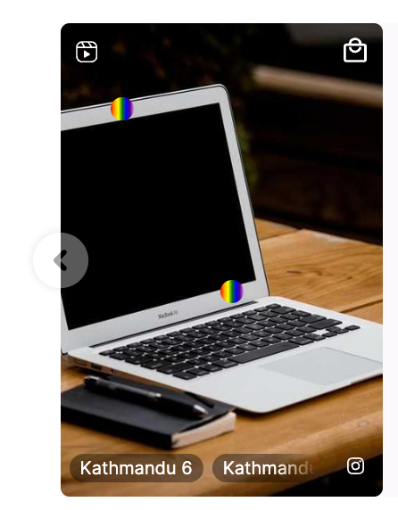

# Styling Widget Shopspots


You are reading the NextGen Documentation

NextGen widgets are a new and improved way to display UGC content.&#x20;

On Oct 1st, all widgets created will be NextGen.

Please check your widget version on the Widget List page to see if it is **Classic** or **NextGen** widget.

You can read the [Classic Widget Documentation](../../onsite-widgets/) here.


## Overview

This article will instruct you on customizing Shopspot style in both Tiles and Expanded Tiles.

## Shopspots in Tiles & Expanded Tiles

You can style Shopspots in tiles via the Custom CSS tab in Nosto Admin Portal or in the IDE by utilising the SDK.

### HTML Structure

The structure is pretty simple. It uses `.shopspot-icon>.fs-tag` as namespace.

```
<div class="fs-tag" data-tag-id="43" style="left: 15.63%; top: 15.63%; cursor: pointer;">
    <div class="tooltip tag-43">Tag</div>
</div>
```

### Sample CSS

Lets make our shopspots rainbow colored!

Place the following code into the Custom CSS in Nosto's UGC Widget settings or in the IDE's widget.scss file.

```
shopspot-icon .fs-tag {
    background: linear-gradient(to right, red, orange, yellow, green, blue, indigo, violet) !important;
    border-radius: 50%;
    width: 30px;
    height: 30px;
    display: flex;
    justify-content: center;
    align-items: center;
}
shopspot-icon .fs-tag:hover {
    background: linear-gradient(to right, violet, indigo, blue, green, yellow, orange, red) !important;
    transform: scale(1.2);
    transition: all 0.3s ease;
}
```

### Result



Congratulations! You have successfully styled your shopspots in tiles.
