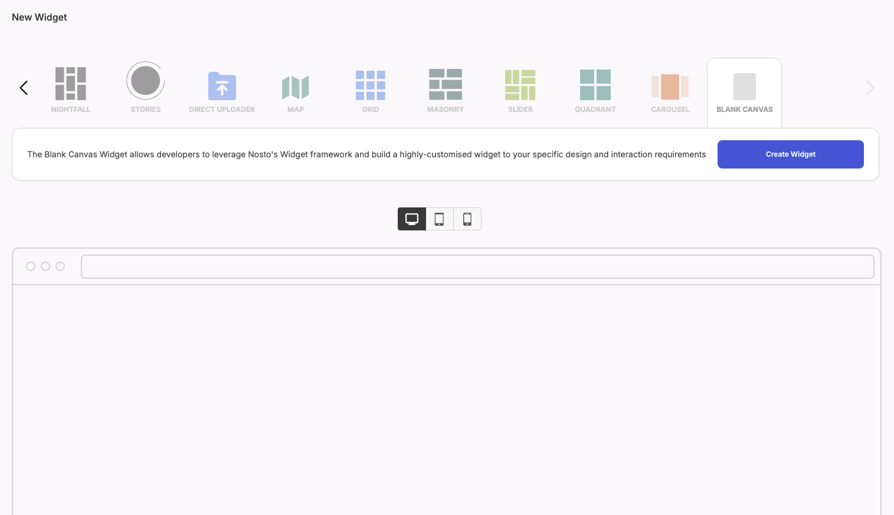
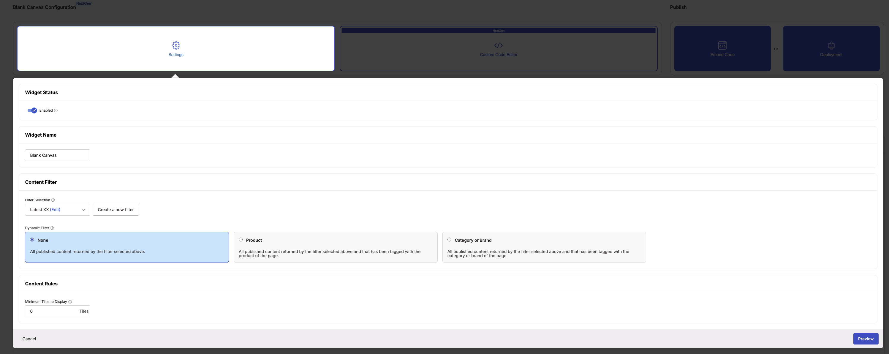
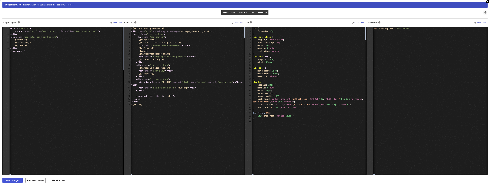
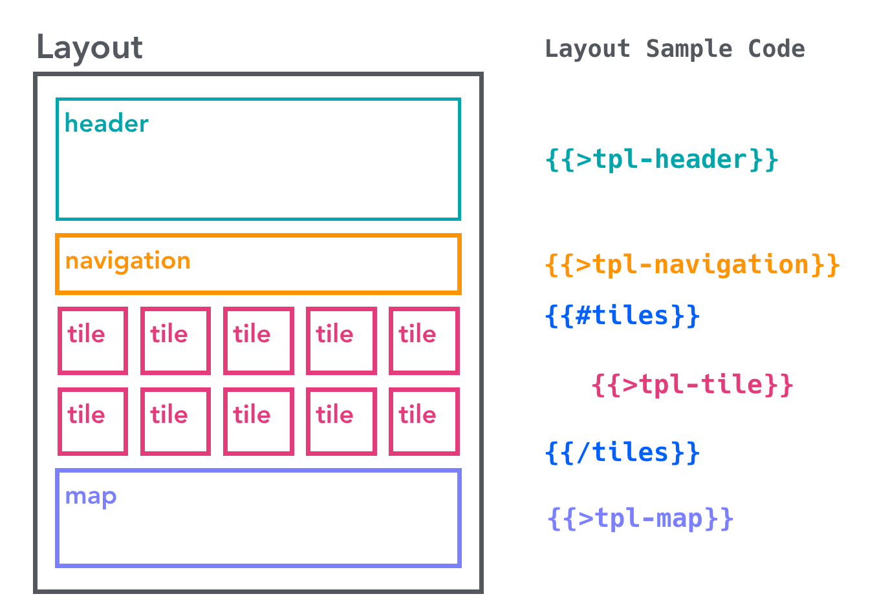
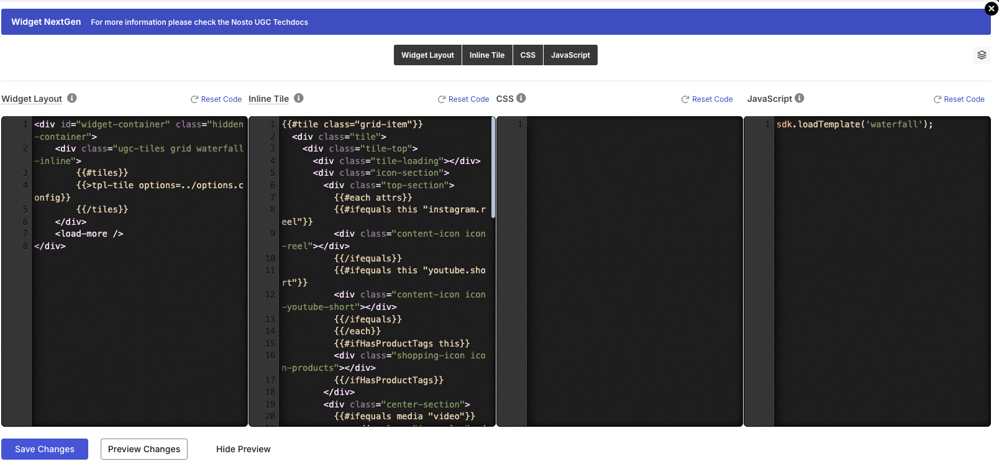
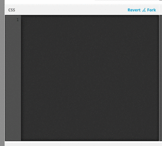

# Creating your own widget type using blank canvas

* [Overview](creating-your-own-widget-type-by-using-the-blank-canvas-widget.md#overview)
* [Step 1 - Getting a Canvas with Single Click!](creating-your-own-widget-type-by-using-the-blank-canvas-widget.md#step1)
* [Step 2 - Super Simple Settings!](creating-your-own-widget-type-by-using-the-blank-canvas-widget.md#step2)
* [Step 3 - Custom Code Editors](creating-your-own-widget-type-by-using-the-blank-canvas-widget.md#step3)
* [Step 4 - Coding for Layout and Tile Templates](creating-your-own-widget-type-by-using-the-blank-canvas-widget.md#step4)
* [Step 5 - Coding for CSS](creating-your-own-widget-type-by-using-the-blank-canvas-widget.md#step5)
* [Step 6 - Coding for JavaScript](creating-your-own-widget-type-by-using-the-blank-canvas-widget.md#step6)
* [Result - The Boilerplate Widget](creating-your-own-widget-type-by-using-the-blank-canvas-widget.md#result)
* [Bonus - Creating the Horizontal Masonry Widget](creating-your-own-widget-type-by-using-the-blank-canvas-widget.md#bonus)


You are reading the NextGen Documentation

NextGen widgets are a new and improved way to display UGC content.&#x20;

On Oct 1st, all widgets created will be NextGen.

Please check your widget version on the Widget List page to see if it is **Classic** or **NextGen** widget.

You can read the [Classic Widget Documentation](creating-your-own-widget-type-by-using-the-blank-canvas-widget.md) here.


## Overview

Though Nosto's UGC provides several different types of widgets and has the great ability of customization, we still can't satisfy some of our customers' unique needs. For example, some customers want to use the [Horizontal Masonry](http://isotope.metafizzy.co/layout-modes/masonryhorizontal.html), which Nosto's UGC doesn't have. This then leads to our customer to using hack solutions or forces them to build from scratch which can take a lot of effort. That's not okay for both Nosto's UGC and our clients.

To resolve this, we have provided a new widget type. Blank Canvas allows you to create your widget from scratch whilst providing developers with some great utility functions and tools to achieve their solution efficiently.

In this tutorial, we will show you how to create a Blank Canvas widget step by step.

## Step 1 - Getting a Canvas with Single Click!



Once the widget is available to you, you will see an extra widget type, Blank Canvas, in your widget creation page.

It doesn't have any JavaScript, CSS, or HTML by default. That's the reason why you can only see the prompt text in the preview widget area.

Just click the **Create Widget** button to start! It's easy!!

## Step 2 - Super Simple Settings!



Before you start to put your imagination and innovative ideas onto the canvas, it's suggested to set up it correctly.

In Blank Canvas, we only provide very basic setting options. That is the Activate Widget, Name, Select Filter, and the Powered by Nosto's UGC Logo fields.

The **Selected Filter** is the most important setting among them. It involves with the data you can fetch from Nosto's UGC.

## Step 3 - Custom Code Editors



Unlike other widgets which have the CSS and JavaScript editors, the Blank Canvas widget provides the other **Layout** and **Tile** editors so that you can write code in [Mustache](https://mustache.github.io).

## Step 4 - Coding for Layout and Tile Templates

### Understanding the Mustache Partials

If you are familiar with the [Mustache](https://mustache.github.io) template engine, you probably know the [Partials](https://mustache.github.io/mustache.5.html#Partials). The Partials feature just makes it easier to **modulize your templates**.

Nosto's UGC introduces the Mustache Partials feature. You can add, remove, or rename any templates. **The only necessary one is the Layout**. You can remove the Tile template if you think you can finish everything in one template.



The above diagram illustrates the Layout template which includes Header, Navigation, Tile (inside the loop), and Map templates. We've created the following widget with this templates structure. See? You basically can create a micro-site with our Blank Canvas. Awesome right?

```html
<div id="ugc-widget" data-ttl="300" data-hash="6808801ecc16b" data-id="64507" data-hash="6808801ecc16b" data-id="64507" data-title="Blank Canvas" data-ttl="300" data-tag-group=""></div>
<script>
    (() => {
        const script = document.createElement('script');
        script.type = 'text/javascript';
        script.src = 'https://widget-ui.teaser.stackla.com/core.js';
        script.onload = (() => {
            // You can customise the widget by passing in parameters to the object below.
            const widget = new window.ugc.widget({});
            widget.init();
        });
        document.body.appendChild(script);
    })();
</script>
```

Note the above example just demonstrates the ability to use multiple templates. There is no interaction between photos and map.

### Sample Code

You can copy and paste the following code as your boilerplate. Or you can just click the **Reset Code** link (at the top-right corner) to get them directly.



#### Layout

```
<div class="ugc-tiles grid grid-inline">
    {{#tiles}}
    {{>tpl-tile}}
    {{/tiles}}
</div>
<load-more />
```

The following Tile template will be included by the **\{{>tpl-tile\}}** syntax. The **tiles** is an array collection containing tile objects. It must be prepared in the Custom JS Editor - which \[we will talk about later]\(#js-stackla.loadTilesByFilter).

#### Tile

```
{{#tile class="grid-item"}}
<div class="tile" data-background-image="{{image_thumbnail_url}}">
  <div class="icon-section">
    <div class="top-section">
      {{#each attrs}}
      {{#ifequals this "instagram.reel"}}
      <div class="content-icon icon-reel"></div>
      {{/ifequals}}
      {{/each}}
      {{#ifHasProductTags this}}
      <div class="shopping-icon icon-products"></div>
      {{/ifHasProductTags}}
    </div>
    <div class="center-section">
      {{#ifequals media "video"}}
      <div class="icon-play"></div>
      {{/ifequals}}
    </div>
    <div class="bottom-section">
      <tile-tags tile-id="{{id}}" variant="dark" mode="swiper" context="grid-inline"></tile-tags>
      <div class="network-icon icon-{{source}}"></div>
    </div>

    <shopspot-icon tile-id={{id}} />
  </div>
</div>
{{/tile}}
```

## Step 5 - Coding for CSS

All the CSS rules reside within the Shadow DOM, so you don't need to worry about any conflicts with your page.

Please make use of the **@import** directive to import the external CSS stylesheets you need.

### Sample Code

Again, you can click the **Fork** link to grab the following code.



```
.widget-icon{display:block}.close{width:24px;height:24px;background-image:url("https://templates.stackla.com/assets/svg/close-black.svg");background-repeat:no-repeat}.close-white{width:26px;height:26px;background-image:url("https://templates.stackla.com/assets/svg/close-white.svg");background-repeat:no-repeat}.chevron-left{width:40px;height:40px;background-image:url("https://templates.stackla.com/assets/svg/chevron-left.svg");background-repeat:no-repeat}.chevron-left-inline{width:36px;height:36px;background-image:url("https://templates.stackla.com/assets/svg/chevron-left-inline.svg");background-repeat:no-repeat}.chevron-right{width:40px;height:40px;background-image:url("https://templates.stackla.com/assets/svg/chevron-right.svg");background-repeat:no-repeat}.chevron-right-inline{width:36px;height:36px;background-image:url("https://templates.stackla.com/assets/svg/chevron-right-inline.svg");background-repeat:no-repeat}.icon-share{width:20px;height:20px;background-size:contain;background-image:url("https://templates.stackla.com/assets/svg/share-white.svg");background-repeat:no-repeat}.icon-share.light{background:url("https://templates.stackla.com/assets/svg/share-black.svg");height:13px;width:13px;background-repeat:no-repeat}.icon-instagram-share{width:34px;height:34px;background-size:contain;background-image:url("https://templates.stackla.com/assets/svg/instagram-share.svg");background-repeat:no-repeat}.icon-x-share{align-items:center;background-color:#000;border-radius:50%;display:flex;justify-content:center;height:34px;position:relative;width:34px}.icon-x-share::after{content:"";position:absolute;width:19px;height:19px;background-size:contain;background-image:url("https://templates.stackla.com/assets/svg/x-share.svg");background-repeat:no-repeat}.icon-linkedin-share{width:34px;height:34px;background-size:contain;background-image:url("https://templates.stackla.com/assets/svg/linkedin-share.svg");background-repeat:no-repeat}.icon-facebook-share{width:34px;height:34px;background-size:contain;background-image:url("https://templates.stackla.com/assets/svg/facebook-share.svg");background-repeat:no-repeat}.icon-pinterest-share{width:34px;height:34px;background-size:contain;background-image:url("https://templates.stackla.com/assets/svg/pinterest-share.svg");background-repeat:no-repeat}.icon-email-share{width:37px;height:30px;background-size:contain;background-image:url("https://templates.stackla.com/assets/svg/email-share.svg");background-repeat:no-repeat}.chevron-up{width:24px;height:24px;background-size:contain;background-image:url("https://templates.stackla.com/assets/svg/chevron-up.svg");background-repeat:no-repeat}.chevron-down{width:24px;height:24px;background-size:contain;background-image:url("https://templates.stackla.com/assets/svg/chevron-down.svg");background-repeat:no-repeat}.back-arrow{width:24px;height:24px;background-size:contain;background-image:url("https://templates.stackla.com/assets/svg/back-arrow.svg");background-repeat:no-repeat}.icon-vimeo{width:16px;height:16px;background-size:contain;background-image:url("https://templates.stackla.com/assets/svg/vimeo.svg");background-repeat:no-repeat}.icon-vimeo.small{width:12px;height:12px}.icon-instagram,.icon-instagram.large,.icon-instagram.medium{width:16px;height:16px;background-size:contain;background-image:url("https://templates.stackla.com/assets/svg/instagram.svg");background-repeat:no-repeat}.icon-instagram.black,.icon-instagram.large.black,.icon-instagram.medium.black{background-image:url("https://templates.stackla.com/assets/svg/instagram-black.svg")}.icon-instagram.small,.icon-instagram.large.small,.icon-instagram.medium.small{width:12px;height:12px}.icon-twitter,.icon-twitter.large,.icon-twitter.medium{display:flex;width:18px;height:18px;background-size:contain;background-image:url("https://templates.stackla.com/assets/svg/twitter.svg");background-repeat:no-repeat}.icon-twitter.black,.icon-twitter.large.black,.icon-twitter.medium.black{background-image:url("https://templates.stackla.com/assets/svg/x-black.svg")}.icon-twitter.small,.icon-twitter.large.small,.icon-twitter.medium.small{width:12px;height:12px}.icon-linkedin,.icon-linkedin.large,.icon-linkedin.medium{width:18px;height:18px;background-size:contain;background-image:url("https://templates.stackla.com/assets/svg/linkedin.svg");background-repeat:no-repeat}.icon-linkedin.black,.icon-linkedin.large.black,.icon-linkedin.medium.black{background-image:url("https://templates.stackla.com/assets/svg/linkedin-black.svg")}.icon-linkedin.small,.icon-linkedin.large.small,.icon-linkedin.medium.small{width:12px;height:12px}.icon-tiktok,.icon-tiktok.large,.icon-tiktok.medium{width:18px;height:18px;background-size:contain;background-image:url("https://templates.stackla.com/assets/svg/tiktok.svg");background-repeat:no-repeat}.icon-tiktok.black,.icon-tiktok.large.black,.icon-tiktok.medium.black{background-image:url("https://templates.stackla.com/assets/svg/tiktok-black.svg")}.icon-tiktok.small,.icon-tiktok.large.small,.icon-tiktok.medium.small{width:12px;height:12px}.icon-facebook,.icon-facebook.large,.icon-facebook.medium{width:16px;height:16px;background-size:contain;background-image:url("https://templates.stackla.com/assets/svg/facebook.svg");background-repeat:no-repeat}.icon-facebook.black,.icon-facebook.large.black,.icon-facebook.medium.black{background-image:url("https://templates.stackla.com/assets/svg/facebook-black.svg")}.icon-facebook.small,.icon-facebook.large.small,.icon-facebook.medium.small{width:12px;height:12px}.icon-reel,.icon-reel.large,.icon-reel.medium{width:12px;height:12px;background-size:contain;background-image:url("https://templates.stackla.com/assets/svg/reel.svg");background-repeat:no-repeat}.icon-reel.small,.icon-reel.large.small,.icon-reel.medium.small{width:12px;height:12px}.icon-products{width:14px;height:14px;background-size:contain;background-image:url("https://templates.stackla.com/assets/svg/products.svg");background-repeat:no-repeat}.icon-products.small{width:10px;height:10px}.icon-products-bg,.icon-products-bg.large,.icon-products-bg.medium{width:24px;height:24px;background-size:contain;background-image:url("https://templates.stackla.com/assets/svg/products-bg.svg");background-repeat:no-repeat}.icon-products-bg.small,.icon-products-bg.large.small,.icon-products-bg.medium.small{width:18px;height:18px}.icon-youtube,.icon-youtube.large,.icon-youtube.medium{width:22px;height:16px;background-size:contain;background-image:url("https://templates.stackla.com/assets/svg/youtube.svg");background-repeat:no-repeat}.icon-youtube.black,.icon-youtube.large.black,.icon-youtube.medium.black{background-image:url("https://templates.stackla.com/assets/svg/youtube-black.svg")}.icon-youtube.small,.icon-youtube.large.small,.icon-youtube.medium.small{width:12px;height:12px}.icon-youtube-short,.icon-youtube-short.large,.icon-youtube-short.medium{width:16px;height:16px;background-size:contain;background-image:url("https://templates.stackla.com/assets/svg/youtube-short.svg");background-repeat:no-repeat}.icon-youtube-short.small,.icon-youtube-short.large.small,.icon-youtube-short.medium.small{width:12px;height:12px}.icon-flickr,.icon-flickr.large,.icon-flickr.medium{width:16px;height:16px;background-size:contain;background-image:url("https://templates.stackla.com/assets/svg/flickr.svg");background-repeat:no-repeat}.icon-flickr.black,.icon-flickr.large.black,.icon-flickr.medium.black{background-image:url("https://templates.stackla.com/assets/svg/flickr-black.svg")}.icon-flickr.small,.icon-flickr.large.small,.icon-flickr.medium.small{width:12px;height:12px}.icon-weibo,.icon-weibo.large,.icon-weibo.medium{width:16px;height:16px;background-size:contain;background-image:url("https://templates.stackla.com/assets/svg/weibo.svg");background-repeat:no-repeat}.icon-weibo.black,.icon-weibo.large.black,.icon-weibo.medium.black{background-image:url("https://templates.stackla.com/assets/svg/weibo-black.svg")}.icon-weibo.small,.icon-weibo.large.small,.icon-weibo.medium.small{width:12px;height:12px}.icon-pinterest,.icon-pinterest.large,.icon-pinterest.medium{width:18px;height:18px;background-size:contain;background-image:url("https://templates.stackla.com/assets/svg/pinterest.svg");background-repeat:no-repeat}.icon-pinterest.black,.icon-pinterest.large.black,.icon-pinterest.medium.black{background-image:url("https://templates.stackla.com/assets/svg/pinterest-black.svg")}.icon-pinterest.small,.icon-pinterest.large.small,.icon-pinterest.medium.small{width:12px;height:12px}.icon-rss,.icon-rss.large,.icon-rss.medium{width:16px;height:16px;background-size:contain;background-image:url("https://templates.stackla.com/assets/svg/rss.svg");background-repeat:no-repeat}.icon-rss.black,.icon-rss.large.black,.icon-rss.medium.black{background-image:url("https://templates.stackla.com/assets/svg/rss-black.svg")}.icon-rss.small,.icon-rss.large.small,.icon-rss.medium.small{width:12px;height:12px}.icon-tumblr,.icon-tumblr.large,.icon-tumblr.medium{width:16px;height:16px;background-size:contain;background-image:url("https://templates.stackla.com/assets/svg/tumblr.svg");background-repeat:no-repeat}.icon-tumblr.small,.icon-tumblr.large.small,.icon-tumblr.medium.small{width:12px;height:12px}.icon-stackla,.icon-stackla.large,.icon-stackla.medium,.icon-sta_feed,.icon-sta_feed.large,.icon-sta_feed.medium{width:18px;height:18px;background-size:contain;background-image:url("https://templates.stackla.com/assets/svg/stackla.svg");background-repeat:no-repeat}.icon-stackla.small,.icon-stackla.large.small,.icon-stackla.medium.small,.icon-sta_feed.small,.icon-sta_feed.large.small,.icon-sta_feed.medium.small{width:12px;height:12px}.icon-snapchat,.icon-snapchat.large,.icon-snapchat.medium{width:16px;height:16px;background-size:contain;background-image:url("https://templates.stackla.com/assets/svg/snapchat.svg");background-repeat:no-repeat}.icon-snapchat.small,.icon-snapchat.large.small,.icon-snapchat.medium.small{width:12px;height:12px}.icon-spotify,.icon-spotify.large,.icon-spotify.medium{width:16px;height:16px;background-size:contain;background-image:url("https://templates.stackla.com/assets/svg/spotify.svg");background-repeat:no-repeat}.icon-spotify.small,.icon-spotify.large.small,.icon-spotify.medium.small{width:12px;height:12px}.icon-hootsuite,.icon-hootsuite.large,.icon-hootsuite.medium{width:16px;height:16px;background-size:contain;background-image:url("https://templates.stackla.com/assets/svg/hootsuite.svg");background-repeat:no-repeat}.icon-hootsuite.small,.icon-hootsuite.large.small,.icon-hootsuite.medium.small{width:12px;height:12px}.icon-prev{width:16px;height:16px;background-size:contain;background-image:url("https://templates.stackla.com/assets/svg/prev.svg");background-repeat:no-repeat}.icon-prev-white{width:16px;height:16px;background-size:contain;background-image:url("https://templates.stackla.com/assets/svg/prev-white.svg");background-repeat:no-repeat}.icon-prev-circle{width:40px;height:40px;background-size:contain;background-image:url("https://templates.stackla.com/assets/svg/prev-circle.svg");background-repeat:no-repeat}.icon-next{width:16px;height:16px;background-size:contain;background-image:url("https://templates.stackla.com/assets/svg/next.svg");background-repeat:no-repeat}.icon-next-white{width:16px;height:16px;background-size:contain;background-image:url("https://templates.stackla.com/assets/svg/next-white.svg");background-repeat:no-repeat}.icon-next-circle{width:40px;height:40px;background-size:contain;background-image:url("https://templates.stackla.com/assets/svg/next-circle.svg");background-repeat:no-repeat}.icon-play{width:2em;height:2em;background-size:contain;background-image:url("https://templates.stackla.com/assets/svg/play.svg");background-repeat:no-repeat}.icon-upload{background-image:url("https://templates.stackla.com/assets/svg/upload.svg");height:15px;width:15px;background-size:contain;background-repeat:no-repeat}.icon-picture{background-image:url("https://templates.stackla.com/assets/svg/picture.svg");background-size:contain;background-repeat:no-repeat;height:18px;width:18px;position:absolute}.icon-tag{width:24px;height:24px;background-size:contain;background-image:url("https://templates.stackla.com/assets/svg/tag.svg");background-repeat:no-repeat}.icon-tag.small{width:18px;height:18px}.icon-video-play{width:18px;height:18px;background-size:contain;background-image:url("https://templates.stackla.com/assets/svg/video-play.svg");background-repeat:no-repeat}.icon-video-pause{width:18px;height:18px;background-size:contain;background-image:url("https://templates.stackla.com/assets/svg/video-pause.svg");background-repeat:no-repeat}.icon-video-volume{width:12px;height:12px;background-size:contain;background-image:url("https://templates.stackla.com/assets/svg/video-volume.svg");background-repeat:no-repeat}.icon-video-mute{width:12px;height:12px;background-size:contain;background-image:url("https://templates.stackla.com/assets/svg/video-mute.svg");background-repeat:no-repeat}.down-arrow{width:8px;height:7px;background-size:contain;background-image:url("https://templates.stackla.com/assets/svg/down-arrow.svg");background-repeat:no-repeat}.up-arrow{width:8px;height:7px;background-size:contain;background-image:url("https://templates.stackla.com/assets/svg/up-arrow.svg");background-repeat:no-repeat}.down-arrow-thin{width:24px;height:24px;background-size:contain;background-image:url("https://templates.stackla.com/assets/svg/down-arrow-thin.svg");background-repeat:no-repeat}.tile>.tile-loading,.loading{border-radius:50% !important;animation:spin 2s linear infinite;position:absolute;z-index:10;border:5px solid #f3f3f3;border-top:5px solid #3498db;border-bottom:5px solid #3498db;width:30px !important;height:30px !important;top:calc(50% - 30px);left:calc(50% - 30px)}.expanded-tile-overlay{position:fixed;width:100vw;height:100vh;inset:0;background-color:rgba(0,0,0,.9);z-index:10;cursor:pointer;display:flex;align-items:center;justify-content:center}.story-overlay{display:none;position:absolute;background-color:rgba(0,0,0,.4);width:var(--tile-size);height:var(--tile-size);border-radius:50%;z-index:10}@media(min-width: 577px)and (max-width: 992px){.expanded-tile-overlay{align-items:flex-start;overflow:hidden}}@media(max-width: 576px){.expanded-tile-overlay{overflow:hidden}}expanded-tiles:not(:empty) add-to-cart .ugc-add-to-cart-button{align-content:center;border-radius:0;height:40px;padding:8px 16px;margin:24px 0 0;width:auto;background-color:var(--cta-button-background-color) !important;color:var(--cta-button-font-color) !important;font-size:var(--cta-button-font-size) !important}expanded-tiles:not(:empty) add-to-cart .ugc-add-to-cart-colorpicker-text,expanded-tiles:not(:empty) add-to-cart .ugc-add-to-cart-colorpicker-text b,expanded-tiles:not(:empty) add-to-cart #variant-container p,expanded-tiles:not(:empty) add-to-cart #variant-container p span{color:#333;font-size:12px;font-weight:400;padding:0}expanded-tiles:not(:empty) add-to-cart #variant-container div:not(.ugc-add-to-cart-sizepicker .ugc-add-to-cart-sizepicker-btn){flex-direction:row;align-items:baseline}expanded-tiles:not(:empty) add-to-cart #variant-container div p::after{content:":"}expanded-tiles:not(:empty) add-to-cart .ugc-add-to-cart-other-variant-selector{background:none;border:none;color:#333;cursor:pointer;font-size:12px;margin:0;padding:0}expanded-tiles:not(:empty) add-to-cart .ugc-add-to-cart-colorpicker-text{margin:0;padding:0;padding:8px 0}expanded-tiles:not(:empty) add-to-cart #variant-container p{margin:18px 0 8px}expanded-tiles:not(:empty) add-to-cart .ugc-add-to-cart-colorpicker{display:flex;gap:12px}expanded-tiles:not(:empty) add-to-cart .ugc-add-to-cart-colorpicker-ring{height:24px;width:24px;margin:0}expanded-tiles:not(:empty) add-to-cart .ugc-add-to-cart-colorpicker-inner{width:15.6px;height:15.6px;left:24.5%;top:24%}expanded-tiles:not(:empty) add-to-cart .ugc-add-to-cart-sizepicker{display:flex;gap:10px}expanded-tiles:not(:empty) add-to-cart .ugc-add-to-cart-sizepicker-btn{border-radius:0;cursor:pointer;font-family:"Open Sans",sans-serif;font-size:12px;font-weight:400;height:34px;margin:0}expanded-tiles:not(:empty) add-to-cart .ugc-add-to-cart-sizepicker-btn[selected=true]{border:2px solid #4083b9}expanded-tiles:not(:empty) add-to-cart .ugc-add-to-cart-sizepicker-btn:not([enabled=true]){border:1px solid #dcdcdc;background:#f2f2f2;color:#b9b9b9;cursor:not-allowed;text-decoration:line-through}expanded-tiles:not(:empty) add-to-cart .ugc-add-to-cart-sizepicker-btn:not([enabled=true])::before{content:none}expanded-tiles:not(:empty) ugc-products{--product-price-font-color: $black;--product-title-font-color: $white;--product-description-font-color: $black;display:flex;flex-direction:column;border-top:1px solid #f4f4f4;padding-top:16px}expanded-tiles:not(:empty) ugc-products .stacklapopup-products-header{display:flex;margin-bottom:0}expanded-tiles:not(:empty) ugc-products .stacklapopup-products-header .stacklapopup-products-header{margin-bottom:0}expanded-tiles:not(:empty) ugc-products .stacklapopup-products-header .stacklapopup-products-item-header{display:none}expanded-tiles:not(:empty) ugc-products .stacklapopup-products-header .stacklapopup-products-item-header.stacklapopup-products-item-active{display:flex;flex-direction:column;justify-content:flex-start;gap:16px}expanded-tiles:not(:empty) ugc-products .stacklapopup-products-header .stacklapopup-products-item-header .stacklapopup-products-item-price{color:var(--product-price-font-color);font-size:14px;font-weight:400;line-height:12px;margin-bottom:8px}expanded-tiles:not(:empty) ugc-products .stacklapopup-products-header .stacklapopup-products-item-header .stacklapopup-products-item-title{color:var(--product-title-font-color);font-size:14px;font-weight:500;line-height:16px;text-decoration:none}expanded-tiles:not(:empty) ugc-products .stacklapopup-product-images-wrapper{display:flex;margin-top:24px;position:relative}expanded-tiles:not(:empty) ugc-products .stacklapopup-product-images-wrapper::-webkit-scrollbar{display:none}expanded-tiles:not(:empty) ugc-products .stacklapopup-product-images-wrapper.arrows-hidden .swiper-nav-icon{display:none !important}expanded-tiles:not(:empty) ugc-products .stacklapopup-product-images-wrapper.arrows-hidden .swiper-expanded-product-recs{width:100% !important}expanded-tiles:not(:empty) ugc-products .stacklapopup-product-images-wrapper .swiper-expanded-product-recs{width:calc(90% - 20px)}expanded-tiles:not(:empty) ugc-products .stacklapopup-product-images-wrapper .swiper-expanded-product-recs .swiper-wrapper{width:calc(100% - 20px);max-width:initial;max-height:initial}expanded-tiles:not(:empty) ugc-products .stacklapopup-product-images-wrapper .swiper-expanded-product-recs .swiper-slide.stacklapopup-product-wrapper{width:84.9px !important;height:110px !important;position:relative;cursor:pointer;display:inline-block;padding:2px}expanded-tiles:not(:empty) ugc-products .stacklapopup-product-images-wrapper .swiper-expanded-product-recs .swiper-slide.stacklapopup-product-wrapper:hover .stacklapopup-products-item{opacity:1}expanded-tiles:not(:empty) ugc-products .stacklapopup-product-images-wrapper .swiper-expanded-product-recs .swiper-slide.stacklapopup-product-wrapper .stacklapopup-products-item{display:flex;flex-shrink:0;height:100%;align-items:center}expanded-tiles:not(:empty) ugc-products .stacklapopup-product-images-wrapper .swiper-expanded-product-recs .swiper-slide.stacklapopup-product-wrapper .stacklapopup-products-item.stacklapopup-products-item-active img{border:.5px solid #9f9f9f;opacity:1}expanded-tiles:not(:empty) ugc-products .stacklapopup-product-images-wrapper .swiper-expanded-product-recs .swiper-slide.stacklapopup-product-wrapper .stacklapopup-products-item .stacklapopup-products-item-image{opacity:.4;border-radius:3px;display:flex;align-items:center;width:100%;height:calc(100% - 2px)}expanded-tiles:not(:empty) ugc-products .stacklapopup-product-images-wrapper .swiper-expanded-product-recs .swiper-slide.stacklapopup-product-wrapper .stacklapopup-products-item-image-recommendation-label{display:flex;width:69px;height:16px;justify-content:center;align-items:center;flex-shrink:0;background:#000;border-radius:14px;position:absolute;top:0;left:10px;z-index:2}expanded-tiles:not(:empty) ugc-products .stacklapopup-product-images-wrapper .swiper-expanded-product-recs .swiper-slide.stacklapopup-product-wrapper .stacklapopup-products-item-image-recommendation-label p{color:#fff;font-size:8px;font-style:normal;font-weight:350;line-height:160%;text-align:center;display:flex;align-items:center}expanded-tiles:not(:empty) ugc-products .stacklapopup-product-images-wrapper .swiper-expanded-product-recs .swiper-slide.stacklapopup-product-wrapper .stacklapopup-products-item-image-recommendation-label p .icon-like{height:9px;width:9px;display:inline-block;background-image:url("data:image/svg+xml,%3Csvg%20xmlns%3D%22http%3A//www.w3.org/2000/svg%22%20width%3D%229%22%20height%3D%229%22%20viewBox%3D%220%200%209%209%22%20fill%3D%22none%22%3E%3Cmask%20id%3D%22mask0_2185_4584%22%20style%3D%22mask-type%3Aalpha%22%20maskUnits%3D%22userSpaceOnUse%22%20x%3D%220%22%20y%3D%220%22%20width%3D%229%22%20height%3D%229%22%3E%3Crect%20width%3D%229%22%20height%3D%229%22%20fill%3D%22%23D9D9D9%22/%3E%3C/mask%3E%3Cg%20mask%3D%22url%28%23mask0_2185_4584%29%22%3E%3Cpath%20d%3D%22M6.75%207.875H2.625V3L5.25%200.375L5.71875%200.84375C5.7625%200.8875%205.79844%200.946875%205.82656%201.02188C5.85469%201.09688%205.86875%201.16875%205.86875%201.2375V1.36875L5.45625%203H7.875C8.075%203%208.25%203.075%208.4%203.225C8.55%203.375%208.625%203.55%208.625%203.75V4.5C8.625%204.54375%208.61875%204.59062%208.60625%204.64062C8.59375%204.69063%208.58125%204.7375%208.56875%204.78125L7.44375%207.425C7.3875%207.55%207.29375%207.65625%207.1625%207.74375C7.03125%207.83125%206.89375%207.875%206.75%207.875ZM3.375%207.125H6.75L7.875%204.5V3.75H4.5L5.00625%201.6875L3.375%203.31875V7.125ZM2.625%203V3.75H1.5V7.125H2.625V7.875H0.75V3H2.625Z%22%20fill%3D%22white%22/%3E%3C/g%3E%3C/svg%3E");background-size:cover;margin-right:2px}expanded-tiles:not(:empty) ugc-products .stacklapopup-product-images-wrapper .swiper-exp-product-recs-button-prev.swiper-button-prev{left:0}expanded-tiles:not(:empty) ugc-products .stacklapopup-product-images-wrapper .swiper-exp-product-recs-button-next.swiper-button-next{right:0}expanded-tiles:not(:empty) ugc-products .stacklapopup-products-item-content{display:none}expanded-tiles:not(:empty) ugc-products .stacklapopup-products-item-content.stacklapopup-products-item-active{display:flex;flex-direction:column}expanded-tiles:not(:empty) ugc-products .stacklapopup-products-item-content .stacklapopup-products-item-button-wrap{all:unset;position:relative;width:100%}expanded-tiles:not(:empty) ugc-products .stacklapopup-products-item-content .stacklapopup-products-item-button-wrap .stacklapopup-products-item-button{display:inline-block;font-weight:500;line-height:14px;text-align:center;text-decoration:none;width:100%;background-color:var(--cta-button-background-color);color:var(--cta-button-font-color);font-size:var(--cta-button-font-size)}expanded-tiles:not(:empty) ugc-products .stacklapopup-products-item-content .stacklapopup-products-item-button-wrap .stacklapopup-products-item-button.disabled{background:#c4c4c4;font-weight:bold;cursor:default;color:#9d9d9d}expanded-tiles:not(:empty) ugc-products .stacklapopup-products-item-content .stacklapopup-products-item-description-wrapper{overflow:hidden auto;width:100%}expanded-tiles:not(:empty) ugc-products .stacklapopup-products-item-content .stacklapopup-products-item-description-wrapper .stacklapopup-products-item-description{color:var(--product-description-font-color);font-size:12px;font-weight:300;line-height:160%;text-overflow:ellipsis;overflow-y:scroll;display:-webkit-box;margin:10px 0 16px;scrollbar-width:thin;scrollbar-color:#e6e6e6 #fff}expanded-tiles:not(:empty) ugc-products .loader{width:50px;aspect-ratio:1;border-radius:50%;background:radial-gradient(farthest-side, #b4b2af 94%, #000) top/8px 8px no-repeat,conic-gradient(#000 30%, #928f8a);mask:radial-gradient(farthest-side, #000 calc(100% - 8px), #000 0);animation:l13 1s infinite linear}expanded-tiles:not(:empty) ugc-products .top-section{margin-bottom:14px}expanded-tiles:not(:empty) ugc-products .top-section .down-arrow-thin{cursor:pointer}@keyframes l13{100%{transform:rotate(1turn)}}expanded-tiles:not(:empty) ugc-products .recommendations-text{color:#2c2c2c;font-size:10px;font-weight:400;text-decoration:underline;text-underline-offset:2px}expanded-tiles:not(:empty) ugc-products .stacklapopup-products-item-button,expanded-tiles:not(:empty) ugc-products .stacklapopup-products-item-button-wrap{align-content:center;display:flex;flex-direction:column;height:40px}@media only screen and (max-width: 992px){expanded-tiles:not(:empty) ugc-products .stacklapopup-products-item-button-wrap{bottom:unset;position:unset}}html{background:var(--widget-background)}expanded-tiles{--expanded-tiles-background: #fff}expanded-tiles:not(:empty){min-height:88vh;display:flex;flex-direction:row;justify-content:center;background-color:rgba(0,0,0,0);text-rendering:auto;max-width:1002px;max-height:712px;position:relative}expanded-tiles:not(:empty) :host{transition:ease all .5s}expanded-tiles:not(:empty) .play-icon{z-index:9;display:inline-block;width:50px;height:50px;background-image:url('data:image/svg+xml;charset=UTF-8,<svg xmlns="http://www.w3.org/2000/svg" width="30" height="30" viewBox="0 0 30 30" fill="none"><circle cx="15" cy="15" r="15" fill="%23BCBBBC"/><path d="M19.5 14.1336C20.1667 14.5185 20.1667 15.4808 19.5 15.8657L13.5 19.3298C12.8333 19.7147 12 19.2335 12 18.4637L12 11.5355C12 10.7657 12.8333 10.2846 13.5 10.6695L19.5 14.1336Z" fill="black"/></svg>');background-size:contain;position:absolute;top:calc(50% - 15px);left:calc(50% - 15px)}expanded-tiles:not(:empty) .hidden{display:none !important}expanded-tiles:not(:empty) .back{display:none;background:#fff;position:relative;height:56px;align-items:center;padding-left:16px;border-radius:5px 5px 0 0;width:100%}expanded-tiles:not(:empty) .expanded-tile-wrapper{--swiper-navigation-top-offset: calc(50% - 20px);display:flex;place-items:center;width:100vw;flex-direction:column}expanded-tiles:not(:empty) .expanded-tile-wrapper .swiper .swiper-wrapper{max-width:895px;max-height:90vh}expanded-tiles:not(:empty) .expanded-tile-wrapper .swiper .swiper-wrapper .swiper-slide{align-items:flex-start;height:fit-content}expanded-tiles:not(:empty) .expanded-tile-wrapper .swiper .swiper-wrapper .swiper-slide ugc-products{max-width:323px}expanded-tiles:not(:empty) .expanded-tile-wrapper .swiper .swiper-wrapper .swiper-slide div.image-filler{background-position:top;background-repeat:no-repeat;background-size:cover;position:absolute;inset:0}expanded-tiles:not(:empty) .expanded-tile-wrapper .swiper .swiper-wrapper .swiper-slide div.image-filler.blurred{filter:blur(20px)}expanded-tiles:not(:empty) .expanded-tile-wrapper .exit{position:absolute;display:flex;right:5%;top:-15px;z-index:2;justify-content:end}expanded-tiles:not(:empty) .expanded-tile-wrapper .panel{overflow:hidden;display:grid;height:100%;position:relative;max-width:879px;min-height:88vh;max-height:880px;background:var(--expanded-tiles-background);border-radius:var(--expanded-tile-border-radius);grid-template-columns:minmax(0, 517px) minmax(0, 363px);grid-template-rows:1fr}expanded-tiles:not(:empty) .expanded-tile-wrapper .panel .panel-left{min-height:300px;min-width:unset;display:flex;place-items:center center;background-position:center;background-repeat:no-repeat;background-size:cover;overflow:hidden;position:relative;color:#fff;max-width:517px}expanded-tiles:not(:empty) .expanded-tile-wrapper .panel .panel-left:has(>.video-content){align-items:stretch}expanded-tiles:not(:empty) .expanded-tile-wrapper .panel .panel-left .image-wrapper{display:flex;position:relative;height:100%;width:100%}expanded-tiles:not(:empty) .expanded-tile-wrapper .panel .panel-left .image-wrapper .image-wrapper-inner{display:flex;align-items:center;justify-content:center;width:100%;height:100%}expanded-tiles:not(:empty) .expanded-tile-wrapper .panel .panel-left .image-wrapper .image-wrapper-inner div.image{display:flex;position:relative}expanded-tiles:not(:empty) .expanded-tile-wrapper .panel .panel-left .image-wrapper .image-wrapper-inner div.image img.image-element{display:flex;width:100%;height:100%;margin-bottom:0}expanded-tiles:not(:empty) .expanded-tile-wrapper .panel .panel-left .image-wrapper .image-wrapper-inner:has(>.video-content){align-items:stretch}expanded-tiles:not(:empty) .expanded-tile-wrapper .panel .panel-left .image-wrapper .image-wrapper-inner .video-content{display:flex;flex-grow:1;border:none;margin:0;padding:0;z-index:1}expanded-tiles:not(:empty) .expanded-tile-wrapper .panel .panel-left video{display:flex;width:100%;height:100%;z-index:10;position:relative}expanded-tiles:not(:empty) .expanded-tile-wrapper .panel .panel-left .video-content-wrapper{display:flex;width:100%;height:100%;place-items:center;justify-content:center}expanded-tiles:not(:empty) .expanded-tile-wrapper .panel .panel-left .video-fallback-content{display:flex;height:100%;justify-content:center;align-items:center}expanded-tiles:not(:empty) .expanded-tile-wrapper .panel .panel-left .video-fallback-content.hidden{display:none}expanded-tiles:not(:empty) .expanded-tile-wrapper .panel .panel-left .icon-section{display:flex;width:100%;height:100%;position:absolute}expanded-tiles:not(:empty) .expanded-tile-wrapper .panel .panel-left .content-text,expanded-tiles:not(:empty) .expanded-tile-wrapper .panel .panel-left .content-html{display:flex;white-space:break-spaces;mix-blend-mode:difference;padding:20px}expanded-tiles:not(:empty) .expanded-tile-wrapper .panel .panel-left carousel-grouping{height:100%}expanded-tiles:not(:empty) .expanded-tile-wrapper .panel .panel-left carousel-grouping .tile-product.swiper-slide{height:100%;align-items:center}expanded-tiles:not(:empty) .expanded-tile-wrapper .panel .panel-left carousel-grouping .tile-product-panel{display:flex;align-items:center;justify-content:center;overflow:hidden}expanded-tiles:not(:empty) .expanded-tile-wrapper .panel .panel-left carousel-grouping .tile-product-panel .carousel-grouping-img{min-width:100%;min-height:100%;object-fit:cover;object-position:var(--image-position);height:70vw}expanded-tiles:not(:empty) .expanded-tile-wrapper .panel .panel-left carousel-grouping .expand-control{width:60px;height:9px;margin-left:21px;margin-bottom:8px;display:inline-flex;padding:4px;justify-content:center;align-items:center;gap:4px;border-radius:25px;opacity:.7;background-color:#fff;cursor:pointer}expanded-tiles:not(:empty) .expanded-tile-wrapper .panel .panel-left carousel-grouping .expand-control.collapsed{visibility:hidden}expanded-tiles:not(:empty) .expanded-tile-wrapper .panel .panel-left carousel-grouping .expand-control .expand-control-label{color:#201c1f;font-size:12px;font-style:normal;font-weight:500;line-height:12px}expanded-tiles:not(:empty) .expanded-tile-wrapper .panel .panel-left carousel-grouping .swiper-pagination{bottom:var(--swiper-pagination-bottom, 20px)}expanded-tiles:not(:empty) .expanded-tile-wrapper .panel .panel-left carousel-grouping .swiper-pagination-bullet-active{background-color:#fff}expanded-tiles:not(:empty) .expanded-tile-wrapper .panel .panel-right{display:flex;padding:20px;overflow-y:scroll;scrollbar-width:none;max-height:80vh}expanded-tiles:not(:empty) .expanded-tile-wrapper .panel .panel-right .panel-right-wrapper{display:flex;overflow:hidden auto;scrollbar-width:none;width:100vw}expanded-tiles:not(:empty) .expanded-tile-wrapper .panel .panel-right .content-wrapper{display:flex;height:100%;width:100%}expanded-tiles:not(:empty) .expanded-tile-wrapper .panel .panel-right .content-wrapper .content-inner-wrapper{gap:8px;display:flex;flex-direction:column;height:100%;width:100%}expanded-tiles:not(:empty) .expanded-tile-wrapper .panel .panel-right .content-wrapper .content-inner-wrapper .tile-tags{display:var(--tags-display-expanded);margin:0 16.4px 8.4px 0;width:100%}@media only screen and (max-width: 992px){expanded-tiles:not(:empty){margin:0;max-width:unset;max-height:unset;height:100vh;width:100%}expanded-tiles:not(:empty) .expanded-tile-wrapper .exit{display:none !important}expanded-tiles:not(:empty) .expanded-tile-wrapper .back{display:flex}expanded-tiles:not(:empty) .expanded-tile-wrapper .swiper{overflow-y:scroll;scrollbar-width:none}expanded-tiles:not(:empty) .expanded-tile-wrapper .swiper .swiper-wrapper{max-height:calc(100vh - 50px)}expanded-tiles:not(:empty) .expanded-tile-wrapper .swiper .swiper-wrapper .swiper-slide ugc-products{max-width:calc(100vw - 40px)}expanded-tiles:not(:empty) .expanded-tile-wrapper .panel{grid-template-columns:1fr;width:100%;max-height:unset;overflow:hidden;margin-bottom:56px}expanded-tiles:not(:empty) .expanded-tile-wrapper .panel .panel-left,expanded-tiles:not(:empty) .expanded-tile-wrapper .panel .panel-right{width:auto}expanded-tiles:not(:empty) .expanded-tile-wrapper .panel .panel-left{max-width:100vw}expanded-tiles:not(:empty) .expanded-tile-wrapper .panel .panel-right{max-width:100vw;overflow:visible;margin-bottom:10px}}@media only screen and (min-width: 577px)and (max-width: 992px){expanded-tiles:not(:empty) .expanded-tile-wrapper{flex-direction:column}expanded-tiles:not(:empty) .expanded-tile-wrapper .swiper .swiper-wrapper{max-height:unset;max-width:100vw;height:auto}expanded-tiles:not(:empty) .expanded-tile-wrapper .swiper .swiper-wrapper .swiper-slide{border-radius:0}expanded-tiles:not(:empty) .expanded-tile-wrapper .swiper .swiper-wrapper .swiper-slide .panel{grid-template-rows:587px fit-content(50%) !important}}@media only screen and (max-width: 992px){expanded-tiles:not(:empty){margin:0;max-width:unset;max-height:unset;height:100vh;width:100%}expanded-tiles:not(:empty) .expanded-tile-wrapper .exit{display:none !important}expanded-tiles:not(:empty) .expanded-tile-wrapper .back{display:flex}expanded-tiles:not(:empty) .expanded-tile-wrapper .swiper{overflow-y:scroll;scrollbar-width:none}expanded-tiles:not(:empty) .expanded-tile-wrapper .swiper .swiper-wrapper{max-height:calc(100vh - 50px)}expanded-tiles:not(:empty) .expanded-tile-wrapper .swiper .swiper-wrapper .swiper-slide ugc-products{max-width:calc(100vw - 40px)}expanded-tiles:not(:empty) .expanded-tile-wrapper .panel{grid-template-columns:1fr;width:100%;max-height:unset;overflow:hidden;margin-bottom:56px}expanded-tiles:not(:empty) .expanded-tile-wrapper .panel .panel-left,expanded-tiles:not(:empty) .expanded-tile-wrapper .panel .panel-right{width:auto}expanded-tiles:not(:empty) .expanded-tile-wrapper .panel .panel-left{max-width:100vw}expanded-tiles:not(:empty) .expanded-tile-wrapper .panel .panel-right{max-width:100vw;overflow:visible;margin-bottom:10px}}@media only screen and (max-width: 576px){expanded-tiles:not(:empty) .expanded-tile-wrapper{height:100%}expanded-tiles:not(:empty) .expanded-tile-wrapper .swiper{max-width:unset;overflow-y:scroll;scrollbar-width:none}expanded-tiles:not(:empty) .expanded-tile-wrapper .swiper .swiper-wrapper{max-width:100vw}expanded-tiles:not(:empty) .expanded-tile-wrapper .swiper .swiper-wrapper .swiper-slide{height:100vh}expanded-tiles:not(:empty) .expanded-tile-wrapper .swiper .swiper-wrapper .panel{height:100vh;grid-template-columns:minmax(100%, 1fr) !important;grid-template-rows:auto !important}expanded-tiles:not(:empty) .expanded-tile-wrapper .swiper .swiper-wrapper .panel .panel-right{overflow:visible}}.swiper{display:flex;height:100%;width:100%}.swiper .swiper-slide{align-items:center;position:relative;display:flex;justify-content:center;overflow:hidden}.swiper .swiper-slide:not(.swiper-initialized) .swiper-slide>.ugc-tile>img{opacity:0}.swiper-button-next,.swiper-button-prev{top:unset}@keyframes spin{0%{transform:rotate(0deg)}100%{transform:rotate(360deg)}}.swiper-button-prev::after,.swiper-button-next::after{content:unset !important;--swiper-navigation-size: 20px}@media(max-width: 576px){.swiper .swiper-wrapper{max-height:100vh}}@media(max-width: 992px){.swiper-button-next.btn-lg,.swiper-button-prev.btn-lg{display:none !important}}@media(min-width: 992px){.swiper-button-next,.swiper-button-prev{display:flex}}#nosto-ugc-container .ugc-tile{cursor:pointer;max-width:400px}#nosto-ugc-container .ugc-tile .video-content{display:flex;object-fit:cover;object-position:top}.grid-inline tile-tags,expanded-tiles tile-tags{--swiper-navigation-sides-offset: 0;--swiper-navigation-top-offset: 3px;align-items:center;display:var(--tags-display-inline);position:relative;overflow:hidden;height:fit-content;width:100%}.grid-inline tile-tags[context=expanded],expanded-tiles tile-tags[context=expanded]{display:var(--tags-display-expanded)}.grid-inline tile-tags .mask-left,expanded-tiles tile-tags .mask-left{mask-image:linear-gradient(to right, transparent 10%, black 25%)}.grid-inline tile-tags .mask-right,expanded-tiles tile-tags .mask-right{mask-image:linear-gradient(to left, transparent 10%, black 25%)}.grid-inline tile-tags .mask-both,expanded-tiles tile-tags .mask-both{mask-image:linear-gradient(to right, transparent 5%, black 15%, black 85%, transparent 95%)}.grid-inline tile-tags[context*=inline] .swiper-tags,expanded-tiles tile-tags[context*=inline] .swiper-tags{margin-left:initial;width:100%}.grid-inline tile-tags[context*=inline][navigation-arrows=true] .swiper-tags,expanded-tiles tile-tags[context*=inline][navigation-arrows=true] .swiper-tags{width:100%}.grid-inline tile-tags:has(.swiper-tags-button-prev:not(.swiper-button-disabled)) .swiper-tags,expanded-tiles tile-tags:has(.swiper-tags-button-prev:not(.swiper-button-disabled)) .swiper-tags{mask-image:linear-gradient(to right, transparent 5%, black 25%)}.grid-inline tile-tags:has(.swiper-tags-button-next:not(.swiper-button-disabled)) .swiper-tags,expanded-tiles tile-tags:has(.swiper-tags-button-next:not(.swiper-button-disabled)) .swiper-tags{mask-image:linear-gradient(to left, transparent 5%, black 25%)}.grid-inline tile-tags:has(.swiper-tags-button-prev:not(.swiper-button-disabled)):has(.swiper-tags-button-next:not(.swiper-button-disabled)) .swiper-tags,expanded-tiles tile-tags:has(.swiper-tags-button-prev:not(.swiper-button-disabled)):has(.swiper-tags-button-next:not(.swiper-button-disabled)) .swiper-tags{mask-image:linear-gradient(to right, transparent 5%, black 15%, black 85%, transparent 95%)}.grid-inline tile-tags .swiper-button-disabled,expanded-tiles tile-tags .swiper-button-disabled{display:none}.grid-inline tile-tags .swiper-tags-button-prev,expanded-tiles tile-tags .swiper-tags-button-prev,.grid-inline tile-tags .swiper-tags-button-next,expanded-tiles tile-tags .swiper-tags-button-next{position:relative}.grid-inline tile-tags .swiper-tags-button-prev .swiper-nav-icon,expanded-tiles tile-tags .swiper-tags-button-prev .swiper-nav-icon,.grid-inline tile-tags .swiper-tags-button-next .swiper-nav-icon,expanded-tiles tile-tags .swiper-tags-button-next .swiper-nav-icon{width:12px;height:12px}.grid-inline tile-tags .swiper-tags-button-prev::after,expanded-tiles tile-tags .swiper-tags-button-prev::after,.grid-inline tile-tags .swiper-tags-button-next::after,expanded-tiles tile-tags .swiper-tags-button-next::after{content:""}.grid-inline tile-tags .tile-tags-wapper,expanded-tiles tile-tags .tile-tags-wapper{flex-direction:column;width:100%}.grid-inline tile-tags .tile-tags-wapper .tile-tags,expanded-tiles tile-tags .tile-tags-wapper .tile-tags{display:var(--tags-display-inline);align-items:center;z-index:2;flex-direction:row;gap:var(--tags-gap)}.grid-inline tile-tags .tile-tags-wapper .tile-tag,expanded-tiles tile-tags .tile-tags-wapper .tile-tag,.grid-inline tile-tags .swiper-tags .swiper-slide,expanded-tiles tile-tags .swiper-tags .swiper-slide{display:inline-flex;background:var(--tile-tag-background, "#D6D4D5");border-radius:3px;font-size:10px;font-style:normal;font-weight:400;padding:2px 4px;line-height:16px;text-wrap:nowrap;max-width:fit-content}.grid-inline tile-tags .tile-tags-wapper .tile-tag a,expanded-tiles tile-tags .tile-tags-wapper .tile-tag a,.grid-inline tile-tags .swiper-tags .swiper-slide a,expanded-tiles tile-tags .swiper-tags .swiper-slide a{color:#000;text-decoration:none}.grid-inline tile-tags .tile-tags-wapper .tile-tag a .tag-title,expanded-tiles tile-tags .tile-tags-wapper .tile-tag a .tag-title,.grid-inline tile-tags .swiper-tags .swiper-slide a .tag-title,expanded-tiles tile-tags .swiper-tags .swiper-slide a .tag-title{margin:0 6px;display:flex}.grid-inline tile-tags[variation=small][context*=inline] .swiper-tags .swiper-slide,expanded-tiles tile-tags[variation=small][context*=inline] .swiper-tags .swiper-slide{max-width:100%}.grid-inline tile-tags .tile-tags-wapper .tile-tag,expanded-tiles tile-tags .tile-tags-wapper .tile-tag{padding:2px 4px}.grid-inline tile-tags .swiper-tags .swiper-slide,expanded-tiles tile-tags .swiper-tags .swiper-slide{padding:2px 0}.grid-inline tile-tags[variant=dark] .tile-tags .tile-tag,expanded-tiles tile-tags[variant=dark] .tile-tags .tile-tag,.grid-inline tile-tags[variant=dark] .swiper-tags .swiper-slide,expanded-tiles tile-tags[variant=dark] .swiper-tags .swiper-slide{background:var(--tile-tag-inline-background, color(srgb 0 0 0 / 0.4));border-radius:25px;line-height:12px}.grid-inline tile-tags[variant=dark] .tile-tags .tile-tag a,expanded-tiles tile-tags[variant=dark] .tile-tags .tile-tag a,.grid-inline tile-tags[variant=dark] .swiper-tags .swiper-slide a,expanded-tiles tile-tags[variant=dark] .swiper-tags .swiper-slide a{color:#fff}load-more{cursor:pointer}load-more #buttons{display:flex;place-content:center;margin-top:20px;margin-bottom:20px}load-more #buttons .load-more{display:flex}.grid-inline tile-content,expanded-tiles tile-content{display:flex}.grid-inline tile-content .tile-content-wrapper,expanded-tiles tile-content .tile-content-wrapper{--max-lines: 7;display:flex;flex-direction:column;height:100%;gap:24px;width:100%}.grid-inline tile-content .tile-content-wrapper .description,expanded-tiles tile-content .tile-content-wrapper .description{display:flex;flex-direction:column;overflow:hidden;flex:1 1 auto;width:100%}.grid-inline tile-content .tile-content-wrapper .description .caption,expanded-tiles tile-content .tile-content-wrapper .description .caption{display:flex;line-height:1.2rem;overflow:hidden;flex:1 1 auto}.grid-inline tile-content .tile-content-wrapper .description .caption .caption-paragraph,expanded-tiles tile-content .tile-content-wrapper .description .caption .caption-paragraph{display:flex;display:-webkit-box;-webkit-line-clamp:var(--lines);color:var(--text-tile-font-color);line-clamp:7;-webkit-box-orient:vertical;font-size:var(--text-tile-font-size);font-weight:300;line-height:16px;-webkit-box-pack:end;height:fit-content;max-height:80px;margin-bottom:16px;text-overflow:ellipsis;overflow:hidden;overflow-y:scroll;scrollbar-width:none;-ms-overflow-style:none}.grid-inline tile-content .tile-content-wrapper .description .caption .caption-paragraph::-webkit-scrollbar,expanded-tiles tile-content .tile-content-wrapper .description .caption .caption-paragraph::-webkit-scrollbar{display:none}.grid-inline tile-content .tile-content-wrapper .user-info,expanded-tiles tile-content .tile-content-wrapper .user-info{display:flex;align-items:center}.grid-inline tile-content .tile-content-wrapper .user-info .user-link,expanded-tiles tile-content .tile-content-wrapper .user-info .user-link{display:flex;flex-direction:column;margin-right:auto;text-decoration:none;gap:8px}.grid-inline tile-content .tile-content-wrapper .user-info .user-link .user-name,expanded-tiles tile-content .tile-content-wrapper .user-info .user-link .user-name{font-size:var(--text-tile-user-name-font-size);color:var(--text-tile-user-name-font-color)}.grid-inline tile-content .tile-content-wrapper .user-info .user-link .user-handle,expanded-tiles tile-content .tile-content-wrapper .user-info .user-link .user-handle{font-size:var(--text-tile-user-handle-font-size);color:var(--text-tile-user-handle-font-color)}.grid-inline tile-content .tile-content-wrapper .user-info .avatar-wrapper,expanded-tiles tile-content .tile-content-wrapper .user-info .avatar-wrapper{margin-right:16px;display:flex}.grid-inline tile-content .tile-content-wrapper .user-info .avatar-wrapper .avatar-link,expanded-tiles tile-content .tile-content-wrapper .user-info .avatar-wrapper .avatar-link{display:flex}.grid-inline tile-content .tile-content-wrapper .user-info .avatar-wrapper .avatar-link>img,expanded-tiles tile-content .tile-content-wrapper .user-info .avatar-wrapper .avatar-link>img{width:40px;height:40px;border-radius:50%}.grid-inline tile-content .tile-content-wrapper .header,expanded-tiles tile-content .tile-content-wrapper .header{display:flex;flex-direction:row;width:100%}.grid-inline tile-content .tile-content-wrapper .header share-menu,expanded-tiles tile-content .tile-content-wrapper .header share-menu{display:flex;margin-left:auto;margin-right:10px;align-items:center}.grid-inline tile-content .tile-content-wrapper .header time-phrase,expanded-tiles tile-content .tile-content-wrapper .header time-phrase{display:flex;margin-left:auto;align-items:center}.grid-inline tile-content .tile-content-wrapper .header .share-menu-timephrase-wrapper,expanded-tiles tile-content .tile-content-wrapper .header .share-menu-timephrase-wrapper{display:flex;flex-direction:column;margin-left:auto;padding-top:4px;padding-bottom:2px;align-items:end}.grid-inline tile-content .tile-content-wrapper .header .share-menu-timephrase-wrapper .share-menu-products-icon,expanded-tiles tile-content .tile-content-wrapper .header .share-menu-timephrase-wrapper .share-menu-products-icon{display:flex;flex-direction:row;align-items:center}.grid-inline tile-content .tile-content-wrapper .header .share-menu-timephrase-wrapper .share-menu-products-icon .icon-products,expanded-tiles tile-content .tile-content-wrapper .header .share-menu-timephrase-wrapper .share-menu-products-icon .icon-products{margin-right:6px}.grid-inline tile-content .tile-content-wrapper .header .share-menu-timephrase-wrapper .share-menu-products-icon share-menu,expanded-tiles tile-content .tile-content-wrapper .header .share-menu-timephrase-wrapper .share-menu-products-icon share-menu{display:flex;margin-left:auto;margin-right:0;align-items:center}.grid-inline tile-content .tile-content-wrapper .header .share-menu-timephrase-wrapper time-phrase,expanded-tiles tile-content .tile-content-wrapper .header .share-menu-timephrase-wrapper time-phrase{margin-top:auto}.grid-inline tile-content .tile-content-wrapper.light .user-info .user-link,expanded-tiles tile-content .tile-content-wrapper.light .user-info .user-link{color:#000}.grid-inline tile-content .tile-content-wrapper.dark .caption .caption-paragraph,expanded-tiles tile-content .tile-content-wrapper.dark .caption .caption-paragraph{color:#fff}.grid-inline tile-content .tile-content-wrapper.dark .user-info .user-link,expanded-tiles tile-content .tile-content-wrapper.dark .user-info .user-link{color:#fff}.grid-inline tile-content .tile-content-wrapper.dark .user-info .user-link .user-handle,expanded-tiles tile-content .tile-content-wrapper.dark .user-info .user-link .user-handle{color:#fff}.grid-inline tile-content .tile-content-wrapper.dark-weight .user-info .user-link,expanded-tiles tile-content .tile-content-wrapper.dark-weight .user-info .user-link{color:#fff;font-weight:600}.grid-inline tile-content .tile-content-wrapper.dark-weight .user-info .user-link .user-handle,expanded-tiles tile-content .tile-content-wrapper.dark-weight .user-info .user-link .user-handle{color:#fff;font-weight:400}.grid-inline tile-content .tile-content-wrapper.custom .user-info .user-link .user-name,expanded-tiles tile-content .tile-content-wrapper.custom .user-info .user-link .user-name{color:var(--text-tile-user-name-font-color);font-weight:600}.grid-inline tile-content .tile-content-wrapper.custom .user-info .user-link .user-handle,expanded-tiles tile-content .tile-content-wrapper.custom .user-info .user-link .user-handle{color:var(--text-tile-user-handle-font-color);font-weight:400}.grid-inline tile-content[orientation=vertical] .tile-content-wrapper .user-info,expanded-tiles tile-content[orientation=vertical] .tile-content-wrapper .user-info{flex-direction:column;gap:10px}.grid-inline tile-content[orientation=vertical] .tile-content-wrapper .user-info .avatar-wrapper,expanded-tiles tile-content[orientation=vertical] .tile-content-wrapper .user-info .avatar-wrapper,.grid-inline tile-content[orientation=vertical] .tile-content-wrapper .user-info .user-link,expanded-tiles tile-content[orientation=vertical] .tile-content-wrapper .user-info .user-link{margin-right:unset}.grid-inline shopspot-icon[mode=expanded] .fs-tag,expanded-tiles shopspot-icon[mode=expanded] .fs-tag{display:var(--shopspots-display-expanded)}.grid-inline shopspot-icon .stacklapopup-shopspot-badge,expanded-tiles shopspot-icon .stacklapopup-shopspot-badge{background:#fff;border-radius:50%;cursor:pointer;left:-12px;position:absolute;top:-12px;padding:5px 8px;text-align:center}.grid-inline shopspot-icon .fs-tag,expanded-tiles shopspot-icon .fs-tag{position:absolute;width:13px;height:13px;background:var(--shopspot-icon);color:#fff;display:var(--shopspots-display-inline);background-size:70%;border:solid #fff 1px;border-radius:50%;text-align:center;font-size:10px;font-style:normal;font-weight:500;z-index:10}.grid-inline shopspot-icon .fs-tag>.tooltip,expanded-tiles shopspot-icon .fs-tag>.tooltip{display:none;width:auto;background-color:#000;color:#fff;text-align:center;padding:3px;border-radius:.5px;position:absolute;z-index:1;top:25px;left:50%;transform:translateX(-50%);transition:opacity .3s;white-space:nowrap;line-height:12px;font-size:12px}.grid-inline shopspot-icon .fs-tag>.tooltip::after,expanded-tiles shopspot-icon .fs-tag>.tooltip::after{content:"";position:absolute;bottom:100%;left:50%;margin-left:-5px;border-width:5px;border-style:solid;border-color:rgba(0,0,0,0) rgba(0,0,0,0) #000}.grid-inline time-phrase,expanded-tiles time-phrase{display:flex}.grid-inline time-phrase .tile-timephrase,expanded-tiles time-phrase .tile-timephrase{color:#b9bab9;border-radius:2px;font-weight:400;display:inline-block;font-size:10px}.grid-inline share-menu .share-button,expanded-tiles share-menu .share-button{display:flex;cursor:pointer;margin-left:auto}.grid-inline share-menu .share-socials-popup-wrapper,expanded-tiles share-menu .share-socials-popup-wrapper{display:none;position:absolute;place-items:center;z-index:20}.grid-inline share-menu .share-socials-popup-wrapper::backdrop,expanded-tiles share-menu .share-socials-popup-wrapper::backdrop{background:rgba(0,0,0,.8);backdrop-filter:blur(5px)}.grid-inline share-menu .share-socials-popup-wrapper .panel-overlay,expanded-tiles share-menu .share-socials-popup-wrapper .panel-overlay{display:none}.grid-inline share-menu .share-socials-popup-wrapper .panel-overlay.active,expanded-tiles share-menu .share-socials-popup-wrapper .panel-overlay.active{display:block;background:#000;cursor:pointer;height:100vh;opacity:.8;position:absolute;width:100vw;z-index:6;top:0;left:50%;transform:translate(-50%, -50%)}.grid-inline share-menu .share-socials-popup-wrapper .share-socials-popup,expanded-tiles share-menu .share-socials-popup-wrapper .share-socials-popup{display:flex;flex-direction:column;width:351px;border-radius:5px;background:#fff;position:relative;z-index:7}.grid-inline share-menu .share-socials-popup-wrapper .share-socials-popup .share-modal-exit,expanded-tiles share-menu .share-socials-popup-wrapper .share-socials-popup .share-modal-exit{position:absolute;top:-12px;right:-12px;z-index:8}.grid-inline share-menu .share-socials-popup-wrapper .ugc-inline-share-buttons,expanded-tiles share-menu .share-socials-popup-wrapper .ugc-inline-share-buttons{align-items:baseline;display:flex;justify-content:space-between;padding:20px 19px}.grid-inline share-menu .share-socials-popup-wrapper .popup-text,expanded-tiles share-menu .share-socials-popup-wrapper .popup-text{text-align:center;font-size:14px;font-style:normal;font-weight:400;line-height:50%;border-bottom:solid #d6d4d5 1px;padding:20px 0 12px;color:#000}.grid-inline share-menu .share-socials-popup-wrapper .url-copy,expanded-tiles share-menu .share-socials-popup-wrapper .url-copy{margin:0 19px 20px}.grid-inline share-menu .share-socials-popup-wrapper .url-copy .url-controls,expanded-tiles share-menu .share-socials-popup-wrapper .url-copy .url-controls{display:flex;height:32px;align-items:flex-start;border-radius:3px;border:1px solid #d6d4d5;background:#fff}.grid-inline share-menu .share-socials-popup-wrapper .url-copy .share-url,expanded-tiles share-menu .share-socials-popup-wrapper .url-copy .share-url{border:none;outline:none;background:#fff;margin:0;box-shadow:none;padding:8px 12px;width:100%;color:#4d4a4c;font-size:12px;font-weight:400}.grid-inline share-menu .share-socials-popup-wrapper .url-copy .copy-button,expanded-tiles share-menu .share-socials-popup-wrapper .url-copy .copy-button{border:none;border-left:1px solid #d6d4d5;outline:none;background:#fff;box-shadow:none;cursor:pointer;height:100%;padding:9px 12px;color:#1f63ca;font-size:12px}.grid-inline share-menu .share-socials-popup-wrapper .url-copy .copy-button:hover,expanded-tiles share-menu .share-socials-popup-wrapper .url-copy .copy-button:hover{background-color:#1f63ca;color:#fff}.grid-inline share-menu .share-socials-popup-wrapper .url-copy .copy-status,expanded-tiles share-menu .share-socials-popup-wrapper .url-copy .copy-status{display:none;color:green;font-weight:500;position:absolute;left:20px}@media(min-width: 577px)and (max-width: 992px){.grid-inline share-menu .share-socials-popup-wrapper,expanded-tiles share-menu .share-socials-popup-wrapper{top:30%}}.grid-inline .icon-section,expanded-tiles .icon-section{display:flex;position:absolute;width:100%;height:100%}.grid-inline .icon-section .top-section,expanded-tiles .icon-section .top-section,.grid-inline .icon-section .bottom-section,expanded-tiles .icon-section .bottom-section{display:flex;position:absolute;justify-content:space-between;z-index:1;width:100%;align-items:flex-end;flex-direction:row}.grid-inline .icon-section .top-section,expanded-tiles .icon-section .top-section{z-index:2;top:8px}.grid-inline .icon-section .top-section .content-icon,expanded-tiles .icon-section .top-section .content-icon{margin-left:8.67px}.grid-inline .icon-section .top-section .shopping-icon,expanded-tiles .icon-section .top-section .shopping-icon{margin-left:auto;margin-right:8.67px}.grid-inline .icon-section .bottom-section,expanded-tiles .icon-section .bottom-section{z-index:2;bottom:8px}.grid-inline .icon-section .bottom-section .network-icon,expanded-tiles .icon-section .bottom-section .network-icon{margin-left:auto;margin-right:8.67px}.grid-inline .icon-section .center-section,expanded-tiles .icon-section .center-section{position:absolute;display:flex;z-index:1;justify-content:center;width:100%;align-items:center;height:100%}:host{transition:ease all .5s}.grid{display:grid;justify-content:center;gap:var(--margin);grid-template-columns:repeat(auto-fit, minmax(var(--tile-size), 1fr));grid-auto-flow:row;margin-bottom:20px}.grid .ugc-tile{color:#fff;text-align:center;border-radius:var(--inline-tile-border-radius, 5px);position:relative;background-size:cover;background-position:top;background-repeat:no-repeat;height:100%;box-sizing:border-box;object-fit:cover;object-position:var(--image-position);overflow:hidden;width:100%;aspect-ratio:1/1}@media(max-width: 576px){.grid{grid-template-columns:repeat(auto-fit, minmax(min-content, 100%))}.grid .ugc-tile{height:auto}.grid .tile{aspect-ratio:1/1}}#nosto-ugc-container{background-color:var(--widget-background);padding:var(--margin)}#nosto-ugc-container .tile{background-size:cover;background-position:top;height:100%;width:100%;position:relative}#nosto-ugc-container .tile .icon-play{top:43%;left:0;right:0;margin:auto}
```
