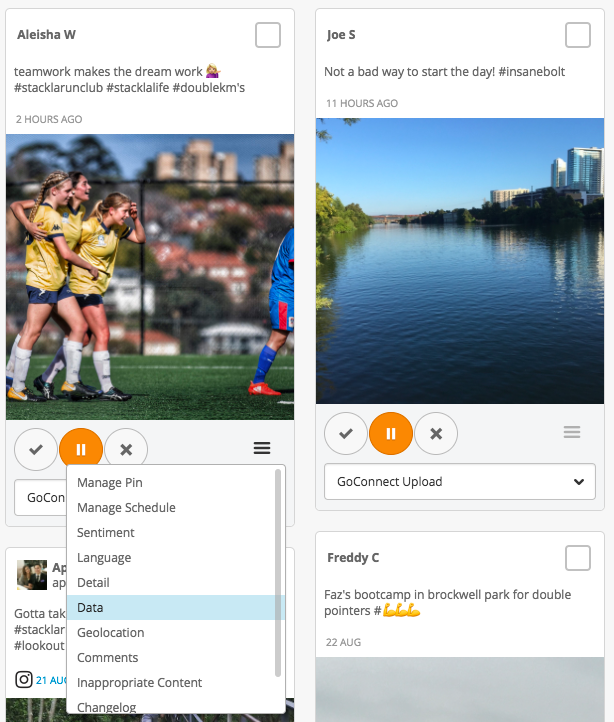
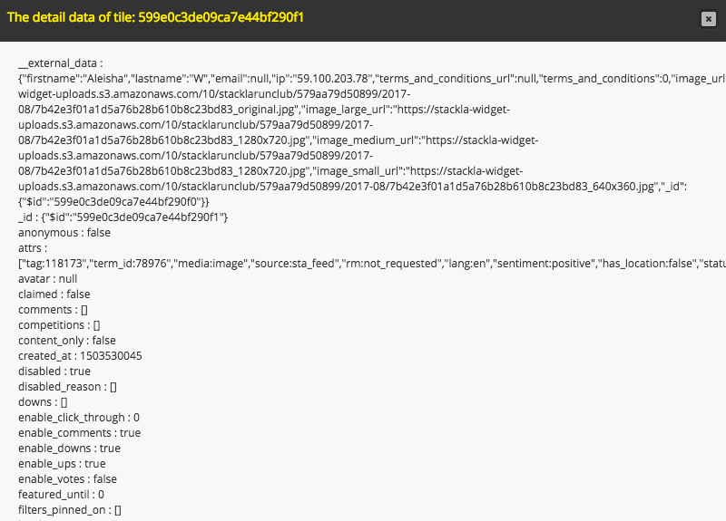

# Dynamically specify tile to display in widget

* [Introduction](dynamically-specify-tile-to-display-in-widget.md#introduction)
* [Key Concepts](dynamically-specify-tile-to-display-in-widget.md#key-concepts)
* [The Fun Part](dynamically-specify-tile-to-display-in-widget.md#fun-part)
* [Creating a Widget](dynamically-specify-tile-to-display-in-widget.md#widget)
* [Find a Tile ID](dynamically-specify-tile-to-display-in-widget.md#tile-id)
* [Widget code for reference](dynamically-specify-tile-to-display-in-widget.md#embed-code)
* [End Result](dynamically-specify-tile-to-display-in-widget.md#end-result)

## Introduction

Through Nosto's UGC Dynamic Filtering functionality, customers have the ability to customise the outputs of their Widgets based upon their relevant use-case by overwriting the Filter and/or the Tags associated with that Filter to generate a more relevant output.

Now whilst the ability to change what content is shown at a Filter or Tag level is incredibly useful for clients attempting to generate relevant outputs for their eCommerce site or generate a personalised display via their DMP, there will of course be times where a client needs to get more granular and specific around what content they wish to display on their outputs.

This is where Nosto's UGC ability to specify exactly which Content Tiles are displayed in a Widget can become extremely useful.

This guide will explore a simple use-case of where a client wishes to display a single Tile in their Widget.

[Back to Top](dynamically-specify-tile-to-display-in-widget.md#top)

## Key Concepts

### Dynamic Filtering

Dynamic Filtering unlocks special features of Nosto'sNosto's UGC, outlined in this guide. You will need to have this feature enabled to complete this guide.

### Widgets

Widgets that are embedded for Stacks with Dynamic Filtering enabled have the ability to overwrite what Tiles are rendered in their Widgets.

### Tile ID

The Tile ID is a unique 24 character alphanumeric unique ID generated by Nosto's UGC for every pieces of content aggregated onto the Platform.

[Back to Top](dynamically-specify-tile-to-display-in-widget.md#top)

## The Fun Part

In this example we will need to do the following:

1. Creating a Widget
2. Finding a Tile ID
3. Updating the Widget Embed Code

[Back to Top](dynamically-specify-tile-to-display-in-widget.md#top)

## Creating the Widget

Similar to our guide on [Dynamically Specifying Products to Display in a Widget](dynamically-specify-products-to-display-in-widget.md) we will only need to create one Widget for this scenario, and will simply augment its embed code to specify which Tile(s) to display.

As such, simply create a Waterfall Widget, leave its filters to ‘Latest’ and Save. The preview should show you a Widget with a series of Tiles in it.

[Back to Top](dynamically-specify-tile-to-display-in-widget.md#top)

## Find a Tile ID

There are a number of ways in which you can find a Tile’s Tile ID. Ranging from using the REST API, to Webhooks to simply viewing the Tile data in the Curate Content section of Stackla.

For this guide, we are just going to collect it manually via the Curate Content section of Stackla.

To source, simply find the tile you wish to get the ID for, click on the overflow menu and select ‘Data’.



This will load up the Tile Data and we can grab the ID from the Data modal. In the below example, the ID of the tile is `599e0c3de09ca7e44bf290f1`



[Back to Top](dynamically-specify-tile-to-display-in-widget.md#top)

## Update the Widget Embed Code

As we mentioned earlier, we will be using a default Waterfall Widget, leveraging the latest filter for this example. As such, we will be presented with embed code similar to the below:

```html
<div class="stackla-widget" data-hash="<hash>" data-id="<id>" data-ttl="30" style="width: 100%; overflow: hidden;"></div>
<script type="module">
    (async () => {
        const widget = await import('https://widget-ui.teaser.stackla.com/core.esm.js');
  		widget.init();
    })();
</script>
```

Now to change what content is displayed in the Widget, all we need to do is add the parameter data-tile-id to the DIV section of the embed code and then include the Tile ID(s) that we wish to render.

For example, to showcase the one tile which we collected earlier, we would add `data-tile-id=”599e0c3de09ca7e44bf290f1”`, and of course if we wanted to showcase two Tiles we would simply add a comma between the Tile IDs.

[Back to Top](dynamically-specify-tile-to-display-in-widget.md#top)

## End Result

Rendered below is the Nosto's UGC Waterfall Widget rendering the single Tile as listed in this guide:

```html
<script type="text/javascript">(function (d, id) { var t, el = d.scripts[d.scripts.length - 1].previousElementSibling; if (el) el.dataset.initTimestamp = (new Date()).getTime(); if (d.getElementById(id)) return; t = d.createElement('script'); t.src = '//assetscdn.stackla.com/media/js/widget/fluid-embed.js'; t.id = id; (d.getElementsByTagName('head')[0] || d.getElementsByTagName('body')[0]).appendChild(t); }(document, 'stackla-widget-js'));</script>
```
