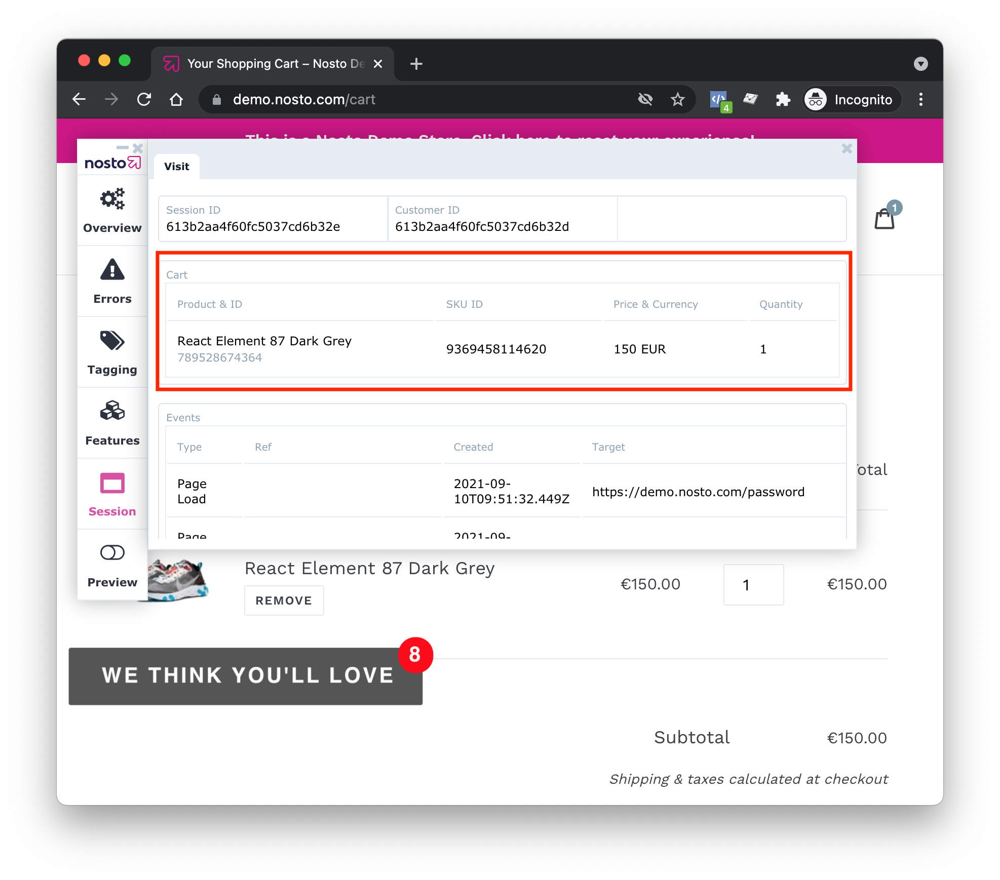
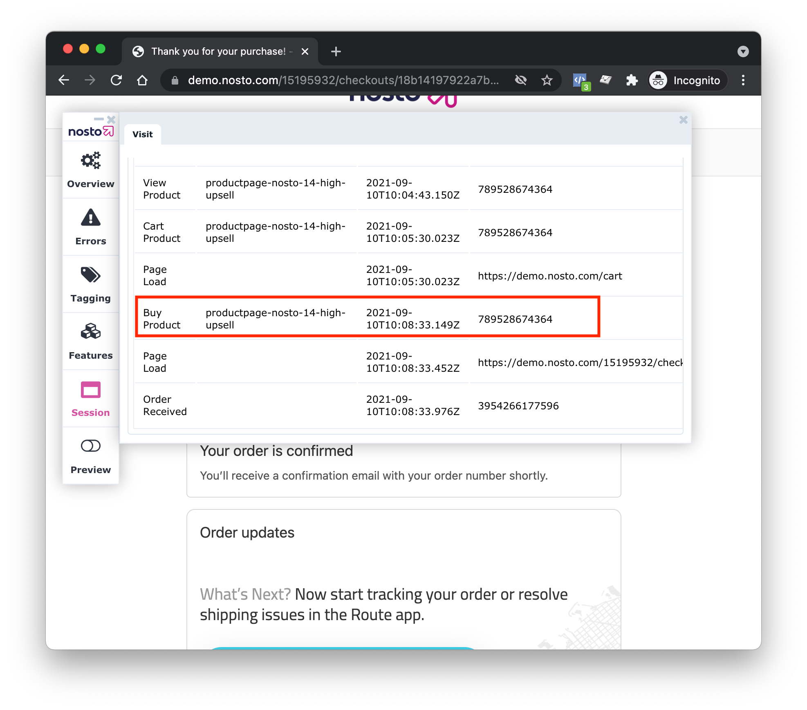

# Checking your setup

### Session view in the debug toolbar 

1. Navigate to your site in [incognito mode](https://support.google.com/chrome/answer/95464).
2. Load the debug toolbar by appending `nostodebug=true` to your store's URL e.g. `https://example.com?nostodebug=true`
3. Click the login link and navigate to the session view.

 

### View Category

Navigate to a category page and verify that the View Category event is tracked with the following details:

* Target matches the viewed category.

If the category doesn't appear in the session, these pages might help

* [Tagging: category](https://docs.nosto.com/techdocs/implementing-nosto/implement-on-your-website/manual-implementation/category-and-brand-tagging)
* [Session API: category](https://docs.nosto.com/techdocs/apis/frontend/implementation-guide-session-api/spa-basics-tracking-events#upon-viewing-a-collection)

### View Product

Navigate to a product page and verify that the View Product event is tracked with the following details:

* Target matches the viewed product ID.

If the product doesn't appear in the session, these pages might help:

* [Tagging: product](https://docs.nosto.com/techdocs/implementing-nosto/implement-on-your-website/manual-implementation/product-tagging)
* [JS API: product](https://docs.nosto.com/techdocs/apis/js-apis/common-examples/sending-product-view-events)
* [Session API: product](https://docs.nosto.com/techdocs/apis/frontend/implementation-guide-session-api/spa-basics-tracking-events#upon-viewing-a-product)

### View a Recommended Product 

Click on a product recommendation and verify that the View Product event is tracked with the following details:

* Target matches the viewed product ID.
* Ref matches the previously viewed recommendation slot ID.

If the product id and recommendation slot id don't appear in the session, these pages might help:

* [JS API: Attribution for recommended Products](https://docs.nosto.com/techdocs/apis/js-apis/recommendations/sending-product-view-events#attribution-for-recommended-products)
* [JS API: Sending Add to Cart-Events](https://docs.nosto.com/techdocs/apis/js-apis/common-examples/sending-add-to-cart-events)
* [Session API: handling attribution](https://docs.nosto.com/techdocs/apis/frontend/implementation-guide-session-api/spa-basics-leveraging-features#handling-attribution)

### Cart

Add the product to cart and verify that the cart’s contents are correct. Ensure that the product details in the cart match the product that was previously viewed.

* Product ID
* Price & Currency
* Quantity

If the cart doesn't correctly show in the session view, these pages might help:

* [Tagging: cart](https://docs.nosto.com/techdocs/implementing-nosto/implement-on-your-website/manual-implementation/cart-tagging)
* [JS API: cart](https://docs.nosto.com/techdocs/apis/js-apis/common-examples/dynamically-sending-the-cart-content)
* [Session API: cart](https://docs.nosto.com/techdocs/apis/frontend/implementation-guide-session-api/spa-basics-managing-sessions#setting-the-cart)

### Order

Purchase the product and verify that the Buy Product event is tracked with the following details:

* Ref matches the recommendation slot id
* Target matches the product id

Wait 30 minutes for the session to expire and then verify that the order shows up in the orders page of the Nosto admin UI.

If the order doesn't correctly show in the session view, these pages might help:

* [Tagging: order](https://docs.nosto.com/techdocs/implementing-nosto/implement-on-your-website/manual-implementation/order-tagging)
* [Session API: order](https://docs.nosto.com/techdocs/apis/frontend/implementation-guide-session-api/spa-basics-tracking-events#upon-placing-an-order)


If it’s not possible to perform a test order, the Nosto admin UI's orders page can be used to review that orders link to known products in the catalogue and that some items have click attribution towards the visible recommendations.


### Measuring Performance

We’ve integrated with the [User Timing API](https://developer.mozilla.org/en-US/docs/Web/API/User\_Timing\_API) to be able to show some performance measurements of our client script. The supported measurements are:

* `nosto.get_dynamic_placements` Parse the DOM and find placements on the page. Performed before a recommendations request is sent.
* `nosto.load_recommendations` Send the recommendations request and handle the recommendation result. This encompasses measuring the recommendations request and `nosto.inject_campaigns`.
* `nosto.inject_campaigns` Inject both dynamic and static campaigns into the DOM. This encompasses both `nosto.inject_static_campaigns` and `nosto.inject_dynamic_campaigns`.
* `nosto.inject_static_campaigns` Inject static campaigns into the DOM.
* `nosto.inject_dynamic_campaigns` Inject dynamic campaigns into the DOM.
* `nosto.evaluate_js` Extract and evaluate embedded JavaScript from recommendation templates.

#### Lighthouse

Chrome's [lighthouse](https://developers.google.com/web/tools/lighthouse) tool can be opened by doing the following:

1. Right click and select Inspect.
2. Navigate to the Lighthouse tab.
3. Ensure the Performance category is enabled.
4. Click Generate Report

.png>) .png>)

Once the report is generated, you can expand the “User Timing marks and measures” section under the Diagnostics section to see some basic information like how long after the page started to load the measurements start and how long each measurement took.

.png>)

You can scroll back up and click the View Original Trace button to view a timeline of the measurements. You may need to expand the Timings section to view the client script’s recorded measurements. You can zoom in an out of this graph and swipe side to side to get a better view of things.

 (1).png>)
