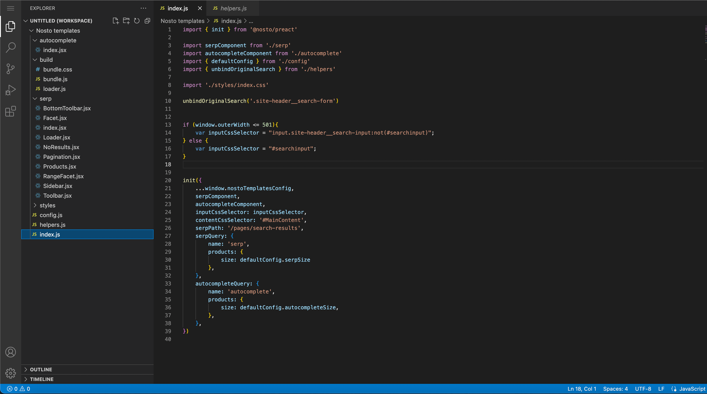

# Getting Started with Nosto Search

To get started with Nosto Search on your website, navigate to the Search tab under 'On-site' within the Nosto UI. This is where everything for Nosto Search can be configured and controlled, including designing the templates for search pages and autocomplete dropdowns, as well as search analytics, query rules and other settings. Synonyms for search queries can also be configured here.&#x20;

To begin implementing Search, navigate to the Templates tab under Search, and Click on “Open Code Editor”.&#x20;

<figure><figcaption><p>Nosto Admin UI > Search</p></figcaption></figure>

You will then be redirected to the VSCode Editor window. On the left-hand side is the project structure panel, and on the right-hand side is the very familiar code-editor panel. Note the components defined for both the Search Page and Autocomplete. These components can be used to define and extend behaviour on your website.

<figure><figcaption><p>VSCode Editor</p></figcaption></figure>

**Why use the VSCode Editor?**

Search functionality can be implemented on your website, all while customising the look and feel of how search pages and search autocomplete boxes are rendered through this editor. We provide flexibility to apply any merchant-defined design, as well as other functionalities, for e.g. a custom “Add to wishlist” button.

There is a default design that allows merchants to get started with a pre-implemented easy-to-understand design, which can be extended and modified as required.

## Setting Up

`index.js` should be used to bind Nosto Search on your website.

The `inputCssSelector` param can be used for this purpose. If there is an existing Search on your website, you can copy the CSS selector for it by highlighting the search box through the developer tools on your browser, and then right-click and ‘Copy selector’.

We will need to unbind any existing Search within the page first. To achieve this, a new function can be introduced (similar to the one below) that will help unbind the original Search functionality and replace it with Nosto Search. This can be done in `helpers.js`, for example.

```
export function unbindOriginalSearch(selector) {
    const elements = document.querySelectorAll(selector);
    elements.forEach(el => {
        var newElement = el.cloneNode(true);
        el.parentNode.replaceChild(newElement, el);
    })
}
```

This can then be called from within `index.js`, just before the `init()` function. The call can pass in the CSS selector that we copied earlier from the website, `unbindOriginalSearch('#search_form')`

## Sort options and other configurations

All sorting options can be controlled via `config.js`, where the field on which the sorting is applied can be changed.

This is also where the default page size can be changed.

<figure><figcaption><p>config.js</p></figcaption></figure>

## Components

Listed below are how the different components under `serp` and `autocomplete` will be used to render different sections on the Search Page and the Autocomplete box.

### Search Page (_`default-design/src/serp`)_

#### **BottomToolbar.jsx**

Design of the toolbar at the button of the page. This can be used for displaying the number of pages, page count, items per page, etc.

#### **Facet.jsx**

Design of the facets. For example, the product colour, size, and other filters the user may wish to apply to the search results.

#### **Loader.jsx**

Design of the loading page, while search results are retrieved and rendered. This is shown while the search results load. By default, this will be a throbber/loading icon.

#### **NoResults.jsx**

Page to show that there were no results found.

#### **Pagination.jsx**

Design for changing pages, usually shown below the _BottomToolbar_. It can be used to design the way the user changes the page.

#### **Products.jsx**

Design of how the product listings show up on the search page. This can be used to control how many products are shown on the result page, as well as the design of how they are shown.

### Search Autocomplete (_`default-design/src/autocomplete`_)

Design of the autocomplete box as the user enters their search query. This is usually shown just below the search box, and updates in real-time. It features product suggestions to help users view the top matches with their query, even before the search page loads.

### Styling

All these components can be customised further with the _.css_ files under `styles`.

## How to use Nosto’s debug toolbar to preview and test Search

To preview an undeployed design on your website, and test your changes from the VSCode Editor:

1. Navigate to your website
2. In the URL, append `?nostodebug=true` to enable the debug toolbar
3. The Nosto debug toolbar should open up, where you will be asked to log in
4. Once you have logged in, enable the Preview toggle button at the bottom
5. You should now be able to view your changes live, via the Search box

Through this method, you will be able to view changes even when there is no deployment. If changes are deployed, then the current changes from the VSCode Editor are loaded instead of the deployed version.

## Rollback & Disable

### **Rollback previous deployment**

1. Navigate to the Nosto Admin UI > Search > Templates
2. Click on the desired deployment and then click on "Redeploy"

### **Disable Search Templates (in case of an emergency)**

1. Navigate to the Nosto Admin UI > Search > Templates
2. Click on the “Disable Templates” button.
3. This will disable Nosto Search completely, and bind the original Search again
4. Once you have addressed the issues with the templates, click "Deploy latest" and Nosto Search will be back in action!


_For any other questions, please feel free to contact Nosto support. We will be happy to help you out!_

