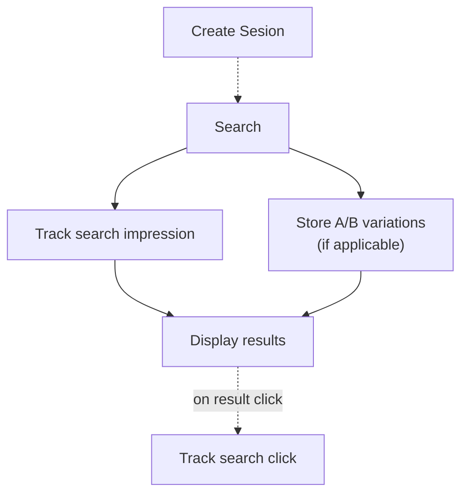

# Using analytics and A/B testing with search

```mermaid
flowchart TD
    Sess[Create Sesion] -.-> Search
    Search --> Imp[Track search impression]
    Search --> AB["Store A/B variations\n(if applicable)"]
    Imp --> Display[Display results]
    AB --> Display

    Display -.->|on result click| Click[Track search click]
```