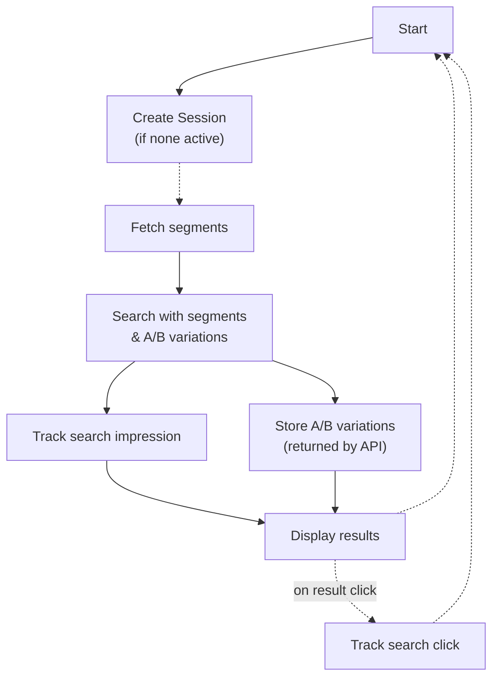
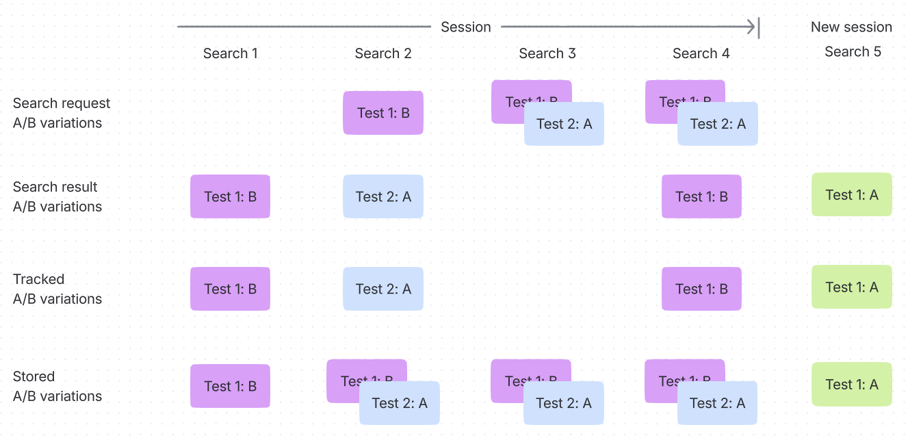

# Analytics and A/B testing in API integrations

Template and JavaScript integrations come with tracking- and A/B testing support out of the box.
For pure API integrations, some extra steps need to be performed on the integration side
to ensure that user interactions are tracked and attributed appropriately.

## Limitations

* Individual personalization with user-specific affinities is currently not available with a pure API approach to search.
If this is a critical requirement, consider using the [JavaScript library](../search/README.md).
* An `API_APPS` token is necessary to implement API requests related to session management and tracking.

## General workflow

The search request lifecycle looks like this:



The key points are:

* Track impression event including found products and A/B variations (if applicable) when displaying search results.
* Track click event including clicked product and A/B variations (if applicable) when clicking on a search result.
* Store A/B variations received from the search API and include them in all following search requests *for the duration of the session*.

Storing the session ID for the duration of the session (30 minutes) is essential to ensure that the experience is personalized using the segments associated with the session.

### Keeping track of assigned A/B test variations

When requesting search results subject to an A/B test without supplying any A/B testing parameters,
the search API applies a random A/B variation and includes it in the search result.
It is vital to include the returned A/B variations in following search requests within the same session to ensure a consistent experience.
Failing to do so results in the user being assigned a new A/B variation for equivalent search requests.

<figure><figcaption></figcaption></figure>

## Relevant APIs

### Search

Search is handled by the [Nosto search GraphQL API](https://search.nosto.com/v1/graphql?ref=InputSearchQuery).
Its use is documented [elsewhere](./using-the-search-api.md) in great detail.

This is a minimal example search request that contains all fields relevant for tracking and A/B testing purposes:

```graphql
query {
  search(
    accountId: "your merchant ID"
    query: "what the user typed"
    segments: ["array", "of", "segment", "IDs", "from", "session", "API"]
    # For the first search in a session, this can be an empty array. All following searches should contain an array
    # of all A/B variation assignments returned by search within the same session.
    abTests: []
  ) {
    products {
      total
      fuzzy
      hits {
        productId
      }
    }
    abTests {
      id
      activeVariation {
        id
      }
    }
  }
}
```

### Session management and tracking

Session creation, segment retrieval, and analytics tracking is handled by the [Nosto platform GraphQL API](../../../apis/graphql-an-introduction/README.md).


This API requires authentication using an API token with scope `API_APPS`.
Learn more about the authentication workflow [here](../../../apis/graphql-an-introduction/graphql-using-the-api.md).


#### Mutation `newSession`

Creates a new session and returns that session's ID, which should be used in further interactions with this API.

##### Request example

```graphql
mutation {
  newSession
}
```

##### Response example

```json
{
  "data": {
    "newSession": "68b6f028a49067459453e89b"
  }
}
```

Store the value of the `newSession` property for 30 minutes and include it in the following API interactions for the duration of the session.

Learn more about session handling [here](../../../apis/graphql-an-introduction/graphql-using-mutations/graphql-onsite-sessions.md).

#### Query `session`

Retrieves segments that have been assigned to this session.
Segments must be included in search requests to leverage segmentation in rules.

##### Request example

```graphql
query {
  session(by: BY_REF, id: "68b6f028a49067459453e89b") {
    segments {
      id
    }
  }
}
```

##### Response example

```json
{
  "data": {
    "session": {
      "segments": ["5a497a000000000000000001", "5b71f1500000000000000006"]
    }
  }
}
```

Request segments *before* searching.
Note that segments can change during the course of the session based on user interactions.

Learn more about session handling [here](../../../apis/graphql-an-introduction/graphql-using-mutations/graphql-onsite-sessions.md).

#### Mutation `recordAnalyticsEvent`

Tracks search impressions (immediately upon displaying search results) and search clicks (upon clicking a product).
The exact structure varies between impressions and clicks, but search metadata is the same for both.

Search metadata example (used in following examples as `$metadata`):

```json
{
  "hasResults": true,
  "autoComplete": false,
  "autoCorrect": false,
  "keyword": false,
  "organic": true,
  "refined": false,
  "refinedQuery": null,
  "sorted": false,
  "query":  "t-shirt",
  "resultId": "d65b040c-56ae-4c6d-a038-fe908e140855"
}
```

Properties:
* `hasResults`: `true` if the search response `total` is greater than zero.
* `autoComplete`: `false` for regular search, `true` for search requests used for providing autocomplete-style functionality.
  This distinguishes interactions in the Nosto search analytics dashboard.
* `autoCorrect`: Set to the `fuzzy` value returned in the search response to indicate searches that required error-tolerant search.
* `keyword`: Set to `true` if search keywords were requested (typically for autocomplete purposes).
* `organic`: Set to `true` if the search was caused by a user action within the store.
  Searches caused by links to the store (e.g. from ads) are indicated by `false`.
* `refined`: Set to `true` if the user searched before in this session, and searched again now *with a different query*.
* `refinedQuery`: In case of refined search (see above), include the previously searched for query.
  Otherwise, this can be `null` or omitted entirely.
* `sorted`: `true` when sorting by anything other than `_score`.
  Sorting by `_score` is default behavior if no sort parameter is supplied in the search request.
* `query`: The current search query entered by the user into the search field.
* `resultId`: Unique ID for this interaction.
  UUID4 is particularly useful for this.

A/B test properties are also the same for both impression- and click tracking.
They should contain all A/B variations that applied to the search request this tracking request is associated with.

If the search API returns A/B test data like this:

```json
// ...
"abTests": [
  {
    "id": "65ca1ee5d05d1f5159f0ac7e",
    "activeVariation": {
      "id": "A"
    }
  }
]
// ...
```

The corresponding tracking properties should look like:

```json
{
  "abTestAttribution": [
    {
      "key": "65ca1ee5d05d1f5159f0ac7e",
      "value": "A"
    }
  ]
}
```

The object above is referred to in following examples as `$properties`.

##### Impression tracking request example

This request must be sent immediately upon displaying search results.

Using previous examples for search metadata as `$metadata` and A/B test properties as `$properties`.

```graphql
mutation ($metadata: InputSearchEventMetadataInputEntity, $properties: InputAnalyticEventPropertiesInputEntity) {
  recordAnalyticsEvent(
    id: "68b6f028a49067459453e89b"
    by: BY_REF
    params: {
      type: "SEARCH"
      timestamp: "2025-09-02T13:56:08.890Z"
      searchImpression: {
        metadata: $metadata
        page: 1
        productIds: ["0", "1", "2"],
        properties: $properties
      }
    }
  )
}
```

Properties:
* `type`: Always `SEARCH` for search events.
* `timestamp`: Time of event must be formatted as ISO 8601 date.
* `page`: 1-based page number.
* `productIds`: The product IDs (`productId` property in search response) that are shown on this result page.

The response contains a generic success message that is not necessary for further processing.

##### Click tracking request example

This request must be sent when a search result is clicked.
The request uses the same search metadata and A/B testing properties as impression tracking, so make sure to store them.

Using previous examples for search metadata as `$metadata` and A/B test properties as `$properties`.

```graphql
mutation ($metadata: InputSearchEventMetadataInputEntity, $properties: InputAnalyticEventPropertiesInputEntity) {
  recordAnalyticsEvent(
    id: "68b6f028a49067459453e89b"
    by: BY_REF
    params: {
      type: "SEARCH"
      timestamp: "2025-09-02T13:56:08.890Z"
      searchClick: {
        metadata: $metadata
        productId: "<ID of the clicked product>",
        properties: $properties
      }
    }
  )
}
```

Properties:
* `type`: Always `SEARCH` for search events.
* `timestamp`: Time of event must be formatted as ISO 8601 date.
* `productId`: The product ID (`productId` property in search response) of the product that was clicked.

The response contains a generic success message that is not necessary for further processing.

## Putting it all together

The small JavaScript program below implements the complete workflow of session maintenance, segment retrieval, search, and tracking with support for A/B testing.
The general flow and data structures can be translated to any language.

Error handling is largely omitted to focus on the more interesting bits.

```js
// This object stores values that are invariant for a given integration.
const config = {
  // This is your merchant ID.
  merchantId: "<your merchant ID>",
  // Nosto API key with scope API_APPS - ask support if you don't have one.
  platformGraphqlApiKey: "<your token>",
  // API URLs and session time are constant.
  platformGraphqlUrl: "https://api.nosto.com/v1/graphql",
  searchGraphqlUrl: "https://search.nosto.com/v1/graphql",
  sessionTimeToLiveMilliseconds: 30 * 60 * 1000, // 30 minutes
}

// Simplistic placeholder for some sort of storage that survives individual
// page views and lasts for the duration of the session.
// In the backend, this could be a key-value store or database.
// In the frontend, this could be localStorage, or a cookie.
const store = {
  // Session ID to attribute user actions to the same session.
  sessionId: null,
  // Remember the session start time to be able to invalidate it after 30 minutes.
  sessionStart: null,
  // Accumulate and store all A/B variation assignments received in search
  // responses during the session, so they can be included in follow-up
  // searches. This ensures that users receive a consistent experience for
  // the duration of the session.
  abTests: [],
  // Store the most recent search metadata for tracking purposes.
  mostRecentSearchMetadata: null,
  // Store the most recent search request's A/B variations for tracking purposes.
  mostRecentABVariations: []
}

async function graphql(url, query, variables) {
  const authHeader = {
    "Authorization": "Basic " + btoa(`:${config.platformGraphqlApiKey}`)
  }

  const response = await fetch(url, {
    method: "POST",
    headers: {
      "Content-Type": "application/json",
      // API key is only needed for platform API.
      ...(url === config.platformGraphqlUrl ? authHeader : {}),
    },
    body: JSON.stringify({ query, variables })
  });
  const json = await response.json();
  // Don't fail on soft errors.
  if (json.errors) {
    console.warn("GraphQL errors:", json.errors);
    if (!json.data) {
        throw new Error(JSON.stringify(json.errors, null, 2));
    }
  }
  // Definitely fail when the request fails completely.
  if (response.status !== 200) {
    throw new Error(JSON.stringify(response.status, null, 2));
  }
  return json.data;
}

async function createSessionIfMissingOrExpired() {
  const now = new Date()
  if (store.sessionStart && (now - store.sessionStart) < config.sessionTimeToLiveMilliseconds) {
    // Session still valid - keep using it.
    return
  } else {
    // Forget previous session assignments and metadata from past searches.
    // This allows the new session to be assigned to new A/B variations.
    clearSession()
  }

  // No active session or session expired - create a new one.
  const response = await graphql(config.platformGraphqlUrl, `
    mutation {
      newSession
    }`, {})

  // Store session ID for tracking.
  store.sessionId = response.newSession

  // Store start of session to know when to invalidate the session ID.
  store.sessionStart = now
}

function clearSession() {
  store.sessionId = null
  store.sessionStart = null
  store.abTests = []
  store.mostRecentSearchMetadata = null
  store.mostRecentABVariations = []
}

async function track(event) {
  await graphql(config.platformGraphqlUrl, `
    mutation ($sessionId: String!, $eventParams: InputRecordAnalyticsEventParams!) {
      recordAnalyticsEvent(id: $sessionId, by: BY_REF, params: $eventParams)
    }`,
    {
      sessionId: store.sessionId,
      eventParams: {
        timestamp: new Date().toISOString(),
        // Event type is the same for all search tracking.
        type: "SEARCH",
        ...event
      }
    })
}

async function fetchSegments() {
  const result = await graphql(config.platformGraphqlUrl, `
    query ($sessionId: String!) {
      session(by: BY_REF, id: $sessionId) {
        segments {
          id
        }
      }
    }`, { sessionId: store.sessionId })

  return result.session.segments.map(segment => segment.id)
}

function transformSearchResultsToTrackingMetadata(query, searchResults, isAutoComplete, isOrganic) {
  return {
    hasResults: searchResults.search.products.total > 0,
    autoComplete: isAutoComplete,
    autoCorrect: searchResults.search.products.fuzzy,
    keyword: false, // Use true if keywords were requested.
    organic: isOrganic,
    refined: !!store.mostRecentSearchMetadata?.query &&
      store.mostRecentSearchMetadata?.query !== query,
    sorted: false,
    query,
    refinedQuery: store.mostRecentSearchMetadata?.query ?? null,
    resultId: crypto.randomUUID(),
  }
}

async function search(query, isAutoComplete = false, isOrganic = true) {
  // Before doing anything, ensure that the session is current. Create a new
  // one if not.
  await createSessionIfMissingOrExpired()

  // Retrieve an up-to-date list of segments the user in this session belongs to.
  // Segments are important to support segment-aware rules that might be
  // associated with A/B tests.
  // Keep in mind that user behavior changes segments during the session!
  // If caching is used, use short lifetimes.
  const segments = await fetchSegments()

  const searchResults = await graphql(config.searchGraphqlUrl, `
    query (
      $accountId: String!,
      $query: String!,
      $segments: [String!],
      $abTests: [InputSearchABTest!]
    ) {
      search(accountId: $accountId, query: $query, segments: $segments, abTests: $abTests) {
        products {
          total
          fuzzy
          hits {
            productId
            name
          }
        }
        abTests {
          id
          activeVariation {
            id
          }
        }
      }
    }`,
    {
      accountId: config.merchantId,
      query,
      segments,
      // Include previously stored A/B variation assignments in search
      // requests to ensure consistent results within the session.
      abTests: store.abTests
    })

  // Add returned A/B variations to memory for use in the next search request.
  // Note that the search API only returns A/B variation assignments relevant
  // to the current request, so the stored assignments need to be accumulated
  // rather than being overwritten.
  store.abTests.push(...searchResults.search.abTests)

  // Store response metadata for impression- and click tracking.
  store.mostRecentSearchMetadata = transformSearchResultsToTrackingMetadata(
    query, searchResults, isAutoComplete, isOrganic)

  // The most recent search request's A/B variations are used to attribute
  // interactions with the result to that A/B test.
  store.mostRecentABVariations = searchResults.search.abTests.map(
    abTest => ({ key: abTest.id, value: abTest.activeVariation.id })
  )

  return searchResults.search
}

async function trackSearchImpression(productIds, page) {
  await track({
    searchImpression: {
      metadata: store.mostRecentSearchMetadata,
      page,
      productIds,
      properties: {
        // This part ensures that the search impression is attributed
        // to the currently active A/B test(s) for this session.
        abTestAttribution: store.mostRecentABVariations
      }
    }
  })
}

async function trackSearchClick(productId) {
  await track({
    searchClick: {
      metadata: store.mostRecentSearchMetadata,
      productId, // Clicked product's ID.
      properties: {
        // This part ensures that the search impression is attributed
        // to the currently active A/B test(s) for this session.
        abTestAttribution: store.mostRecentABVariations
      }
    }
  })
}

// Session takes place in the following block.
(async () => {
  // 1. Search for something (implicitly creates a new session if needed).
  const searchResults = await search("<your search query>")
  // 2. Display results.
  console.log(searchResults.products.hits.map(hit => hit.name))
  // 3. Track impression with current 1-based pagination information.
  await trackSearchImpression(
    searchResults.products.hits.map(hit => hit.productId),
    1
  )

  // 4. User now looks at search results and may or may not interact.
  // If a result is clicked, track the ID of the clicked product:
  await trackSearchClick(searchResults.products.hits[0].productId)
  await trackSearchClick(searchResults.products.hits[2].productId)
})()
```