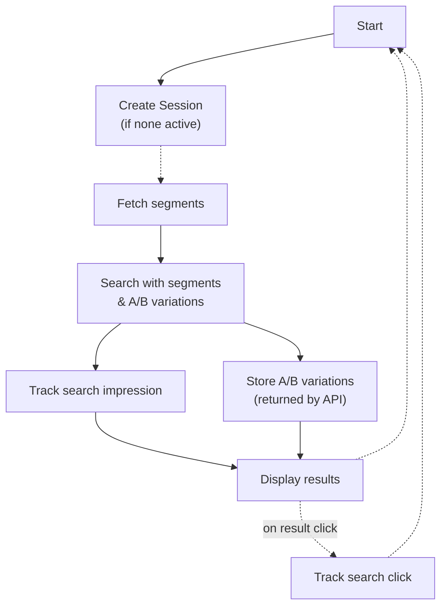

# Analytics and A/B testing in API integrations

Template and JavaScript integrations come with tracking- and A/B testing support out of the box.
For pure API integrations, some extra steps need to be performed on the integration side
to ensure that user interactions are tracked and attributed appropriately.

## General workflow

The search request lifecycle looks like this:

The key points are:

* Track impression event including found products and A/B variations (if applicable) when displaying search results.
* Track click event including clicked product and A/B variations (if applicable) when clicking on a search result.
* Store A/B variations received from the search API and include them in all following search requests *for the duration of the session*.

Storing the session ID for the duration of the session (30 minutes) is essential to ensure that the experience is personalized using the segments associated with the session.

When requesting search results subject to an A/B test without supplying any A/B testing parameters,
the search API applies a random A/B variation and includes it in the search result.
It is vital to include the returned A/B variations in following search requests within the same session to ensure a consistent experience.
Failing to do so results in the user being assigned a new A/B variation for equivalent search requests.

## Relevant APIs

Search is handled by the [Nosto search GraphQL API](https://search.nosto.com/v1/graphql?ref=InputSearchQuery).

Session creation, segment retrieval, and analytics tracking is handled by the [Nosto platform GraphQL API](../../../apis/graphql-an-introduction):

* Mutation `newSession` creates a new session ID.
* Query `session` is used to retrieve segments.
* Mutation `recordAnalyticsEvent` is used to track search impressions and clicks.