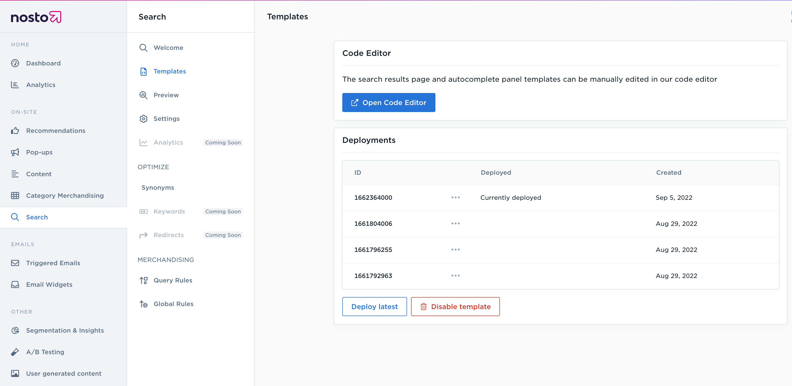
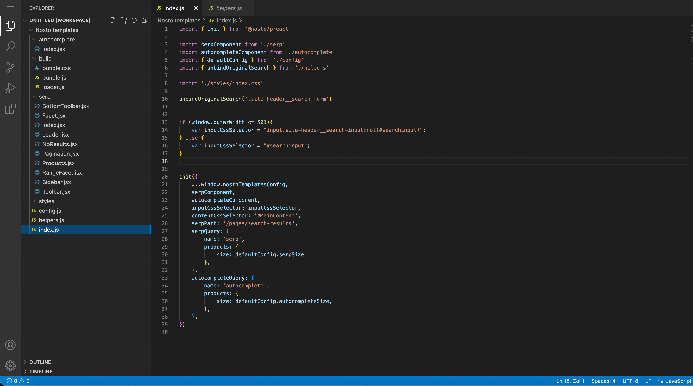

# Using the Code Editor

## **Why use the Code Editor?**

Code editor allows you to add a search function to your website quickly and easily without the need to use an API. You can customize the design of your search pages and autocomplete boxes to match your brand's look and feel. This saves you a lot of time compared to implementing search functionality through an API.

## Get Started

To get started with Search Templates on your website, navigate to the Search tab under 'On-site' within the Nosto UI. This is where everything for Search can be configured and controlled, including designing the templates for search pages and autocomplete dropdowns, as well as search analytics, query rules and other settings. Synonyms for search queries can also be configured here.

To begin implementing Search, navigate to the Templates tab under Search, and Click on “Open Code Editor”.

<figure><figcaption>
Nosto Admin UI > Search
</figcaption></figure>

You will then be redirected to the Code Editor window, where you can see and edit all project files.

<figure><figcaption>
Code Editor
</figcaption></figure>

The Code Editor ships with a library called `@nosto/preact` that contains functionality to interact with the Nosto Search product. API documentation for the library is available [here](https://nosto.github.io/search-templates/library/)

## Project structure

Project structure has the following requirements:

* `index.js` - this is application entry point that is used when building project. When building project it will recursively scan this file for imports.
* `build/` - this directory stores build output that will be used when deploying project.

## Saving, testing & deploying

After saving changes (`CTRL + S`) build should be triggered and bundled code should be uploaded to CDN. You can preview final result on your website and deploy it when ready.


[testing-and-deployment.md](testing-and-deployment.md)

