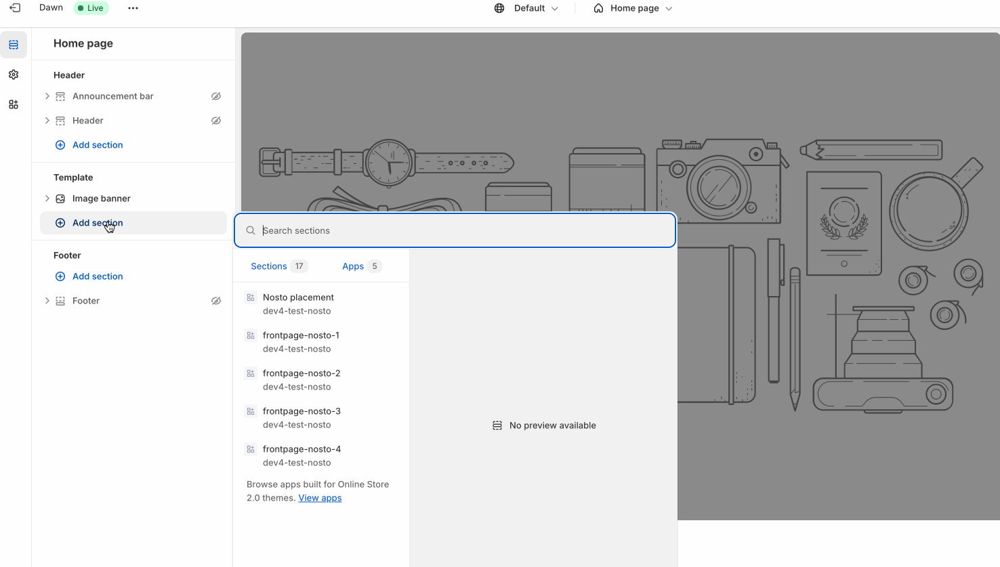
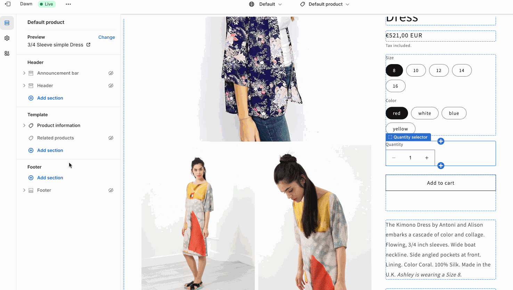
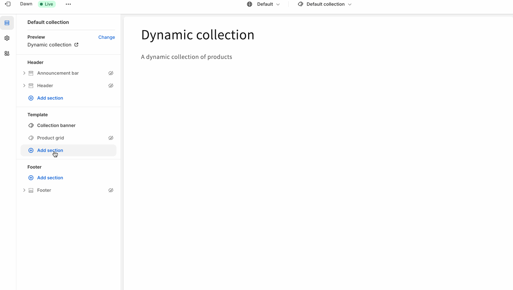
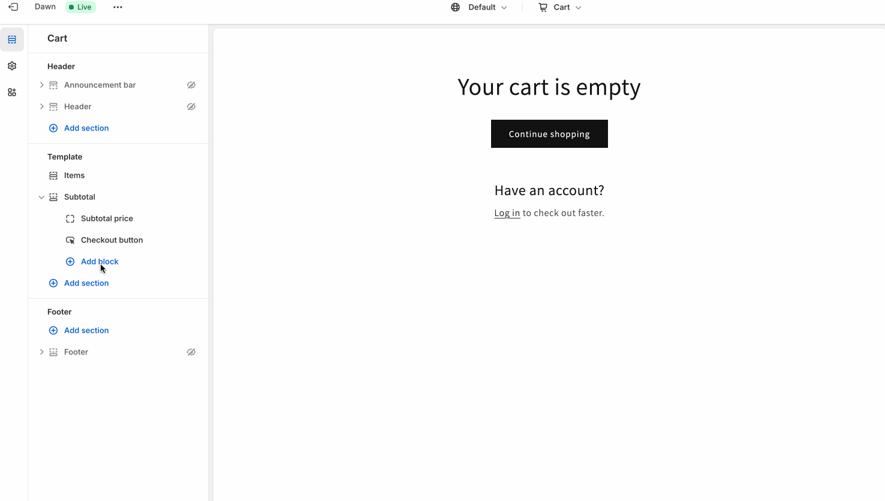
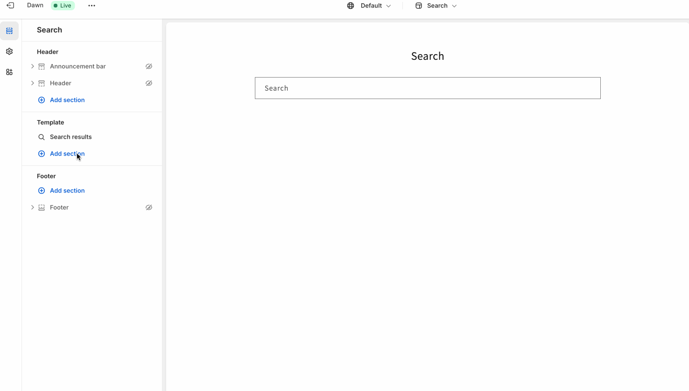
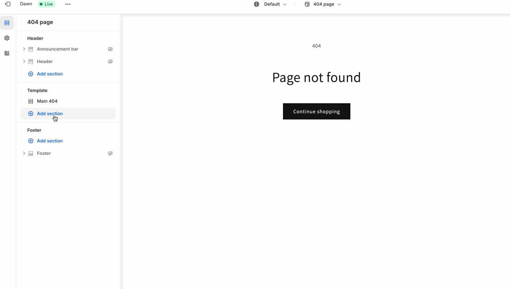

# Placements Setup

### Home/Index page

<figure><figcaption>
index page - adding placements
</figcaption></figure>

### Product page

<figure><figcaption>
product page - adding placements
</figcaption></figure>

### Collection page

<figure><figcaption>
collection page - adding placements
</figcaption></figure>

### Cart page

<figure><figcaption></figcaption></figure>

### Search page

<figure><figcaption>
search page - adding placements
</figcaption></figure>

### Not Found page

<figure><figcaption>
404 page - adding placements
</figcaption></figure>
