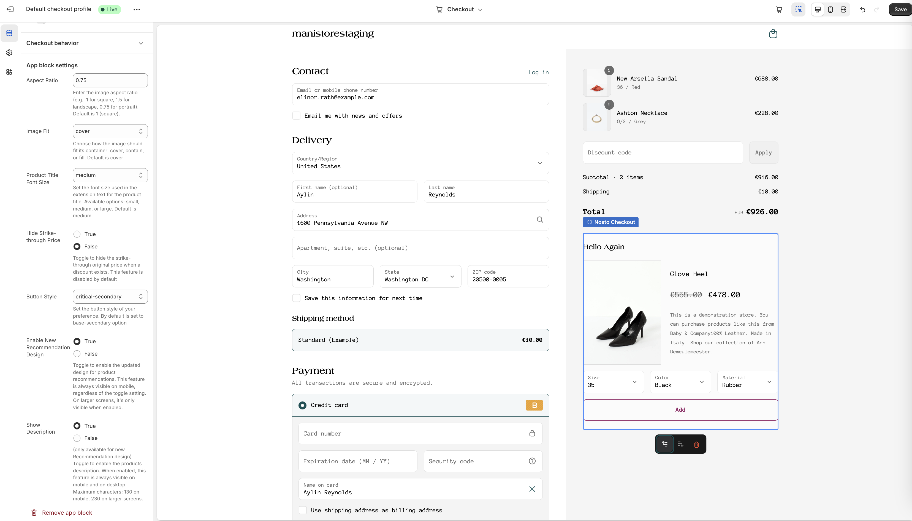

# Tracking & Session Management

Personalization in Nosto depends on the ability to recognize returning visitors, follow them through the purchase journey, and attribute purchases correctly. On Shopify, tracking and session persistence require a few special building blocks — especially during checkout.

This guide explains how Nosto tracks sessions in Shopify, how the Shopify Pixel fits in, and what to watch out for when troubleshooting or working with headless setups.

## Overview 

Shopify’s checkout is sandboxed, meaning most scripts and cookies from your storefront can’t be accessed once the user enters the checkout flow.

**To keep tracking working across this barrier, Nosto uses:**

* A session cookie (2c.cId) to identify users
* The Shopify Pixel to pass data between checkout steps
* Optional manual handling for headless or Hydrogen setups

> Without session tracking, Nosto can’t serve personalized content, collect behavioral insights, or track purchases for analytics and reporting.

## How Tracking Works in Shopify

Here’s what powers Nosto’s personalization engine:

### Nosto Script

The Nosto script loads on your storefront and sets the 2c.cId cookie. This cookie is the basis for identifying a user session.

### The 2c.cId Cookie

This cookie stores the unique customer session ID. It is essential for tracking page views, clicks, and enabling personalization across the store.

### Shopify Pixel

Shopify doesn’t allow third-party scripts inside checkout. Nosto Shopify Pixel uses a 2c.cId cookie and the checkout token, to personalise the Checkout with the Nosto Checkout extensions.

## Required Permissions

To activate and use the Shopify Pixel, Nosto requests access to specific Shopify scopes. You’ll be prompted to accept these permissions when:

* Installing the Nosto app
* Updating the app after a new feature release

When a new scope is added, Shopify will prompt you to approve the new access level. If you skip or decline this, the Pixel won’t activate and no checkout tracking will occur.

> You can review permissions in _Shopify Admin -> Settings -> Apps and sales channels -> Nosto -> Permission details_&#x20;
>
> To accept new permissions navigate to _Shopify Admin -> Apps -> Open Nosto —_ if new permission is required, your Shopify Admin can accept the new scope here

### Required scopes

* `read_customer_events`
* `write_pixels`

These are necessary to create, manage, and respond to Shopify Pixel events — especially those related to checkout.

<figure><figcaption>
<em>Screenshot of Shopify’s permission prompt</em>
</figcaption></figure>

## Enabling the Shopify Pixel

To activate the Nosto Pixel in Shopify:

1. Go to Shopify Admin → Settings → Customer Events
2. Click Manage Pixels
3. Look for the Nosto Pixel
4. Enable it (or accept new access permissions if prompted)

That’s it — no manual code needed.

<figure><figcaption></figcaption></figure>

> The Pixel will now automatically send a session update when a customer begins checkout.

## Cookie Consent & Legal Compliance

For tracking to work, the customer must accept cookies — especially in markets with strict privacy laws.

### What’s required:

* The 2c.cId cookie must be present
* Users must opt-in to analytics/marketing cookies
* In regions like Germany, passive banners are not enough — consent must be explicit

## Troubleshooting

| Pixel request fails (404 / token not found) | - Open DevTools → Network tab- Look for a request like /pixel/token/{shop}/{cid}/{checkout-token}- Confirm the cookie + token are passed        |
| ------------------------------------------- | ----------------------------------------------------------------------------------------------------------------------------------------------- |
| Pixel doesn’t show up at all                | - _Go to Shopify Admin → Settings → Customer Events_- Make sure the Nosto Pixel is listed and active                                            |
| Nothing seems to track                      | - Is Nosto script loaded on the storefront?- Does your consent tool properly trigger script loading and cookie creation?                        |
| Recommendations don’t appear in Checkout    | - Is the Nosto Pixel enabled?- Is the 2c.cId cookie present?- Did the user accept cookies?- Are you using “Buy Now”? That flow isn’t supported. |

If unsure, please reach out to your Nosto team via support@nosto.com!
