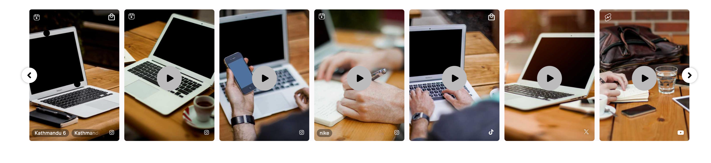

# Bind your own events

* [Introduction](bind-your-own-events.md#introduction)
* [Creating your Custom Event](bind-your-own-events.md#custom-events)

## Introduction

Nosto's UGC Widget SDK empowers users to feed their favorite Analytics tools with useful interaction information from their UGC Widgets based on common user behavior.

These common events relate to items such as Expanding a Tile, Loading more Content, or Clicking on a Shopspot link, and are based on the areas our users have wanted to track the most.

Now whilst these ‘Events’ cover the most common areas a client may wish to track, there are always scenarios where you need to track the less common areas and thus need to be able to create your events.

This guide provides a few examples as to how a user can create their custom events.

[Back to Top](bind-your-own-events.md#top)

## Creating your Custom Event

Now for this guide, we are going to focus on tracking the Left / Right arrows that are available on the Carousel Widget on the In-Line tile.



In this use case, we want to understand whether or not people are clicking on these buttons to see either new content or previous content.

Now as these buttons aren’t offered as part of Nosto's UGC standard \[Widgets Event API], we are going to create our Events by binding a click function to the CSS classes associated with these buttons (`.swiper-inline-carousel-button-prev` & `.swiper-inline-carousel-button-next`)

To do this, we can take two routes.

Either :

1. We append Custom JS to the code editor of the widget itself with the following contents:

```
sdk.querySelector('.swiper-inline-carousel-button-prev').addEventListener('click', function () {
	console.log('Click Previous');
});

sdk.querySelector('.swiper-inline-carousel-button-next').addEventListener('click', function () {
	console.log('Click Next');
});

```

2. We update the widget.tsx file in the IDE with the following contents:

```
import { ISdk } from '@stackla/widget-utils':

declare const sdk: ISdk;

sdk.querySelector('.swiper-inline-carousel-button-prev').addEventListener('click', function () {
	alert('inlinePrevClicked');
});
sdk.querySelector('.swiper-inline-carousel-button-next').addEventListener('click', function () {
	alert('inlineNextClicked');
});
```

Once added, we can then simply save and test.

We also offer other event bindings, which can be found in the Event Listeners section of the NextGen widgets documentation.

We suggest that you familiarise yourself with these events, as they can be useful for tracking other interactions within your widgets.

[Back to Top](bind-your-own-events.md#top)
